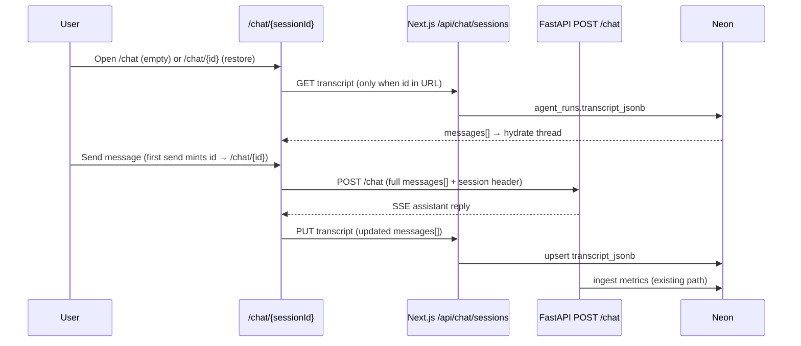

# Chat session persistence & replay — implementation plan

**Status:** ✅ shipped (2026-08-08) — Phases A–E complete  
**Author:** planning doc for v0.2 exploration phase  
**Related:** `.cursor/chat-exploration-scenarios.md`, `.cursor/chat-exploration-findings.md`, `.cursor/rapidui-v0.2-implementation.md`  
**Last updated:** 2026-08-08 — Phase E sign-off; lazy session URL model (ChatGPT-style)

---

## Summary

Persist the full Vercel AI v6 `messages[]` transcript for every `/chat` session in Neon, keyed by `session_id`. Make sessions addressable at **`/chat/{sessionId}`** so Observe (and internal Cursor agents) can open a saved conversation and restore the full interaction — even after browser refresh or tab close.

This is **internal agent observability** (conversation replay), not a replacement for Phase 6 metrics or Phase 7 eval grading. No per-user accounts in v0.2; UUID session ids remain the correlation key.

---

## Problem

| Today | Gap |
|-------|-----|
| Browser holds thread in assistant-ui memory | Lost on refresh, New chat, or new tab |
| `agent_runs` / `agent_turns` store metrics only | Cannot read what was said |
| Observe session detail shows validate/save timeline | No conversation prose or tool-step narrative |
| Exploration docs point at `sessionId` only | Cursor agents cannot analyze interview quality without copy-paste |
| Phase 5 UX locked **“No past chat sessions”** | Exploration + demo consent model now needs durable replay |

The eval harness (`eval_driver.py`) already builds the correct transcript shape in memory; Phase 7.4 will persist it to `eval_trials.transcript_jsonb`. **Live `/chat` sessions have no equivalent path today.**

---

## Goals

1. **Persist** full conversation after each completed assistant turn (typical session: 4–6 user turns).
2. **Restore** conversation at `/chat/{sessionId}` with output panel state derived from tool results in the transcript.
3. **Link** from Observe agent session detail → open conversation in chat UI.
4. **Support** chat exploration workflow (UC1–UC3 scenarios) and internal Cursor-agent analysis.
5. **Disclose** storage to demo participants (consent banner; no secrets).

## Non-goals (v0.2)

- Per-user auth or session lists / sidebar (ChatGPT-style history UI)
- Server-owned `message_history` passed to Pydantic AI (v0.3+ trust hardening)
- LLM-as-judge on transcripts (v0.3+ advisory `conversation_scores`)
- Public session index or search
- Transcript retention / GDPR deletion workflows (document policy; implement later)
- Replacing `eval_trials.transcript_jsonb` — automated eval keeps its own table

---

## Scope change from Phase 5 UX

Phase 5 explicitly decided:

> **Past chat sessions (ChatGPT sidebar): No** — single thread + New chat. Observe + `/specs/:id` are the persistence surfaces.

**This plan revises that decision for the exploration/demo stage:**

| Phase 5 | This plan |
|---------|-----------|
| No session replay | Replay via URL |
| `sessionStorage` only | URL is canonical; storage synced to DB |
| Observe = metrics | Observe = metrics **+ conversation link** |

We still **do not** ship a multi-session sidebar. Replay is **URL-driven** (share link, Observe cross-link, bookmarks) — not a session browser.

Update `rapidui-v0.2-implementation.md` Phase 5 “Resolved open questions” when this ships.

---

## Architecture



### Trust model (unchanged for v0.2)

- Agent still receives **client-supplied** `messages[]` each turn ([Pydantic AI trust model](https://ai.pydantic.dev/ui/overview/#trust-model-for-client-submitted-messages)).
- DB transcript is a **mirror for replay/analysis**, not yet the authoritative history for the LLM.
- v0.3+ may flip to server-owned history via `message_history` ([agent README](../agent/README.md) § Security and trust model).

### Persist location: platform (Next.js), not FastAPI

**Recommendation:** browser POSTs transcript to Next.js after each completed turn.

| Approach | Pros | Cons |
|----------|------|------|
| **Client → Next.js API** (recommended v1) | Browser already has assembled assistant-ui thread; no SSE re-parse; same shape as eval driver | Lost if tab closes mid-stream before turn completes |
| FastAPI captures request + response | Survives client crash | Must reconstruct assistant message from `AgentRunResult`; more agent-side work |
| Extend `/api/observe/ingest/agent` | Reuses ingest path | Overloads metrics contract; INGEST.md limits UI exceptions to `abandoned` |

**v1:** client persist. **v1.1 (optional):** FastAPI also snapshots request `messages[]` at turn start as a backstop.

---

## Data model

### Migration `009_agent_runs_transcript.sql`

Register **after** Phase 7.4 migrations `007` / `008` (do not collide).

```sql
ALTER TABLE agent_runs
  ADD COLUMN IF NOT EXISTS transcript_jsonb JSONB NULL,
  ADD COLUMN IF NOT EXISTS transcript_updated_at TIMESTAMPTZ NULL,
  ADD COLUMN IF NOT EXISTS transcript_turn_count INT NULL;

CREATE INDEX IF NOT EXISTS agent_runs_transcript_updated_idx
  ON agent_runs (transcript_updated_at DESC)
  WHERE transcript_jsonb IS NOT NULL;
```

**Why on `agent_runs` (not a new table):**

- One row per session already exists (`session_id UNIQUE`).
- Observe already queries `agent_runs` for session detail.
- Typical payload: 20–150 KB for 4–6 turns — fine for JSONB.
- Aligns conceptually with `eval_trials.transcript_jsonb` (same JSON shape, different source).

**Optional later:** `exploration_scenario_id TEXT NULL` if we want to tag manual UC runs (can also live only in findings doc).

### Transcript JSON shape

Store the **full Vercel AI v6 `messages[]` array** — same structure `eval_driver.py` emits in `DriverResult.messages`:

```json
[
  {
    "id": "m-abc123",
    "role": "user",
    "parts": [{ "type": "text", "text": "..." }]
  },
  {
    "id": "m-def456",
    "role": "assistant",
    "parts": [
      { "type": "text", "text": "...", "state": "done" },
      { "type": "tool-validate_rui", "toolCallId": "...", "input": {}, "output": {} }
    ]
  }
]
```

**Do not** store a separate slim format in v1 — slim views can be derived at read time for Observe display or Cursor export.

### Size expectations

| Scenario | Approx size |
|----------|-------------|
| UC1-S1 (3 user turns) | 15–40 KB |
| UC3-S4 (4 user turns + validate retries) | 40–120 KB |
| S+1 post-save iteration (+1 turn) | +10–30 KB |

If validate tool payloads become problematic, v1.1 can strip `input`/`output` bodies from older turns while keeping tool names and error codes.

---

## API

### `GET /api/chat/sessions/[sessionId]/transcript`

Returns:

```json
{
  "sessionId": "uuid",
  "messages": [ /* Vercel AI v6 messages[] */ ],
  "updatedAt": "ISO-8601",
  "turnCount": 3,
  "run": {
    "outcome": "saved | failed | abandoned | null",
    "specId": "uuid | null"
  }
}
```

- **404** if no `agent_runs` row — client **redirects to `/chat`** with error banner (see [Unknown session id](#unknown-session-id)). Does **not** auto-mint a replacement session.
- **200** with `messages: []` when a row exists but `transcript_jsonb` is null (e.g. metrics ingest created the row before first transcript PUT).

### `PUT /api/chat/sessions/[sessionId]/transcript`

Body:

```json
{
  "messages": [ /* full thread after turn completes */ ]
}
```

Behavior:

- Upsert `agent_runs` row if missing (minimal row — metrics backfill on next agent ingest).
- Replace `transcript_jsonb` atomically (full snapshot, not append-only messages table).
- Set `transcript_updated_at = NOW()`, `transcript_turn_count = user message count`.
- **400** if `messages` fails Zod validation (roles, required fields) or `messages` is empty (`.min(1)`).
- **413** if payload exceeds cap (suggest 512 KB — generous for exploration).

Auth: none in v0.2 (same as ingest). Rate-limit in production if abused.

### Files to add

```txt
lib/db/migrations/009_agent_runs_transcript.sql
lib/chat/transcriptSchema.ts       # Zod: messages[] shape
lib/chat/transcriptWrites.ts         # upsert + get
app/api/chat/sessions/[sessionId]/transcript/route.ts
```

---

## UI / routing

### Session URL model (revised — ChatGPT-style)

**Decision (locked 2026-08-07):** Session id appears in the URL only after the user sends their **first message**. Empty chat has **no session id** in the URL — same pattern as ChatGPT.

| State | URL | DB row | Behavior |
|-------|-----|--------|----------|
| Fresh chat | `/chat` | none | Empty thread; no GET; **no auto-mint** |
| First message sent | `/chat/{sessionId}` | created on first PUT | Mint id → `router.replace` → POST /chat → PUT transcript |
| Restore | `/chat/{sessionId}` | exists | GET 200 → hydrate thread |
| Invalid / unknown id | `/chat/{bad-id}` | none | GET 404 → redirect `/chat?error=session-not-found` + banner |
| New chat | `/chat` | prior unchanged | Clear thread + sessionStorage; **do not mint** until next send |

This resolves the GET 404 vs fresh-mint tension: `/chat` never calls the transcript API, so 404 reliably means “unknown session.”

### Routes

| Route | Behavior |
|-------|----------|
| `/chat` | Empty thread; no session id; consent banner |
| `/chat/[sessionId]` | GET transcript → hydrate; or 404 → redirect to `/chat` with error |

Implement as:

```txt
app/chat/page.tsx              # <MainDemo /> — no sessionId prop
app/chat/[sessionId]/page.tsx  # <MainDemo sessionId={params.sessionId} /> — fetch + hydrate
```

### Session id lifecycle (replaces sessionStorage-only model)

1. **New visit to `/chat`:** empty thread; **no** uuid mint; sessionStorage cleared.
2. **First user message:** `crypto.randomUUID()` → set sessionStorage → `router.replace(/chat/{id})` **before** POST /chat (headers + transcript PUT share the same id).
3. **URL is canonical once established:** sessionStorage mirrors URL for transport headers.
4. **New chat:** final PUT (if had messages) → abandon → navigate to `/chat` (no new id until next send).
5. **Share link:** `/chat/{sessionId}` restores from DB (meaningful only after first message created the row).

Update `lib/demo/session.ts`:

- `getSessionIdFromUrl()` — read from route param (null on `/chat`).
- Replace `getOrCreateSessionId()` — **do not mint on mount**; mint only on first send or explicit restore.
- `clearSessionId()` — New chat clears storage without minting.
- `ensureSessionId()` — mint + persist to storage + URL (called on first send).

### Persist hook (client)

Use AI SDK **`onFinish`** (passed through `useChatRuntime` → `useChat` → `ChatInit`) — fires when the assistant response finishes streaming.

After each **completed** assistant turn:

1. Read `messages` from the `onFinish` callback (or `useAuiState` thread export).
2. `PUT /api/chat/sessions/{sessionId}/transcript` with full wire-format `messages[]` (fire-and-forget; log errors).

Also persist once when user confirms **New chat** (final snapshot before abandon) — belt-and-suspenders.

**Do not** use `ThreadHistoryAdapter` for v1 — see [Spike findings](#spike-findings-assistant-ui-restore).

### Restore / hydration — spike complete ✅

See [Spike findings](#spike-findings-assistant-ui-restore) for full analysis. **Recommended v1 approach:**

1. Server or client `GET /api/chat/sessions/{sessionId}/transcript` before mounting chat runtime.
2. Show loading shell until fetch completes (avoid mounting runtime with empty thread then patching).
3. Mount `useChatRuntime({ transport, messages: restoredMessages, onFinish: persist })`.
4. Wrap `AssistantRuntimeProvider` with **`key={sessionId}`** so session changes remount cleanly.
5. User can **continue chatting** — composer stays active; restored-session banner only (not read-only).

**Visual fidelity:** restored session must look identical to the live session — same `ChatPanel` components (`UserTextPart`, `ReasoningPart`, `ToolFallback`, markdown). Wire-format `messages[]` round-trips through `AISDKMessageConverter`; no custom read-only renderer.

### Output panel on restore

`useSpecPanelListener` walks assistant **internal** messages (`message.content` with `type: "tool-call"`) — converted automatically from wire `parts` by `AISDKMessageConverter`. No separate panel snapshot needed.

On hydrate, listener should rebuild:

- `draft` after last successful `validate_rui`
- `saved` after last `save_rui` → `fetchSpecById`

**Spike note:** store wire-format `parts` with `state: "output-available"` and tool outputs (same as `eval_driver.py`). Do not store assistant-ui internal shape.

### Unknown session id

**Decision (locked):** Unknown or invalid `sessionId` in URL → **redirect to `/chat`** with a dismissible error banner. **Do not** auto-mint a replacement session.

Implementation:

- `GET /api/chat/sessions/{sessionId}/transcript` returns **404** when no `agent_runs` row exists.
- `[sessionId]/page.tsx` client guard: 404 → `router.replace("/chat?error=session-not-found")`.
- `/chat` reads query param and shows banner: “This conversation could not be found.”

Fresh `/chat` visits never hit GET — no redirect loop.

### Observe stale-session inference (30 minutes)

**Decision (locked):** sessions with a stored transcript **do not expire** to “Abandoned (inferred)” based on idle time. They remain **`in_progress`** until an explicit terminal outcome (`saved` / `failed` / `abandoned`).

Today `resolveAgentRunOutcome()` in `lib/observe/queries.ts` uses `AGENT_STALE_SESSION_MS = 30 * 60 * 1000` to infer abandon when `outcome IS NULL` and last activity > 30m. That is **Observe display only** — it never blocked chat — but it mislabels exploration sessions paused overnight.

**Change for this feature:**

```typescript
// resolveAgentRunOutcome — add hasTranscript parameter
if (dbOutcome == null) {
  if (hasTranscript) return "in_progress"; // resumable — no time-based expiry
  if (stale) return "abandoned_inferred";
  return "in_progress";
}
```

Pass `hasTranscript` from queries. **Three call sites** (code-verified 2026-08-07): the runs-list row mapping, the metrics aggregation loop, and session detail — all in `lib/observe/queries.ts`. Each feeding query must select **`transcript_jsonb IS NOT NULL AS has_transcript`** (boolean flag, not the JSONB column — see W11). Keep 30m inference for sessions **without** transcript (legacy partial runs).

Update `agent/README.md` Observe section to document the split.

### UX additions

1. **Consent banner** on `/chat` (dismissible per browser via `localStorage`):

   > Conversations are stored by session ID for product improvement and internal review. Do not paste secrets or production credentials. By continuing, you agree.

2. **Restored session banner** when transcript loaded from DB (session is **continuable**, not read-only):

   > Restored session · last updated {relative time} · [Open in Observe] · [Dismiss]

   Dismiss persists per session in `localStorage` (`rapidui-restored-banner-dismissed-{sessionId}`).

3. **SessionBar:** Observe telemetry link only (no copy-link button — share via browser URL).

4. **New chat copy:** update confirm dialog to mention prior conversation remains saved at its URL.

---

## Observe integration

### Agent session detail (`/observe/agent/sessions/[sessionId]`)

Transcript metadata lives in the **summary grid** (not a separate section):

| Element | Source |
|---------|--------|
| Transcript turns | `transcript_turn_count` or derived |
| Transcript updated | `transcript_updated_at` |
| **Open in chat** | Link → `/chat/{sessionId}` (new tab) |

Update `getAgentRunDetail()` / `AgentRunDetail` type to include transcript fields.

### Agent runs list (optional v1.1)

Column or badge: “has transcript” for filtering exploration runs.

### Cross-link symmetry

| From | To |
|------|-----|
| Observe agent session | `/chat/{sessionId}` |
| Chat SessionBar | `/observe/agent/sessions/{sessionId}` (already exists when messages > 0) |
| Exploration findings | sessionId + `/chat/{sessionId}` |

---

## Fit with v0.2 implementation plan

### Where this sits

Treat as **Phase 7.3½** or **Phase 6 extension** — exploration enabler, not a blocker for 7.4–7.7.

```txt
Phase 7.3 ✅ guided runner
    ↓
[THIS PLAN] chat session persistence  ← parallel / before exploration runs
    ↓
Phase 7.4 eval_trials persistence (automated transcripts)
    ↓
Phase 7.6 eval UI (reads eval_trials.transcript_jsonb)
```

### Relationship to Phase 7.4 (`eval_trials`)

| | `agent_runs.transcript_jsonb` | `eval_trials.transcript_jsonb` |
|--|-------------------------------|--------------------------------|
| **Source** | Live `/chat` UI | `npm run eval:run` |
| **Migration** | `009` | `007` (planned) |
| **Tagged with** | session_id | eval_case_id, experiment_id, assertions |
| **JSON shape** | Same Vercel AI v6 `messages[]` | Same |

Share `lib/chat/transcriptSchema.ts` validation between both paths. Do **not** merge tables.

### Relationship to Phase 7.6 (eval UI)

7.6 transcript panel reads **`eval_trials`**, not `agent_runs`. Optional later: reuse a shared `<TranscriptPanel>` component with different data sources.

### Relationship to chat exploration docs

Updated (2026-08-07):

- `.cursor/chat-exploration-findings.md` — evidence paths include `/chat/{sessionId}` + transcript API
- `.cursor/chat-exploration-scenarios.md` — How to run + infra prerequisite note
- No full transcripts in findings doc — link chat URL or GET API instead

### Relationship to v0.3 backlog

| v0.3 item | This plan |
|-----------|-----------|
| Server-owned `message_history` | Prerequisite data model exists; flip trust when auth ships |
| WorkOS auth | Then restrict transcript GET/PUT to session owner |
| Observe empty-session polish | Partially addressed — transcript may exist before `api_events` |
| FastAPI disconnect → `abandoned` | Transcript still helps post-hoc analysis |

---

## Implementation phases

### Phase A — Schema + API (half day)

- [x] Migration `009_agent_runs_transcript.sql` + register in `scripts/migrate.ts`
- [x] `lib/chat/transcriptSchema.ts` + `transcriptWrites.ts`
- [x] `GET/PUT` transcript route
- [x] Unit tests: schema validation, upsert, 404
- [x] GET 404 when no row; PUT `messages.min(1)`; smoke script

### Phase B — Persist from live chat (half day)

- [x] Spike: assistant-ui hydration API — see [Spike findings](#spike-findings-assistant-ui-restore)
- [x] `usePersistChatTranscript` hook — `onFinish` → PUT after turn complete
- [x] Wire-format `messages[]` from AI SDK `onFinish` payload (not assistant-ui internal shape)
- [x] Persist before New chat abandon (`flushTranscript` before thread reset + abandon)

### Phase C — URL routing + restore (1 day)

- [x] `/chat` (no session) + `/chat/[sessionId]` page
- [x] Refactor `lib/demo/session.ts` — lazy mint on first send; clear on New chat
- [x] First message → mint id → `router.replace(/chat/{id})` before POST /chat
- [x] Fetch transcript → gate render → `useChatRuntime({ messages, onFinish })` + `key={runtimeEpoch}`
- [x] Unknown sessionId → GET 404 → `/chat?error=session-not-found` + banner
- [x] Verify output panel restores from tool results — `useSpecPanelListener` skips seeding on initial mount (`resetKey === 0`); manual smoke still recommended
- [x] Consent + restored-session banners (restored banner dismissible per session)
- [x] SessionBar: hide uuid until session established; “New conversation” label on `/chat`

### Phase D — Observe links + stale inference (half day)

- [x] Extend `getAgentRunDetail` with transcript metadata
- [x] “Open in chat” on agent session detail (summary grid)
- [x] SessionBar: Observe link only (no copy-link button)
- [x] `resolveAgentRunOutcome`: no time-based expiry when `transcript_jsonb` present

### Phase E — Docs + exploration workflow (2 hours)

- [x] Update `chat-exploration-findings.md` instructions (evidence paths)
- [x] Update `chat-exploration-scenarios.md` How to run
- [x] Amend Phase 5 + Phase 6 rows in `rapidui-v0.2-implementation.md`
- [x] Add Phase 7.3½ section to implementation plan
- [x] Amend `agent/README.md` stale-session inference
- [x] Mark this plan checklist complete when feature ships
- [x] `lib/chat/TRANSCRIPT.md` API contract

**Total estimate:** 2–3 days including spike and manual UC1 smoke test.

---

## Testing

| Test | Expected |
|------|----------|
| New `/chat` | Empty thread; **no** session id in URL; no DB row |
| First message on `/chat` | URL updates to `/chat/{sessionId}`; row created on first PUT |
| 3-turn UC1-S1 flow | Transcript row after each turn; final PUT has 6 messages (3 user + 3 assistant) |
| Refresh mid-session | Thread restores; can send turn 4 |
| New chat | Prior session abandoned; navigate to `/chat` (no id); prior transcript unchanged in DB |
| Observe link | Opens restored conversation |
| Saved session restore | Output panel shows saved spec from `save_rui` in transcript |
| Invalid / unknown session UUID in URL | GET 404 → redirect to `/chat` + error banner; **no** auto-mint |
| Session idle > 30m with transcript | Observe shows **In progress** (not Abandoned inferred) |
| Oversized payload | 413 with clear error |
| Empty PUT body | 400 (messages array min 1) |

Manual: run UC1-S1 from `chat-exploration-scenarios.md`, restore via URL in incognito, confirm Observe cross-link.

---

## Spike findings (assistant-ui restore)

**Investigated:** `@assistant-ui/react-ai-sdk@^1.3.41`, `@assistant-ui/react@^0.14.27`, `ai` SDK v6 (`ChatInit`), `eval_driver.py` wire format, `useSpecPanelListener`.

**Verdict: ✅ feasible** — full thread restore including tool parts, reasoning, and text, with continued chat and identical UI rendering.

### What the stack already supports

| Mechanism | Location | Relevance |
|-----------|----------|-----------|
| **`messages` on `ChatInit`** | `ai/dist/index.d.ts` → `useChat` → `useChatRuntime` | Pass restored `UIMessage[]` directly: `useChatRuntime({ transport, messages: restored })` |
| **`onFinish` on `ChatInit`** | same | Persist hook after each completed assistant turn |
| **`aiSDKV6FormatAdapter`** | `@assistant-ui/react-ai-sdk` | Official format id `"ai-sdk/v6"` — matches `eval_driver.py` wire shape |
| **`AISDKMessageConverter`** | `useAISDKRuntime.ts` | Converts wire `parts` → assistant-ui internal `content` (tool-call, reasoning, text) |
| **`useSpecPanelListener`** | `lib/demo/useSpecPanelListener.ts` | Reads internal `tool-call` parts with `result` — works after hydration |

### Recommended restore path (v1)

**Use `messages` init — not `ThreadHistoryAdapter`.**

`ThreadHistoryAdapter` + `useExternalHistory` is the idiomatic persist/load path, but its **load** effect gates on `threadListItem.remoteId` (cloud / remote thread list). `MainDemo` does not set that today, so history load would no-op. Auto-persist via history adapter would also require implementing `withFormat` + remote id wiring.

Simpler for RapidUI:

```tsx
// Pseudocode — MainDemo after transcript fetch
const runtime = useChatRuntime({
  transport,
  messages: restoredMessages, // UIMessage[] from GET transcript
  onFinish: ({ messages }) => persistTranscript(sessionId, messages),
});

return (
  <AssistantRuntimeProvider runtime={runtime} key={sessionId}>
    <DemoWorkspace ... />
  </AssistantRuntimeProvider>
);
```

**Render gate:** do not mount runtime until transcript fetch settles (show existing “Loading…” shell). Prevents empty-thread flash and avoids patching messages into an already-mounted runtime.

### Wire format to store (matches eval driver)

Persist **`chatHelpers.messages`** / `onFinish` payload — AI SDK `UIMessage[]` with `parts`:

| Part type | Example |
|-----------|---------|
| User text | `{ type: "text", text: "..." }` |
| Assistant text | `{ type: "text", text: "...", state: "done" }` |
| Reasoning | `{ type: "reasoning", text: "...", state: "done" }` |
| Tool | `{ type: "tool-validate_rui", toolCallId, input, state: "output-available", output }` |

This is exactly what `eval_driver.py` `TurnBuilder.build_assistant_message()` produces. **Store the same shape the client already sends to `POST /chat`.**

### Output panel + tool UI on restore

1. Wire `parts` hydrate into AI SDK message list.
2. `AISDKMessageConverter.useThreadMessages` → internal thread with `tool-call` content parts.
3. Existing `ChatPanel` renders tools via `demoToolComponents` / `ToolFallback`.
4. `useSpecPanelListener` scans tool results → draft/saved panel state.

**No second renderer.** User sees the same bubbles, reasoning blocks, and tool steps as before refresh.

### Risks confirmed in spike

| Risk | Spike result |
|------|--------------|
| No initial messages API | **Clear** — `ChatInit.messages` exists |
| Tool parts don't restore | **Supported** — converter handles `tool-*` parts with output |
| Panel state lost | **Recoverable** from tool results in transcript |
| ThreadHistoryAdapter easier | **Not for us** — remoteId gate blocks load without cloud thread list |

### Remaining implementation unknowns (low risk)

1. **`onFinish` message shape** — ✅ **verified in installed types (2026-08-07):** `ChatOnFinishCallback` receives `{ message, messages, isAbort, isDisconnect, isError, finishReason }` — the **full `messages[]` array**, not just the last message. Keep a dev smoke that tool `output-available` parts survive, but the API contract is confirmed.
2. **Export for PUT** — prefer `onFinish` messages arg over manual thread export; add unit test with fixture from `eval_driver` JSON.
3. **Hydration smoke test** — manual UC1-S1: save mid-session, refresh, confirm tools + spec panel match.

### Version naming note (installed packages, 2026-08-07)

Docs in this repo say "Vercel AI **v6** `messages[]`", but the installed `ai` package is **7.0.34** (with `@assistant-ui/react-ai-sdk@1.3.41`). The type surface matches everything this plan relies on — `ChatInit.messages`, `ChatInit.onFinish`, full-array `onFinish` payload — so this is **naming drift, not an architecture problem**. During Phase B, confirm the assistant-ui format adapter id (`"ai-sdk/v6"`) still applies to the installed version and align doc wording so future readers don't chase a phantom version mismatch.

---

## Open questions & analysis

### Q1: Can assistant-ui restore a full thread including tool parts?

**Status:** ✅ **resolved (spike 2026-08-07)** — use `useChatRuntime({ messages })` after GET transcript.

See [Spike findings](#spike-findings-assistant-ui-restore).

---

### Q2: Should restored sessions allow continuing the conversation?

**Decision (locked):** **yes** — composer stays active; show restored-session banner only.

---

### Q3: Persist after every turn vs only on session end?

**Decision (locked):** **after every completed turn** + final snapshot on New chat before abandon.

---

### Q4: Separate API vs extend ingest?

**Decision (locked):** **separate** `/api/chat/sessions/.../transcript` — ingest is analytics; transcript is application state.

---

### Q5: Migration numbering vs Phase 7.4?

**Recommendation:** use **`009`** for agent transcript; reserve **`007`/`008`** for 7.4 as documented.

Can land in either order — no FK dependency between migrations.

---

### Q6: Store transcript before first platform API call?

**Yes.** Today Observe session pages 404 until `api_events` exists. Transcript can exist on `agent_runs` as soon as first turn completes — may create agent_run row earlier than first `fetch_docs`.

**Follow-up (optional):** show agent session detail when transcript exists even if no api_events (relax 404 guard).

---

### Q7: Privacy / consent sufficient?

**For internal exploration:** banner + “don’t paste secrets” is enough.

**Before public demo at scale:** document retention period; consider Neon row cleanup job; v0.3 auth.

---

### Q8: File-based exploration logging (`.cursor/exploration-runs/`)?

**Decision (locked):** **not needed.** DB transcript + `/chat/{sessionId}` + `chat-exploration-findings.md` structured entries are sufficient. Cursor agents use GET transcript API or open chat URL.

---

### Q9: 30-minute stale session inference

**Decision (locked):** sessions **with** `transcript_jsonb` never flip to `abandoned_inferred` on idle time — stay **`in_progress`** until explicit terminal outcome. Keep 30m inference only for sessions without transcript.

See [Observe stale-session inference](#observe-stale-session-inference-30-minutes).

---

## Risks

| Risk | Likelihood | Impact | Mitigation |
|------|------------|--------|------------|
| assistant-ui hydration edge cases | low | medium | Spike done; manual UC1 refresh smoke |
| Large validate payloads in JSONB | low | medium | 512 KB cap; strip bodies in v1.1 |
| Transcript / metrics row timing | low | low | PUT creates minimal agent_run if needed |
| Scope creep → session sidebar | medium | medium | Explicit non-goal; URL-only replay |
| Divergence from eval transcript shape | low | medium | Shared Zod schema; same as eval_driver |
| Forged client transcripts in DB | accepted | low | exploration-only; v0.3 server history |
| Observe mislabels paused sessions | medium | low | Q9 fix — transcript-aware outcome |

---

## Pre-implementation review (2026-08-07)

**Verdict: GO** — proceed with Phase A (migration + API) first so exploration runs do not lose data while UI work lands.

### Roadmap fit

```txt
Phases 0–6 ✅          Platform, agent, Observe metrics, /chat UI
Phase 7.1–7.3 ✅        Portfolio, grader, eval:run harness
─────────────────────────────────────────────────────────────
► THIS WORK             Chat transcript + URL replay (7.3½)
─────────────────────────────────────────────────────────────
Phase 7.4–7.7           eval_trials, variants, eval UI, matrix
Chat exploration        UC1–UC3 scenarios → findings → case fixes
v0.3                    Auth, server-owned history, renderer
```

| Pillar | Relationship |
|--------|--------------|
| Phase 4 ingest | Unchanged — metrics only via ingest |
| Phase 5 `/chat` | Extended — URL session, restore, consent; no sidebar |
| Phase 6 Observe | Extended — conversation link + transcript-aware outcome |
| Phase 7.3 `eval:run` | Unchanged until 7.4; stdout transcripts only |
| Phase 7.4 `eval_trials` | Parallel — same JSON shape, different table |
| v0.3 | Prerequisite data model for server-owned history + auth |

### Does not block 7.4–7.7

Shared `lib/chat/transcriptSchema.ts` should be designed for reuse by 7.4. Exploration findings feed 7.5 case scripts — this work **helps** the eval loop, not delays it.

### Migration order (confirmed)

| Migration | Owner | Repo today |
|-----------|-------|------------|
| `007` eval_trials | Phase 7.4 | Not written |
| `008` eval_runs.session_id | Phase 7.4 | Not written |
| `009` agent_runs.transcript | This work | Ready to implement |

Ship **`009` now** without waiting for 7.4. No FK conflicts.

### Conflicts checked — none

- Ingest contract stays analytics-only ✅  
- Agent FastAPI unchanged in v1 ✅  
- Trust model unchanged (client `messages[]` each turn) ✅  
- eval_driver wire format = storage format ✅  
- Spike: `useChatRuntime({ messages, onFinish })` ✅  

---

## Final review notes (2026-08-07 — code-verified)

Second independent review pass, verified against the working tree and installed `node_modules`. **Verdict unchanged: GO.** No blockers found; four minor notes folded into this doc:

| # | Finding | Where handled |
|---|---------|---------------|
| 1 | Installed `ai` is **7.0.34**, docs say "AI SDK v6" — naming drift only; `ChatInit.messages` / `ChatInit.onFinish` verified present | [Version naming note](#version-naming-note-installed-packages-2026-08-07) · W12 |
| 2 | `onFinish` fires on **abort/error/disconnect** too (flags in payload) — persist behavior must be a deliberate choice | W3 (amended) |
| 3 | `resolveAgentRunOutcome` has **three call sites**; queries must select a `has_transcript` boolean, not the JSONB | [Observe stale-session inference](#observe-stale-session-inference-30-minutes) · W11 |
| 4 | Observe session detail **redirects** on missing row (no 404) — W7 wording corrected | W7 (amended) |

Also confirmed during this pass: migrations `001–006` registered and `007`–`009` numbering free (`scripts/migrate.ts` re-runs all files — `009` must stay idempotent, planned SQL already is); `upsertAgentRun` merge semantics safe for PUT-created minimal rows (`COALESCE` + saved-outcome guard); `useSpecPanelListener` reads internal `tool-call` parts with `result` as this plan assumes; W1 confirmed real in `MainDemo.tsx` transport headers. **No new column needed for Observe → chat linking** — the chat URL derives from `session_id` (`/chat/{sessionId}`).

---

## Implement-time watch-outs

Handle these **during** implementation (pre-documented — not blockers).

| # | Watch-out | When | Action |
|---|-----------|------|--------|
| W1 | **`sessionStorage` ↔ URL sync** | Phase C | URL is canonical **once established** (after first send). `/chat` has no id. On first send: mint → update URL + sessionStorage together. New chat: clear both, navigate to `/chat`. Transport headers use sessionStorage id (must match URL when present). |
| W2 | **Render gate before runtime** | Phase C | Fetch transcript **before** mounting `useChatRuntime`. Show loading shell; avoid empty-thread flash. Remount with `key={sessionId}`. |
| W3 | **`onFinish` payload + abort semantics** | Phase B (first task) | Type-verified ✅ (2026-08-07): `onFinish` receives the **full `messages[]`** plus `isAbort` / `isDisconnect` / `isError` flags — it fires on aborts and errors too, not only clean completions. **Decide explicitly:** recommend persisting on abort/disconnect as well (keeps the user's message; transcript is a mirror, partial turns are acceptable), optionally skipping pure `isError` turns. Keep the dev smoke that tool `output-available` parts survive; add fixture test from `eval_driver` JSON. |
| W4 | **Wire format for PUT** | Phase B | Persist AI SDK `UIMessage[]` from `onFinish` — **not** assistant-ui internal `message.content`. Same shape sent to `POST /chat`. |
| W5 | **New chat ordering** | Phase B | **PUT final transcript** for prior session → then `abandonAgentSession` → then navigate to `/chat` (no session id; do not mint). |
| W6 | **Shared transcript schema** | Phase A | `lib/chat/transcriptSchema.ts` — design for reuse by Phase 7.4 `eval_trials.transcript_jsonb`. |
| W7 | **Observe missing-session redirect** | Phase D (optional v1.1) | Agent session detail does **not** 404 today — `getAgentRunDetail` returns `null` and the page **`redirect()`s** to `buildMissingSessionAgentObserveHref` (code-verified 2026-08-07). Same practical effect: transcript PUT creates the `agent_runs` row, so the page renders. Timeline may still be empty until first `fetch_docs`. v1 ships “Open in chat” link; relaxing the missing-row redirect when transcript exists is optional follow-up. |
| W8 | **Docs on ship** | Phase E | ✅ `rapidui-v0.2-implementation.md` checklist complete. `agent/README.md` + `lib/chat/TRANSCRIPT.md` shipped. Exploration docs updated. |
| W9 | **Transcript API auth** | Phase A | Open GET/PUT acceptable for exploration (UUID obscurity). Document in route/README; v0.3 auth gates later. |
| W10 | **Unknown sessionId** | Phase C | GET 404 (no row) → `router.replace("/chat?error=session-not-found")` + dismissible banner. Fresh `/chat` never calls GET — no redirect loop. |
| W11 | **`resolveAgentRunOutcome` has three call sites** | Phase D | Not one caller — the runs **list** mapping, the **metrics aggregation** loop, and **detail** all call it (`lib/observe/queries.ts`). Every feeding query needs the transcript flag. Select **`transcript_jsonb IS NOT NULL AS has_transcript`** (boolean) in list/aggregate queries — never the full JSONB column there (transcripts can be 100+ KB per row). |
| W12 | **`ai` package version naming** | Phase B | Installed `ai` is **7.0.34**, docs say "AI SDK v6". Types match the plan (verified) — confirm the `"ai-sdk/v6"` format adapter id applies, then align doc wording. See [Version naming note](#version-naming-note-installed-packages-2026-08-07). |

---

| # | Topic | Decision |
|---|-------|----------|
| 1 | Continue vs read-only on restore | **Continue** with restored-session banner |
| 2 | Unknown `sessionId` in URL | **Redirect to `/chat`** + error banner; **no** auto-mint |
| 12 | Session id in URL | **Lazy** — appears on first user message (ChatGPT-style); `/chat` has no id |
| 3 | Inline Observe transcript preview | **Defer to v1.1** — ship “Open in chat” link first |
| 4 | `exploration_scenario_id` column | **Defer** — tag in findings doc only |
| 5 | Priority vs Phase 7.4 | **Build now** before bulk exploration; 7.4 parallel |
| 6 | Persist cadence | **Every completed turn** + snapshot on New chat |
| 7 | API surface | **Separate transcript API** — not ingest |
| 8 | File-based exploration logs | **No** |
| 9 | 30m Observe stale inference | **Disabled** when transcript exists |
| 10 | Visual fidelity on restore | **Identical** to live chat — same components, wire format |
| 11 | Consent banner | **Yes** on `/chat` |

---

## Checklist (sign-off)

### Infrastructure (Phase A–B)

- [x] Migration `009` applied
- [x] `lib/chat/transcriptSchema.ts` reusable by 7.4 (W6)
- [x] GET/PUT transcript API tested
- [x] `onFinish` smoke: full messages[] with tool outputs (W3) — `shouldPersistTranscript` + live hook wired
- [x] Live chat persists after each turn (wire format — W4)
- [x] New chat: final PUT before abandon (W5)

### UI (Phase C)

- [x] `/chat` empty state (no session id) + `/chat/{sessionId}` restore
- [x] Lazy session mint on first send + URL update (W1)
- [x] Transcript fetch gate before runtime mount (W2)
- [x] Thread + output panel restore; seeding fix applied — manual smoke to confirm visual fidelity
- [x] Unknown sessionId → `/chat` + error banner (W10)
- [x] Consent + restored-session banners (restored banner dismissible per session)

### Observe (Phase D)

- [x] Observe → Open in chat works (link in summary grid)
- [x] Stale inference: transcript sessions stay in progress
- [x] SessionBar: Observe link only (no copy-link button)

### Docs + smoke (Phase E)

- [x] Exploration docs confirmed after ship (W8)
- [x] Manual UC1-S1 restore smoke passed (refresh + continue + panel state) — verified during Phase C/D ship testing

---

## References (code)

| Area | Path |
|------|------|
| Chat UI | `components/demo/MainDemo.tsx`, `app/chat/page.tsx` |
| Transcript API contract | `lib/chat/TRANSCRIPT.md` |
| Session helpers | `lib/demo/session.ts` |
| Output panel listener | `lib/demo/useSpecPanelListener.ts` |
| Agent ingest | `agent/telemetry.py`, `lib/observe/writes.ts` |
| Eval transcript shape | `agent/scripts/eval_driver.py`, `lib/eval/runnerTypes.ts` |
| Observe session detail | `app/observe/agent/sessions/[sessionId]/page.tsx` |
| Phase 7.4 plan | `.cursor/rapidui-v0.2-implementation.md` § Phase 7.4 |
| Stale inference | `lib/observe/queries.ts` (`AGENT_STALE_SESSION_MS`, `resolveAgentRunOutcome`) |
| Observe outcome badges | `components/observe/AgentRunOutcomeBadge.tsx` |
| assistant-ui runtime | `node_modules/@assistant-ui/react-ai-sdk/src/ui/use-chat/useChatRuntime.ts` |
| Wire format reference | `agent/scripts/eval_driver.py` (`TurnBuilder.build_assistant_message`) |
