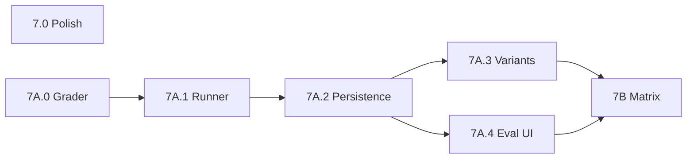

# RapidUI v0.2 — Implementation Plan

Scaffold for building v0.2 **one phase at a time**. Each phase has goals, scope, and a completion checklist. When starting a phase, point an agent here **and** at the reference doc — the agent should investigate gaps and expand that phase into a detailed execution plan.

**Reference (decisions & design — do not duplicate):** [rapidui-v0.2.md](./rapidui-v0.2.md)

**v0.1 build record:** [rapidui-mvp-v0.1-implementation.md](./rapidui-mvp-v0.1-implementation.md)

---

## How to use this document

1. Pick the **next phase** in build order (see below).
2. Read the phase section here + the linked **Reference §** in `rapidui-v0.2.md`.
3. Ask the agent to: audit the repo, resolve **Open questions** for that phase, and produce a step-by-step plan before coding.
4. Check off the phase **Checklist** before moving on.

**Do not** implement later phases before dependencies are done. Area 2 (schema) is the **critical path** for agent + main UI.

---

## Build order

```txt
Phase 0  Infra
   │
   ├─► Phase 1  API telemetry
   │      │
   │      ├─► Phase 2  Operations schema + docs + eval cases  ◄── critical path
   │      │      │
   │      │      ├─► Phase 4  RapidUI Agent
   │      │      │      └─► Phase 5  Main UI
   │      │      │
   │      │      └─► Phase 5 also needs Phase 2 (inspector)
   │      │
   │      └─► Phase 3  Observe API dashboard
   │             └─► Phase 6  Observe Agent dashboard (needs Phase 4)
   │                    Phase 6 P0 telemetry correctness — gate before 6 UI
   │
   └─► Phase 7  Polish + eval harness (after 1–6)
          7.0 portfolio polish (required ship)
          7A.0–7A.4 eval harness (grader → runner → persistence → UI)
          7B model/prompt comparison (stretch O5)
```

**Recommended sequence:** `0 → 1 → 2 → 4 → 5` in parallel with `3`; then **6 P0 → 6**; then **7.0** in parallel with **7A.0 → 7A.1 → …**; **7B** last.

Eval automation (Phase 7A) must **not** block Phases 4–6 or portfolio ship (7.0). Model matrix (7B / stretch O5) must **not** run until grader + runner are trusted. Ship with default `o4-mini` + `v1`; matrix confirms or changes default before portfolio freeze.

---

## Ship criteria map

| Criterion | Primary phase(s) |
|-----------|------------------|
| S1 Fresh Neon | 0 |
| S2 Operations schema 0.2 | 2 |
| S3 API telemetry | 1 |
| S4 Observe `/observe/api` + `/observe/agent` | 3, 6 |
| S5 RapidUI Agent | 4 |
| S6 Main UI | 5 |
| S7 Use cases 1–3 E2E | 4, 5 |
| S8 Path B external agent in Observe | 1, 3 |
| S9 Monorepo + Render agent | 0, 4 |
| O5 Eval lab | 7B (after 7A harness) |

Full definitions: reference **§15**.

---

## Phase index

| Phase | Name | Reference § |
|-------|------|-------------|
| **0** | Infra baseline | §4, §9 Area 0, §10 |
| **1** | API telemetry | §4, §9 Area 1, §10, §14 |
| **2** | Operations schema + docs + eval cases | §6, §7, §9 Area 2, §14 |
| **3** | Observe hub + API dashboard | §5, §9 Area 3 |
| **4** | RapidUI Agent (FastAPI) | §4, §8, §9 Area 4, §11 |
| **5** | Main UI (chat + inspector) | §5, §6, §9 Area 5 |
| **6** | Observe Agent dashboard — **observability** (+ **6 P0** telemetry) | §9 Area 6 |
| **7** | Polish + **eval harness** (**7.0**, **7A**, **7B**) | §9 Area 7, §14, §15 O* |

**Cross-cutting (Phases 4–7):** [Appendix C — Agent strengthening, tracing & eval](#appendix-c--agent-strengthening-tracing--eval-strategy) · [Appendix D — Industry alignment & v0.3 backlog](#appendix-d--industry-alignment--v03-backlog)

---

# Phase 0 — Infra baseline

**Reference:** §4 (monorepo, domains), §9 Area 0, §10 (tables sketch), §15 S1/S9, §16 (deferrals)

**Status:** Complete (verified 2026-07-18 — local + prod + Render).

### Goal

Fresh Neon Postgres, monorepo layout for two deploy targets (Vercel + Render), and scaffolding so later phases can write telemetry and run the agent service.

### Depends on

Nothing.

### Unlocks

All other phases.

---

### Neon database (locked — reference §3 #11, #21, §15 S1)

v0.2 uses a **fresh, empty Neon Postgres database**. This is a locked product decision — not optional.

| Requirement | Meaning |
|-------------|---------|
| **Fresh Neon** | New empty database for v0.2. Run migrations from scratch (`001`–`005`). No v0.1 specs or eval rows carried over. |
| **No Vercel Postgres migration** | Do **not** export/import or ETL data from the v0.1 production store. Do **not** keep using the old v0.1 DB as the v0.2 store. |
| **Neon driver in code** | Replace deprecated `@vercel/postgres` with `@neondatabase/serverless` directly. Same `DATABASE_URL` env var; different npm package. |
| **Shared DB for v0.2** | One Neon database serves Vercel (Next.js) and receives agent telemetry via ingest. Render agent does **not** connect to Neon directly in v0.2 — it POSTs to the platform ingest API (Phase 1). |

**Vercel Integrations showing “Neon” is fine** — that is the expected host. The integration is how you provision and wire `DATABASE_URL`. What matters is that the connection string points at a **new database**, not the v0.1 production database that already holds old specs.

```txt
✅ Do                                    ❌ Don't
────────────────────────────────────    ────────────────────────────────────
Create new Neon project or new DB       Reuse v0.1 prod DB + migrate rows
  in existing Neon account
Point Vercel DATABASE_URL at new URL    Keep @vercel/postgres in package.json
Run npm run db:migrate (empty → 5 tables)  Assume Vercel Neon link = v0.2-ready
Use @neondatabase/serverless            Copy v0.1 eval_runs / specs into v0.2
```

**How to provision (pick one):**

1. **Neon console** — [console.neon.tech](https://console.neon.tech): new project → copy **pooled** connection string → paste into Vercel env (Production + Preview + Development) and `.env.local`.
2. **Vercel Neon integration** — add/link Neon, but create a **new database or project** for v0.2; update `DATABASE_URL` to that URL. Disconnect or leave the old v0.1 integration/database unused for v0.2.

After cutover, v0.1 production data remains in the old database for archive/reference only — v0.2 demo and Observe start clean.

---

### Repo audit (2026-07-18)

| Area | Current state | Phase 0 action |
|------|---------------|----------------|
| **Postgres driver** | `@vercel/postgres` in `lib/db/client.ts` + `package.json` | Replace with `@neondatabase/serverless`; keep tagged-template API shape so `specs.ts` / `evalRuns.ts` need minimal changes |
| **Migrations** | `001_specs.sql`, `002_eval_runs.sql`; runner in `scripts/migrate.ts` | Add `003_api_events.sql`, `004_agent_runs.sql`, `005_agent_turns.sql`; register in `MIGRATIONS` array |
| **`lib/observe/`** | Missing | Create `writes.ts` (Zod ingest schemas + stub writers) |
| **Ingest route** | Missing | Create `app/api/observe/ingest/agent/route.ts` — validate body, return 200; no DB writes until Phase 1 |
| **`agent/`** | Missing entirely | New FastAPI skeleton: `GET /health`, CORS, `prompts/` dir |
| **`.env.example`** | Still says “Vercel Postgres” | Document Neon `DATABASE_URL` + agent vars (Render) |
| **README** | References Vercel Postgres | Update DB section to Neon (minimal — full v0.2 README is Phase 7) |
| **Neon database** | v0.1 prod likely on legacy Vercel Postgres or first Neon link (has old specs) | **Manual:** new **empty** Neon DB; new `DATABASE_URL` on Vercel — see **Neon database (locked)** above |
| **Render + DNS** | Not configured | **Manual:** Render web service (`agent/` root), CNAME `agent.rapidui.dev` |
| **Golden RUIs** | UC1–UC4 staged in git | **Phase 2** — ignore for Phase 0 |

**v0.1 code that must keep working after Phase 0:** `POST/GET /api/specs`, `eval:log`, `smoke:specs`, `smoke:eval` — against the **new** Neon DB (empty store is fine).

---

### Resolved open questions

| Question | Decision |
|----------|----------|
| Migration tool / folder | Keep v0.1 pattern: SQL files in `lib/db/migrations/`, applied by `npm run db:migrate` (`scripts/migrate.ts`). Idempotent `CREATE TABLE IF NOT EXISTS`. |
| Neon driver | `@neondatabase/serverless` — `neon(process.env.DATABASE_URL!)`. Wrap in `lib/db/client.ts` so `sql` tagged templates still return `{ rows }` (matches existing `specs.ts` / `evalRuns.ts`). Update `sql.query()` for raw migration files. |
| `agent_runs` / `agent_turns` SQL | **Phase 0:** create tables with all columns from reference §4 + Phase 1 sketch (below). **Phase 1:** wire inserts + indexes tuning; **Phase 7:** `eval_runs` column extensions only. |
| CORS on Render | FastAPI `CORSMiddleware`: `allow_origins=["https://rapidui.dev", "http://localhost:3000"]`, `allow_methods=["GET","POST","OPTIONS"]`, `allow_headers=["*"]`, `allow_credentials=False`. Preflight from browser before Phase 4 `/chat` exists — test with `OPTIONS` + dummy `POST` from localhost. |
| Ingest auth | None (reference §3 #26). Stub route accepts JSON only; no API key. |
| Monorepo ignore rules | No Turborepo. Vercel deploys repo root; Render sets root directory `agent/`. Optional: add `agent/.python-version` or `runtime.txt` for Render Python pin. |
| Neon vs Vercel integration | Neon **is** the database; Vercel integration is optional provisioning UI | Must be a **new empty** Neon database (§3 #21). Integration alone does not satisfy “fresh” if it still points at v0.1 data. |
| Old v0.1 database | Keep or delete separately — out of scope | Do not migrate rows; do not point v0.2 `DATABASE_URL` at v0.1 prod unless intentionally resetting that same empty DB (prefer new DB). |

---

### Task list (build order)

#### A — Fresh Neon + driver swap (platform)

1. **Provision fresh Neon database** — new Neon project *or* new database in Neon console; must be **empty** (no v0.1 specs/eval rows). Copy **pooled** connection string.
2. **Vercel env:** set `DATABASE_URL` to the **new** URL for Production + Preview + Development. Leave old v0.1 database disconnected from this project (archive only).
3. **Local:** `vercel env pull .env.local` (or paste the new Neon URL into `.env.local`).
4. **Dependencies:** remove `@vercel/postgres`; add `@neondatabase/serverless`.
5. **Rewrite `lib/db/client.ts`:** Neon client + thin wrapper preserving `{ rows }` return shape and `sql.query(text)` for migrations.
6. **Verify store layer on fresh Neon:** run `npm run smoke:specs` and `npm run smoke:eval` (insert + read on empty DB).

#### B — v0.2 table migrations

7. Add migration files (see SQL below).
8. Extend `scripts/migrate.ts` `MIGRATIONS` array through `005`.
9. Run `npm run db:migrate` on local Neon; confirm five tables exist (`specs`, `eval_runs`, `api_events`, `agent_runs`, `agent_turns`).

#### C — Observe ingest scaffold (platform)

10. Create `lib/observe/schemas.ts` (or inline in `writes.ts`) — Zod types for agent ingest payload (minimal: `session_id`, optional `run`, optional `turns[]`).
11. Create `lib/observe/writes.ts` — export schemas + **stub** `insertAgentRun` / `insertAgentTurn` (throw `not implemented` or no-op; Phase 1 implements Neon inserts).
12. Create `app/api/observe/ingest/agent/route.ts` — `POST` parses JSON, Zod-validates, returns `{ ok: true }` with 200; 400 on bad payload.

#### D — Python agent skeleton (Render target)

13. Create `agent/pyproject.toml` — FastAPI, uvicorn, pydantic (Pydantic AI deferred to Phase 4).
14. Create `agent/main.py` — `GET /health` → `{ "status": "ok" }`; CORS middleware per above.
15. Create `agent/prompts/.gitkeep` (or empty `v1.txt` placeholder — real prompt in Phase 4).
16. Create `agent/README.md` — local run (`uvicorn main:app`), Render setup (root dir `agent/`), env vars for later phases.
17. Optional: `agent/render.yaml` blueprint (build/start commands) to speed Render setup.

#### E — Deploy + DNS (manual, after D)

18. **Render:** new Web Service, repo connected, root directory `agent/`, build `pip install -e .` or `pip install .`, start `uvicorn main:app --host 0.0.0.0 --port $PORT`.
19. **DNS:** CNAME `agent.rapidui.dev` → Render hostname.
20. **Smoke:** `curl https://agent.rapidui.dev/health` → 200.
21. **CORS smoke:** from browser console on `http://localhost:3000`, `fetch("https://agent.rapidui.dev/health")` succeeds; `OPTIONS` preflight returns allowed origin.

#### F — Docs + env template

22. Update `.env.example` — Neon URL comment, `RAPIDUI_BASE_URL`, document Render-side vars (`OPENAI_API_KEY`, `RAPIDUI_BASE_URL`, optional agent overrides) as comments-only until Phase 4.
23. Update README “Database migration” + env table — Neon, five migrations, note fresh DB (no v0.1 data carry-over).

---

### Files to create / modify

**Create**

```txt
lib/db/migrations/003_api_events.sql
lib/db/migrations/004_agent_runs.sql
lib/db/migrations/005_agent_turns.sql
lib/observe/writes.ts          # + schemas (split optional)
app/api/observe/ingest/agent/route.ts
agent/pyproject.toml
agent/main.py
agent/README.md
agent/prompts/.gitkeep
agent/render.yaml              # optional
```

**Modify**

```txt
package.json                   # @neondatabase/serverless; drop @vercel/postgres
package-lock.json              # via npm install
lib/db/client.ts               # Neon driver wrapper
scripts/migrate.ts             # register 003–005
.env.example
README.md                      # Neon + migration count (minimal)
```

---

### Migration SQL (Phase 0 — minimal but complete columns)

`003_api_events.sql` — from reference §10:

```sql
CREATE TABLE IF NOT EXISTS api_events (
  id            UUID PRIMARY KEY DEFAULT gen_random_uuid(),
  occurred_at   TIMESTAMPTZ NOT NULL DEFAULT NOW(),
  endpoint      TEXT NOT NULL,
  session_id    TEXT,
  agent         TEXT,
  eval_case_id  TEXT,
  intent        TEXT,
  valid         BOOLEAN,
  error_codes   TEXT[],
  spec_id       UUID REFERENCES specs(id),
  duration_ms   INT
);
CREATE INDEX IF NOT EXISTS api_events_occurred_idx ON api_events (occurred_at DESC);
CREATE INDEX IF NOT EXISTS api_events_session_idx ON api_events (session_id);
```

`004_agent_runs.sql` — session summary (finalize ingest mapping in Phase 1):

```sql
CREATE TABLE IF NOT EXISTS agent_runs (
  id                UUID PRIMARY KEY DEFAULT gen_random_uuid(),
  session_id        TEXT NOT NULL UNIQUE,
  started_at        TIMESTAMPTZ NOT NULL DEFAULT NOW(),
  finished_at       TIMESTAMPTZ,
  outcome           TEXT,
  spec_id           UUID REFERENCES specs(id),
  validate_attempts INT,
  model             TEXT,
  provider          TEXT,
  prompt_version    TEXT,
  eval_case_id      TEXT,
  total_tokens      INT,
  latency_ms        INT,
  intent            TEXT,
  error_summary     TEXT
);
CREATE INDEX IF NOT EXISTS agent_runs_started_idx ON agent_runs (started_at DESC);
```

`005_agent_turns.sql`:

```sql
CREATE TABLE IF NOT EXISTS agent_turns (
  id                UUID PRIMARY KEY DEFAULT gen_random_uuid(),
  run_id            UUID NOT NULL REFERENCES agent_runs(id),
  turn_index        INT NOT NULL,
  latency_ms        INT,
  input_tokens      INT,
  output_tokens     INT,
  had_validate_call BOOLEAN NOT NULL DEFAULT FALSE,
  had_save          BOOLEAN NOT NULL DEFAULT FALSE,
  UNIQUE (run_id, turn_index)
);
```

**Note:** If Neon’s HTTP driver rejects multi-statement `sql.query()` files, split each `CREATE INDEX` into its own migration file or execute statements sequentially in `migrate.ts`.

---

### Ingest stub contract (Phase 0)

Phase 0 validates shape only; Phase 1 adds real inserts + shared schema doc for `agent/`.

Minimal JSON (Zod):

```json
{
  "session_id": "uuid-or-string",
  "run": {
    "outcome": "saved",
    "spec_id": "optional-uuid"
  },
  "turns": [
    { "turn_index": 0, "latency_ms": 1200, "had_validate_call": true }
  ]
}
```

Route: `POST /api/observe/ingest/agent` → 200 `{ "ok": true }` | 400 RFC 9457 problem response on validation failure.

---

### Test plan (before checking boxes)

| Step | Command / action | Expected |
|------|------------------|----------|
| Driver swap | `npm run smoke:specs` | Pass against Neon (empty or with new row) |
| Migrations | `npm run db:migrate` | All five SQL files log “applied”; re-run idempotent |
| Table check | `psql $DATABASE_URL -c '\dt'` or Neon console | Five tables listed |
| Ingest stub | `curl -X POST localhost:3000/api/observe/ingest/agent -H 'Content-Type: application/json' -d '{"session_id":"test"}'` | 200 |
| Ingest bad payload | POST `{}` | 400 |
| Agent local | `cd agent && uvicorn main:app --reload` → `curl localhost:8000/health` | `{ "status": "ok" }` |
| Agent prod | `curl https://agent.rapidui.dev/health` | 200 after Render + DNS |
| CORS | Browser `fetch` from localhost to agent health URL | No CORS error |
| Vercel | Deploy preview; POST `/api/specs` with golden JSON | 201 (confirms Neon on Vercel) |

---

### Out of scope

- Full ingest DB writes (Phase 1)
- `insertApiEvent()` / validate-save middleware (Phase 1)
- Operations schema (Phase 2)
- `POST /chat`, Pydantic AI, tools (Phase 4)
- Observe UI (Phases 3, 6)
- `eval_runs` v0.2 column extensions (Phase 7)

### Checklist

- [x] **Fresh Neon** — new empty database provisioned; `DATABASE_URL` updated on Vercel + local (not the v0.1 prod database)
- [x] Neon live; local + Vercel connect successfully against the **new** DB
- [x] `@neondatabase/serverless` replaces `@vercel/postgres`; store smokes pass on fresh DB
- [x] All five tables exist after `db:migrate` (`specs`, `eval_runs`, `api_events`, `agent_runs`, `agent_turns`)
- [x] `agent/` runs locally (`GET /health` + CORS preflight on `localhost:3000`)
- [x] Render deploy succeeds; `agent.rapidui.dev/health` responds
- [x] CORS allows `rapidui.dev` (+ localhost dev) → agent (preflight verified)
- [x] Ingest route stub returns 200 / validates payload shape (local + prod)
- [x] `.env.example` documents all required vars (platform + agent comments)

---

# Phase 1 — API telemetry foundation

**Reference:** §4 (telemetry flow), §9 Area 1, §10 (`api_events`), §12, §14 (headers)

**Status:** Complete (verified 2026-07-18 — local Neon + smoke tests).

### Goal

Platform records **every validate/save** from all agents (external + ours). Agent ingest route persists `agent_runs` / `agent_turns` from FastAPI. Satisfies ship criterion **S3** (telemetry + documented headers).

### Depends on

Phase 0 (`api_events`, `agent_runs`, `agent_turns` tables exist; ingest route stub; `lib/observe/schemas.ts`).

### Unlocks

Phase 3 (Observe API dashboard), Path B external-agent demo (**S8**), Phase 4 agent telemetry POST.

---

### Repo audit (2026-07-18)

| Area | Current state | Phase 1 action |
|------|---------------|----------------|
| **`api_events` table** | Migration `003` applied in Phase 0 | Wire `insertApiEvent()` — no schema change |
| **`agent_runs` / `agent_turns`** | Migrations `004`–`005` applied | Implement upsert inserts in `writes.ts` |
| **`lib/observe/schemas.ts`** | `agentIngestPayloadSchema` only | Add `apiEventInputSchema`, export header name constants |
| **`lib/observe/writes.ts`** | Stub `insertAgentRun` / `insertAgentTurn` throw; ingest validates only | Implement all three insert/upsert functions |
| **`lib/observe/headers.ts`** | Missing | Parse optional `X-RapidUI-*` headers from `Request` |
| **`lib/observe/telemetry.ts`** | Missing | `recordApiEvent()` helper — timing + field mapping; called from route handlers |
| **`POST /api/validate`** | Validates only; no telemetry | Call `recordApiEvent()` before every response |
| **`POST /api/specs`** | Validates + saves; no telemetry | Same — log `spec_id` on 201 |
| **`POST /api/observe/ingest/agent`** | Zod validate → `{ ok: true }`; no DB | Call `ingestAgentTelemetry()` → upsert run + turns |
| **`GET /api/docs`** | v0.1 block-tree docs; no headers | Add **`telemetry`** section + optional headers on validate/specs API entries (**header docs only** — full operations rewrite is Phase 2) |
| **`eval/manual/wrapper_*.txt`** | v0.1 workflow; no session headers | Add telemetry header block + curl `-H` examples |
| **`agent/README.md`** | Points at ingest URL (Phase 1) | Link to shared ingest schema doc |
| **`scripts/smoke-observe.ts`** | Missing | New smoke: api_events insert + ingest upsert |
| **`POST /api/eval/log`** | Does not exist; CLI `eval:log` works | **Out of scope** — defer to Phase 7 stretch **O3** |

**v0.1 behavior that must keep working:** validate/specs responses unchanged; telemetry failures must **not** break API responses.

---

### Resolved open questions

| Question | Decision |
|----------|----------|
| **“Middleware” vs route handlers** | **Route-handler instrumentation**, not root `middleware.ts`. Body must be parsed for `valid` / `error_codes`; handler owns `duration_ms`. Reference §4 “middleware” = platform layer outside the LLM — implement as shared helper called from `app/api/validate/route.ts` and `app/api/specs/route.ts`. |
| **Which endpoints log `api_events`** | **`POST /api/validate`** and **`POST /api/specs` only** — every request, including transport failures (HTTP 400). Do **not** log `GET /api/specs/:id`. |
| **Telemetry insert failure** | **Non-blocking.** Wrap insert in try/catch; `console.error`; always return the same HTTP response the route would return without telemetry. |
| **`valid` / `error_codes` mapping** | Transport failure (400): `valid: null`, `error_codes: ['INVALID_JSON']` (or first transport code). Semantic failure (200, `valid: false`): `valid: false`, codes from `errors[].code`. Success validate: `valid: true`, empty codes. Specs 201: `valid: true`, `spec_id` set. Specs 200 valid:false: same as validate failure. Specs 503: `valid: true`, `spec_id: null` (validation passed, storage failed). |
| **`duration_ms`** | `Date.now()` delta from start of route handler to just before response (includes validation + DB save). |
| **Optional headers** | Phase 1: read if present. **Phase 3B (locked):** **`X-RapidUI-Session-Id` required** on guarded routes; trim whitespace; empty → 400 `MISSING_SESSION_ID`. **`X-RapidUI-Agent`** recommended. |
| **Header names (locked)** | `X-RapidUI-Session-Id`, `X-RapidUI-Agent`, `X-RapidUI-Eval-Case`, `X-RapidUI-Intent` — per reference §12, §14. |
| **Ingest auth / rate limiting** | **None** — reference §3 #26. Public ingest endpoint; same as Phase 0 stub. |
| **Ingest upsert semantics** | `agent_runs`: **`INSERT … ON CONFLICT (session_id) DO UPDATE`** — merge non-null fields from payload; preserve `started_at` on conflict; set `finished_at` when `run.outcome` or `run.finished_at` provided. `agent_turns`: **`INSERT … ON CONFLICT (run_id, turn_index) DO UPDATE`** — replace turn metrics. Route ensures a run row exists before inserting turns (create minimal run if only `turns[]` sent). |
| **`run.outcome` values** | `'saved' \| 'failed' \| 'abandoned'` — Zod enum already in `schemas.ts`. Store as TEXT in DB. |
| **`started_at` / `finished_at` in ingest** | Optional ISO strings in payload; if omitted, DB defaults (`started_at` = first insert time; `finished_at` set only when outcome/finished_at sent). Phase 4 FastAPI may send explicit timestamps later. |
| **Shared ingest schema location** | **`lib/observe/INGEST.md`** — canonical JSON examples + field table; `agent/README.md` links here. Keeps contract in platform tree (single source of truth per §4). |
| **`POST /api/eval/log`** | **Defer to Phase 7 (O3).** Phase 1 keeps **`npm run eval:log`** CLI only. Eval runs do not need new columns until eval lab. |
| **`eval_runs` column extensions** | **Phase 7 only** — no migration in Phase 1. |
| **Docs rewrite for operations schema** | **Phase 2.** Phase 1 adds telemetry headers to existing v0.1 `/api/docs` payload only. |
| **Wrapper v0.2 case ids** | Phase 1: document headers + session id generation. Case id placeholders stay `{{CASE_ID}}` until Phase 2 eval cases land; mention v0.2 case ids in comment only. |

---

### Architecture (Phase 1)

```txt
POST /api/validate | /api/specs
        │
        ▼
  route handler (existing validate/save logic)
        │
        ├──► HTTP response to agent (unchanged)
        │
        └──► recordApiEvent() ──► insertApiEvent() ──► Neon api_events
                    ▲
                    └── parseTelemetryHeaders(request)


POST /api/observe/ingest/agent  (from Render FastAPI in Phase 4)
        │
        ▼
  Zod validate body
        │
        └──► ingestAgentTelemetry()
                  ├── upsert agent_runs (by session_id)
                  └── upsert agent_turns (by run_id + turn_index)
```

---

### Task list (build order)

#### A — Shared observe layer

1. **`lib/observe/headers.ts`** — export header name constants + `parseTelemetryHeaders(request: Request)` returning `{ sessionId, agent, evalCaseId, intent } | null fields`.
2. **Extend `lib/observe/schemas.ts`** — add `apiEventInputSchema` + exported type `ApiEventInput` (fields matching `api_events` columns except `id` / `occurred_at`).
3. **Implement `insertApiEvent(input: ApiEventInput)`** in `writes.ts` — Zod parse → `INSERT INTO api_events … RETURNING id`.
4. **`lib/observe/telemetry.ts`** — export `recordApiEvent({ request, endpoint, result, httpStatus, specId?, startedAt })` — maps `ValidationResult` → `valid` + `error_codes`, merges headers, calls `insertApiEvent` in try/catch.

#### B — Wire validate/save routes

5. **`app/api/validate/route.ts`** — `const startedAt = Date.now()` at top; after result known, `await recordApiEvent(...)` before each `return` (200 success, 200 invalid, 400 transport).
6. **`app/api/specs/route.ts`** — same pattern; pass `specId: saved.specId` on 201; handle 200 valid:false, 503, 400.

#### C — Agent ingest (full implementation)

7. **Implement `upsertAgentRun(sessionId, run?)`** — returns `{ id, sessionId }`.
8. **Implement `upsertAgentTurn(runId, turn)`** — returns `{ id }`.
9. **Implement `ingestAgentTelemetry(payload: AgentIngestPayload)`** — orchestrates run + turns array in one transaction-like sequence (sequential awaits OK for v0.2).
10. **Update `app/api/observe/ingest/agent/route.ts`** — call `ingestAgentTelemetry`; return `{ ok: true, runId }` on success; 500 only if DB throws (ingest is service path — unlike public API, a 500 on DB failure is acceptable; log error).
11. **Remove or repurpose `validateAgentIngestPayload`** — redundant with Zod; keep only if extra business rules needed.

#### D — Documentation + eval wrappers

12. **`lib/observe/INGEST.md`** — full ingest contract (JSON examples, upsert behavior, field tables for `agent_runs` + `agent_turns`).
13. **Update `lib/docs/index.ts`** — add `telemetry` object to docs payload: header names, purpose, example curl; add `optionalHeaders` array on validate/specs API sections.
14. **Update `eval/manual/wrapper_local.txt` and `wrapper_prod.txt`** — new **Telemetry** section: generate `SESSION_ID=$(uuidgen)` (or equivalent), pass four headers on every validate/save curl.
15. **Update `agent/README.md`** — link to `../lib/observe/INGEST.md`; note Phase 4 will POST this shape.

#### E — Smoke + verify

16. **`scripts/smoke-observe.ts`** — (1) POST validate with headers against local or `BASE_URL`; query `api_events` count ≥ 1; (2) POST ingest sample payload; verify `agent_runs` + `agent_turns` rows.
17. **`package.json`** — add `"smoke:observe": "tsx --env-file=.env.local scripts/smoke-observe.ts"`.

---

### Files to create / modify

**Create**

```txt
lib/observe/headers.ts
lib/observe/telemetry.ts
lib/observe/INGEST.md
scripts/smoke-observe.ts
```

**Modify**

```txt
lib/observe/schemas.ts          # apiEventInputSchema
lib/observe/writes.ts           # insertApiEvent, upsertAgentRun/Turn, ingestAgentTelemetry
app/api/validate/route.ts       # recordApiEvent calls
app/api/specs/route.ts          # recordApiEvent calls
app/api/observe/ingest/agent/route.ts
lib/docs/index.ts               # telemetry + optionalHeaders in API sections
eval/manual/wrapper_local.txt
eval/manual/wrapper_prod.txt
agent/README.md
package.json                    # smoke:observe script
```

---

### `insertApiEvent` input (Zod)

Maps 1:1 to `api_events` (Phase 0 migration — no DDL change):

| Field | Type | Source |
|-------|------|--------|
| `endpoint` | `'/api/validate' \| '/api/specs'` | Route constant |
| `session_id` | `string \| null` | `X-RapidUI-Session-Id` |
| `agent` | `string \| null` | `X-RapidUI-Agent` |
| `eval_case_id` | `string \| null` | `X-RapidUI-Eval-Case` |
| `intent` | `string \| null` | `X-RapidUI-Intent` |
| `valid` | `boolean \| null` | `true` / `false` / `null` (transport) |
| `error_codes` | `string[] \| null` | `errors[].code` or `null` when valid |
| `spec_id` | `uuid \| null` | POST /api/specs 201 only |
| `duration_ms` | `number` | Handler timing |

`id` and `occurred_at` — DB defaults.

---

### Agent ingest JSON contract (canonical — also in `INGEST.md`)

**Endpoint:** `POST /api/observe/ingest/agent`  
**Auth:** none  
**Success:** `200 { "ok": true, "runId": "<uuid>" }`  
**Validation error:** `400` with `INVALID_INGEST_PAYLOAD`

#### Minimal (run summary only — Phase 4 end-of-session)

```json
{
  "session_id": "550e8400-e29b-41d4-a716-446655440000",
  "run": {
    "outcome": "saved",
    "spec_id": "6ba7b810-9dad-11d1-80b4-00c04fd430c8",
    "validate_attempts": 2,
    "model": "o4-mini",
    "provider": "openai",
    "prompt_version": "v1",
    "eval_case_id": "crud-admin-v0.2",
    "total_tokens": 4200,
    "latency_ms": 18500,
    "intent": "UC2",
    "error_summary": null,
    "finished_at": "2026-07-18T20:15:00.000Z"
  }
}
```

#### Per-turn update (mid-session — Phase 4 after each assistant reply)

```json
{
  "session_id": "550e8400-e29b-41d4-a716-446655440000",
  "turns": [
    {
      "turn_index": 0,
      "latency_ms": 3200,
      "input_tokens": 800,
      "output_tokens": 450,
      "had_validate_call": true,
      "had_save": false
    }
  ]
}
```

#### Combined (single POST)

```json
{
  "session_id": "550e8400-e29b-41d4-a716-446655440000",
  "run": { "outcome": "saved", "spec_id": "…", "validate_attempts": 1 },
  "turns": [{ "turn_index": 0, "latency_ms": 5000, "had_validate_call": true, "had_save": true }]
}
```

**Upsert rules:**

- Same `session_id` across all POSTs for one chat session.
- `session_id` on `agent_runs` is **UNIQUE** — later POSTs merge into the same row.
- `(run_id, turn_index)` on `agent_turns` is **UNIQUE** — re-posting a turn overwrites metrics.
- `spec_id` in ingest must reference an existing `specs.id` if provided (FK) — Phase 4 saves before ingest.

---

### Telemetry headers (for `/api/docs` + wrappers)

| Header | Required | Example | Stored on |
|--------|----------|---------|-----------|
| `X-RapidUI-Session-Id` | **Required** (guarded routes) | `550e8400-e29b-41d4-a716-446655440000` | `api_events.session_id`; joins to `agent_runs.session_id`. **Not required on `GET /llms.txt` only.** |
| `X-RapidUI-Agent` | Recommended | `claude`, `cursor`, `codex`, `rapidui-agent` | `api_events.agent` |
| `X-RapidUI-Eval-Case` | Eval runs only | `crud-admin-v0.2` | `api_events.eval_case_id` |
| `X-RapidUI-Intent` | Optional | `UC2 users admin` | `api_events.intent` |

**Wrapper addition (sketch):**

```txt
## Telemetry (v0.2)

Generate once per session:
  SESSION_ID=<uuid>

On every POST /api/validate and POST /api/specs, include:
  -H "X-RapidUI-Session-Id: $SESSION_ID"
  -H "X-RapidUI-Agent: claude"
  -H "X-RapidUI-Eval-Case: {{CASE_ID}}"
```

---

### Test plan (before checking boxes)

| Step | Command / action | Expected |
|------|------------------|----------|
| Unit path | `npm run smoke:observe` | Pass — api_event + ingest rows |
| Validate telemetry | `curl -X POST localhost:3000/api/validate -H 'Content-Type: application/json' -H 'X-RapidUI-Session-Id: test-1' -H 'X-RapidUI-Agent: manual' -d @fixture.json` | 200 + row in `api_events` with session/agent |
| Invalid JSON | POST validate with body `{` | 400 + `api_events` row with `valid` null |
| Save telemetry | POST golden RUI to `/api/specs` with same session header | 201 + row with `spec_id` populated |
| Ingest run | `curl -X POST localhost:3000/api/observe/ingest/agent -H 'Content-Type: application/json' -d '{"session_id":"ingest-1","run":{"outcome":"saved"}}'` | 200 `{ ok: true, runId }` + `agent_runs` row |
| Ingest turns | Same session + `turns:[{turn_index:0,had_validate_call:true}]` | `agent_turns` row linked to run |
| Ingest upsert | Repeat POST with updated `validate_attempts` | Single `agent_runs` row updated |
| Ingest bad payload | POST `{}` | 400 |
| Docs | `curl localhost:3000/api/docs \| jq '.sections'` or smoke:docs | Telemetry section present |
| Non-blocking | Temporarily break `DATABASE_URL` → validate still returns 200/400 | Response unchanged; error logged |
| Prod spot-check | Repeat one curl against `rapidui.dev` | Row visible in Neon console |

**SQL spot-check:**

```sql
SELECT endpoint, session_id, agent, valid, error_codes, spec_id, duration_ms
FROM api_events ORDER BY occurred_at DESC LIMIT 5;

SELECT session_id, outcome, validate_attempts FROM agent_runs ORDER BY started_at DESC LIMIT 5;
```

---

### Out of scope

- Observe dashboards (Phases 3, 6)
- FastAPI agent / `POST /chat` (Phase 4)
- Operations schema or v0.2 `/api/docs` rewrite (Phase 2)
- `POST /api/eval/log` (Phase 7 — **O3**)
- `eval_runs` column migrations (Phase 7)
- Ingest auth, rate limiting, IP allowlists
- `POST /api/observe/ingest/api-event` (optional future — not needed for v0.2)

### Checklist

- [x] `insertApiEvent()` writes Zod-validated rows to `api_events`
- [x] `POST /api/validate` and `POST /api/specs` call `recordApiEvent()` on every response path
- [x] Telemetry insert failure does not change API HTTP responses
- [x] Optional headers persisted when present; documented in `/api/docs`
- [x] *(Amendment — Phase 3B)* Headers become **required session id** on guarded routes; Phase 1 optional behavior superseded by §3 #37–38
- [x] `ingestAgentTelemetry()` upserts `agent_runs` + `agent_turns`
- [x] Ingest contract documented in `lib/observe/INGEST.md`; linked from `agent/README.md`
- [x] `eval/manual/wrapper_*.txt` include session header instructions
- [x] `npm run smoke:observe` passes locally
- [x] Manual test: validate + save with headers → `api_events` rows; ingest POST → agent tables

---

# Phase 2 — Operations schema + docs + eval cases

**Reference:** §6 (use cases), §7 (full schema), §9 Area 2, §14 (eval cases, scoring), §18

**Status:** Complete (verified 2026-07-19 — all smokes + build pass).

### Goal

Greenfield **operations-first** RUI v0.2 — Zod schemas, semantic validator (O1–O20), agent docs, golden fixtures, and eval cases. Satisfies ship criterion **S2**. Unblocks Phase 4 agent output and Phase 5 inspector data model.

### Depends on

Phase 0 (Postgres stable). Independent of Phase 1 telemetry (can run in parallel, but Phase 1 is already complete).

### Unlocks

Phases 4, 5; all v0.2 eval cases; use cases 1–3 (+ optional UC4 / O1).

---

### Repo audit (2026-07-19)

| Area | Current state | Phase 2 action |
|------|---------------|----------------|
| **`lib/registry/*`** | v0.1 Page → Section → block model; powers validate, `/api/schema`, docs, eval scoring, RuiInspector | **Remove** after `lib/operations/*` wired; migrate all imports |
| **`lib/operations/golden/`** | **Staged** — UC1–UC4 `.rui.json` files exist (804 lines total) | Audit against O1–O20 once validator exists; fix goldens if needed |
| **`lib/validate/*`** | v0.1 pipeline: `RuiSchema`, planned-gate, semantic checks for pages/navigation/tables | **Rewrite** — operations Zod parse + O1–O20 semantic modules |
| **`GET /api/schema`** | Returns `blocks`, `layouts`, `bindings`, `planned` | Replace payload with operations vocabulary (reference §7) |
| **`lib/docs/*`** | v0.1 prose (`Page`/`Section`/blocks); `DOCS_VERSION = "0.1"` | Rewrite markdown + API section for operations-first workflow |
| **`llms.txt`** | Block-tree discovery text | Rewrite for operations + flow patterns |
| **`eval/cases/`** | Only `support-dashboard-v0.1.json` (block-based criteria) | Add 3 required v0.2 cases; retire v0.1 case |
| **`eval/score.ts` / `lib/eval/scoreRun.ts`** | Scores `requiredBlocks` / `requiredBindings` via `collectBlocks.ts` | Replace with operation-aware scoring (`requiredOperations`, etc.) |
| **`eval/manual/wrapper_*.txt`** | Telemetry headers done (Phase 1); still says “block definitions” in workflow | Update workflow steps for operations discovery |
| **`scripts/smoke-*`** | Registry, validate, docs, eval, inspector smokes all assume v0.1 golden | Rewrite against UC goldens + v0.2 schema |
| **`lib/review/RuiInspector.tsx`** | Block-tree renderer | **Not** full rewrite (Phase 5) — add minimal v0.2 JSON fallback so app compiles and `/specs/:id` shows saved JSON |
| **Golden vs validator today** | UC goldens use `"version": "0.2"` — **fail** current validator (`VERSION_MISMATCH` expects `"0.1"`) | Expected; Phase 2 flips this |

**Golden inventory (already in git):**

| File | entities | ops | transitions | Notes |
|------|----------|-----|-------------|-------|
| `UC1-static-browse-v0.2.rui.json` | 2 | 2 | 0 | Static browse + header metrics |
| `UC2-crud-admin-v0.2.rui.json` | 1 | 4 | 5 | Scope selectors, cta/cancel, embedded delete |
| `UC3-ai-review-queue-v0.2.rui.json` | 1 | 2 | 1 | Embedded approve/reject `act` |
| `UC4-hr-ops-seed-v0.2.rui.json` | 3 | 6 | 4 | Optional UC4 seed (O1 stretch) |

**Known golden fix (audit before checklist):** UC2 `op-create-user` includes `context.breadcrumb` — reference §7 says breadcrumb belongs on `read`/`update` reached via transition, **not** on create entrypoints. Remove breadcrumb from create during golden audit.

---

### Resolved open questions

| Question | Decision |
|----------|----------|
| **UC4 seed: Neon vs file-only** | **Phase 2:** golden file + optional `spec-update-v0.2.json` eval case referencing golden by filename. **No Neon pre-seed required** for Phase 2 checklist. Optional stretch script `npm run seed:uc4` (save UC4 golden → print `specId`) for Phase 4 `load_spec` demo — defer unless pursuing O1 early. |
| **Which use-case variants ship** | **Phase 2:** canonical prompts only for 3 **required** cases (`static-browse-v0.2`, `crud-admin-v0.2`, `ai-review-queue-v0.2`). §7 variants V1–V6 → **Phase 7** (“at least one variant per UC” for portfolio polish). |
| **Golden files vs schema** | Goldens are the **acceptance fixtures** — implement schema + rules, then run `npm run smoke:validate` until all four pass. Fix goldens or rules; do not weaken rules to match mistakes. |
| **`registryVersion` response field** | **Keep field name** `registryVersion` in validate/save responses and DB columns — value becomes `"0.2"`. Avoid rename churn in telemetry and SavedSpec shape. |
| **`VALIDATION_VERSION` / `DOCS_VERSION`** | Bump both to **`"0.2"`**. |
| **`planned-gate` / PLANNED blocks** | **Remove** — v0.2 has no planned vocabulary; strict Zod + semantic rules only. |
| **v0.1 rejection behavior** | `version: "0.1"` (page-tree shape) → `VERSION_MISMATCH` with message requiring `"0.2"`. v0.2 doc with wrong top-level keys → Zod `UNKNOWN_PROP` / structural errors. |
| **Orphan operations (O14)** | **Warning** severity (`ORPHAN_OPERATION`) — does not fail validation; include in errors with distinct code or `severity: "warning"` if we extend error type. **v0.2 MVP:** emit as non-blocking warning in `errors[]` with code `ORPHAN_OPERATION` but still return `valid: true` if no errors-only failures — **simpler:** treat as error-level for agent feedback (reference lists as “warning” but agents should fix). **Locked:** emit `ORPHAN_OPERATION` as a **validation error** (fail) for v0.2 — keeps agent loop honest. |
| **RuiInspector during Phase 2–4** | Minimal shim: if `normalizedRui.version === "0.2"`, render operations placeholder + collapsible raw JSON (no block tree). Full operations inspector = **Phase 5**. |
| **`smoke-inspector`** | Update to assert v0.2 JSON fallback renders (not Page/Section labels). |
| **Eval `mode` field** | Add to `EvalCase`: `"guided" \| "single-shot"`. Required cases use `"guided"` + `conversationScript`. External manual runs stay single-shot. |
| **Retire v0.1 eval case** | Delete `eval/cases/support-dashboard-v0.1.json`; `smoke-eval.ts` scores UC1–UC3 goldens against all three required cases; `spec-update-v0.2` smoke deferred to Phase 4 (O1). |
| **Internal golden exposure** | Goldens stay **repo-only** — never in `/api/docs`, `llms.txt`, or agent prompts (reference §14). |

---

### Architecture (Phase 2)

```txt
POST /api/validate | /api/specs
        │
        ▼
  parseTransportRequest (unchanged)
        │
        ▼
  validateSpec(body)
        │
        ├── version gate → reject v0.1 (VERSION_MISMATCH)
        ├── OperationsRuiSchema (Zod strict)
        ├── mapZodIssues → operation-centric paths
        └── runSemanticChecks (O1–O20)
                  │
                  ├── ids, entities, operations, transitions
                  ├── outcomes, data bindings, presentations
                  └── scope propagation (O19)
        │
        ▼
  normalizeRui (deterministic sort: entities, operations, transitions)
        │
        ▼
  { valid: true, registryVersion: "0.2", normalizedRui }


GET /api/schema  ← getSchemaPayload() from lib/operations
GET /api/docs    ← rewritten markdown + API examples (operations paths in errors)
eval/score       ← collectFromOperations + successCriteria checklist
```

**Module layout (target):**

```txt
lib/operations/
  index.ts              # SCHEMA_VERSION, exports, getSchemaPayload()
  rui.ts                # root document schema
  entities.ts           # entities[], scope.selectors
  operations.ts         # operation types, presentations, embedded actions
  transitions.ts
  outcomes.ts
  data.ts               # static | api bindings
  ids.ts                # ent-*, op-* patterns
  rules.ts              # O1–O20 catalog for /api/schema

lib/validate/
  pipeline.ts           # rewrite — import from @/lib/operations
  normalize.ts          # rewrite — sort entities/operations/transitions
  messages.ts           # rewrite ERROR_CATALOG for operation codes
  semantic/
    index.ts
    ids.ts
    entities.ts
    operations.ts
    transitions.ts
    outcomes.ts
    data.ts
    presentations.ts
    scope.ts
  fixtures/             # v0.1-reject, duplicate op id, invalid transition, …
```

---

### Task list (build order)

#### A — Operations schema (Zod)

1. **`lib/operations/ids.ts`** — `ent-{name}`, `op-{name}` patterns; shared `isValidId()` (reuse v0.1 kebab rules or tighten per §7).
2. **`lib/operations/outcomes.ts`** — `OutcomeNavigate`, `OutcomeStay`, mutating outcome shapes.
3. **`lib/operations/data.ts`** — `static` \| `api`; `read` / `write` / `invoke` bindings; `records[]`, `bodyMap`.
4. **`lib/operations/operations.ts`** — discriminated union on `type`: `browse` \| `read` \| `create` \| `update` \| `delete`; presentation layouts (`table`, `form`, `detail`, `confirm`); embedded `actions[]` on `read`.
5. **`lib/operations/transitions.ts`** — `trigger`: `row` \| `link` \| `cta` \| `cancel`; optional `label`, `placement`, `map`.
6. **`lib/operations/entities.ts`** — `entrypoints`, `operationIds`, optional `scope.selectors`.
7. **`lib/operations/rui.ts`** — root: `version: "0.2"`, `app`, `entities[]`, `operations[]`, `transitions[]` (all `.strict()`).
8. **`lib/operations/rules.ts`** — O1–O20 rule catalog for `/api/schema`.
9. **`lib/operations/index.ts`** — export types/schemas; **`getSchemaPayload()`** per reference §7 (`operationTypes`, `presentationLayouts`, `flowPatterns`, `embeddedActionTypes`, `transitionTriggers`, compact `examples` — no full goldens).

#### B — Validator rewrite

10. **`lib/validate/version.ts`** — `VALIDATION_VERSION = "0.2"`.
11. **Remove `planned-gate.ts`** and all imports.
12. **Rewrite `pipeline.ts`** — early `version !== "0.2"` check; parse with `OperationsRuiSchema`; semantic checks; return `registryVersion: SCHEMA_VERSION`.
13. **Rewrite `zod-mapper.ts`** — paths like `operations[3].presentation.fields[0].name`.
14. **Implement semantic modules O1–O20** (split files above) — errors cite `operationId`, transition index, entity id.
15. **Rewrite `messages.ts`** — new `RuleCode` set + `ERROR_CATALOG` templates (operation-centric hints).
16. **Rewrite `normalize.ts`** — stable sort: entity id, operation id, transition `(from,to,trigger)`, form field names, table columns.

#### C — Golden audit + acceptance

17. Run validator against UC1–UC4; fix goldens (e.g. UC2 create breadcrumb) until all pass.
18. Replace `lib/validate/fixtures/*` — v0.1 page-tree rejection, duplicate operation id, missing `cta` when create exists (O18), invalid transition map (O6).
19. Remove dependency on `lib/registry/golden/support-dashboard.rui.json`.

#### D — Agent docs + schema API

20. **Rewrite `lib/docs/content/overview.md`** — operations-first thesis; v0.2 scope table.
21. **Rewrite `lib/docs/content/workflow.md`** — plan ops → map → validate → save (reference §7); update example error paths.
22. **Replace `nesting.md`** with **`operations.md`** (or rewrite in place) — entities, operation types, transitions, outcomes, embedded actions — **not** Page/Section tree.
23. **Update `lib/docs/index.ts`** — `DOCS_VERSION = "0.2"`; API section documents `version: "0.2"`, operations error examples; inspector note = operations view (Phase 5).
24. **Update `lib/docs/llms.ts`** — operations-first discovery blurb.
25. **`app/api/schema/route.ts`** — import `getSchemaPayload` from `@/lib/operations`.
26. **Update `eval/manual/wrapper_*.txt`** — “operations vocabulary” instead of blocks; list v0.2 case ids.

#### E — Eval cases + scoring

27. **Extend `eval/types.ts`** — `mode`, `conversationScript`, new `successCriteria` fields; deprecate `requiredBlocks` / `requiredBindings`.
28. **Create eval cases:**
    - `eval/cases/static-browse-v0.2.json`
    - `eval/cases/crud-admin-v0.2.json`
    - `eval/cases/ai-review-queue-v0.2.json`
    - *(optional)* `eval/cases/spec-update-v0.2.json` with `seedGolden: "UC4-hr-ops-seed-v0.2"`
29. **Replace `lib/eval/collectBlocks.ts`** → **`lib/eval/collectOperations.ts`** — walk `operations[]`, `transitions[]`, embedded actions, API paths.
30. **Rewrite `lib/eval/scoreRun.ts`** — outcome checklist + `maxUserTurns` / `maxRetries` process caps.
31. **Delete `eval/cases/support-dashboard-v0.1.json`.**

#### F — Import migration + cleanup

32. Update **`lib/db/types.ts`**, **`lib/db/specs.ts`**, **`lib/db/hash.ts`** — import `Rui` from `@/lib/operations`.
33. **Minimal `RuiInspector` shim** — v0.2 JSON panel + “Operations inspector ships in Phase 5” notice.
34. **Delete `lib/registry/**`** (entire directory).
35. Update **`package.json`** script: `smoke:registry` → `smoke:operations` (or keep alias).

#### G — Smoke tests

36. **`scripts/smoke-operations.ts`** — schema version 0.2, strict mode, golden UC1 parses.
37. **`scripts/smoke-validate.ts`** — all UC goldens pass; v0.1 fixture rejected; normalization stable.
38. **`scripts/smoke-docs.ts`** — docs/schema version 0.2; no block vocabulary; UC1 validates.
39. **`scripts/smoke-eval.ts`** — save UC1–UC3 goldens; score against all three required v0.2 cases (`static-browse-v0.2`, `crud-admin-v0.2`, `ai-review-queue-v0.2`). **`spec-update-v0.2` / UC4 scoring smoke deferred to Phase 4 (O1)** — see **Eval smoke coverage** below.
40. **`scripts/smoke-inspector.ts`** — v0.2 fallback HTML includes raw JSON.
41. **`scripts/smoke-specs.ts`** — save UC3 golden to Neon (if DB available).

---

### Files to create / modify

**Create**

```txt
lib/operations/index.ts
lib/operations/rui.ts
lib/operations/entities.ts
lib/operations/operations.ts
lib/operations/transitions.ts
lib/operations/outcomes.ts
lib/operations/data.ts
lib/operations/ids.ts
lib/operations/rules.ts
lib/validate/semantic/entities.ts
lib/validate/semantic/operations.ts
lib/validate/semantic/transitions.ts
lib/validate/semantic/outcomes.ts
lib/validate/semantic/data.ts
lib/validate/semantic/presentations.ts
lib/validate/semantic/scope.ts
lib/eval/collectOperations.ts
lib/docs/content/operations.md
eval/cases/static-browse-v0.2.json
eval/cases/crud-admin-v0.2.json
eval/cases/ai-review-queue-v0.2.json
eval/cases/spec-update-v0.2.json          # optional UC4
scripts/smoke-operations.ts               # replaces smoke-registry.ts
```

**Modify**

```txt
lib/validate/pipeline.ts
lib/validate/normalize.ts
lib/validate/messages.ts
lib/validate/zod-mapper.ts
lib/validate/types.ts                     # RuleCode import from operations
lib/validate/semantic/index.ts
lib/validate/semantic/ids.ts
lib/validate/version.ts
lib/validate/fixtures/*
lib/docs/index.ts
lib/docs/llms.ts
lib/docs/content/overview.md
lib/docs/content/workflow.md
lib/docs/content/getting-started.md
eval/types.ts
lib/eval/scoreRun.ts
eval/manual/wrapper_local.txt
eval/manual/wrapper_prod.txt
lib/review/RuiInspector.tsx               # minimal v0.2 shim only
lib/db/types.ts
lib/db/specs.ts
app/api/schema/route.ts
scripts/smoke-validate.ts
scripts/smoke-docs.ts
scripts/smoke-eval.ts
scripts/smoke-inspector.ts
scripts/smoke-specs.ts
package.json
```

**Delete**

```txt
lib/registry/**                           # entire v0.1 registry
lib/validate/planned-gate.ts
lib/eval/collectBlocks.ts
eval/cases/support-dashboard-v0.1.json
scripts/smoke-registry.ts                 # replaced by smoke-operations.ts
lib/docs/content/nesting.md               # replaced by operations.md (or rewritten)
```

---

### Semantic rules → error codes (implement O1–O20)

| Rule | Code (suggested) | Fail? |
|------|------------------|-------|
| O1 version `"0.2"` | `VERSION_MISMATCH` | yes |
| O2 unique operation ids | `DUPLICATE_ID` | yes |
| O3 transition refs | `INVALID_TRANSITION_REF` | yes |
| O4 entity membership | `INVALID_ENTITY_REF` | yes |
| O5 row from browse | `INVALID_TRANSITION_TRIGGER` | yes |
| O6 map ⊆ columns | `INVALID_TRANSITION_MAP` | yes |
| O7 api bindings | `MISSING_DATA_BINDING` | yes |
| O8 static no API | `STATIC_API_CONFLICT` | yes |
| O9 route params | `ROUTE_PARAM_MISMATCH` | yes |
| O10 form fields / bodyMap | `INVALID_FORM_FIELD` | yes |
| O11 embedded actions | `INVALID_EMBEDDED_ACTION` | yes |
| O12 delete method DELETE | `INVALID_DELETE_METHOD` | yes |
| O13 breadcrumb target | `INVALID_BREADCRUMB` | yes |
| O14 orphan operations | `ORPHAN_OPERATION` | yes (locked above) |
| O15 route + params | `MISSING_ROUTE` | yes |
| O16 mutating outcomes | `MISSING_OUTCOME` | yes |
| O17 embedded outcomes | `MISSING_OUTCOME` | yes |
| O18 browse+create needs cta | `MISSING_CTA_TRANSITION` | yes |
| O19 scope placeholders | `SCOPE_PLACEHOLDER_MISSING` | yes |
| O20 trigger enum | `INVALID_TRANSITION_TRIGGER` | yes |

Error `path` examples: `operations[op-read-user].presentation.actions[0].outcomes`, `transitions[1].map.userId`.

---

### Eval cases (canonical — Phase 2)

**Required for ship (3 files):**

| Case id | UC | mode | conversationScript |
|---------|-----|------|-------------------|
| `static-browse-v0.2` | 1 | `guided` | 1–2 turns clarifying static data layout |
| `crud-admin-v0.2` | 2 | `guided` | 2 turns (API details + confirm build) |
| `ai-review-queue-v0.2` | 3 | `guided` | 2 turns (endpoints + approve/reject on detail) |

**Optional (UC4 / O1):** `spec-update-v0.2` — references `UC4-hr-ops-seed-v0.2.rui.json`; scoring checks added operations/transitions after edit. No Neon seed in Phase 2.

**Example `successCriteria` (`crud-admin-v0.2`):**

```json
{
  "mustValidate": true,
  "maxRetries": 5,
  "maxUserTurns": 4,
  "requiredOperations": ["browse", "read", "create", "update"],
  "requiredEmbeddedActions": ["delete"],
  "requiredTransitions": ["row", "cta", "cancel"],
  "requiredDataPaths": [
    "GET /api/users",
    "POST /api/users",
    "PATCH /api/users/{userId}",
    "DELETE /api/users/{userId}"
  ]
}
```

---

### Eval smoke coverage

| Case | Golden | `smoke:eval` | Notes |
|------|--------|--------------|-------|
| `static-browse-v0.2` | UC1 | **Yes** | browse-only; empty transitions/data-path criteria |
| `crud-admin-v0.2` | UC2 | **Yes** | full CRUD, scope, embedded delete, transitions |
| `ai-review-queue-v0.2` | UC3 | **Yes** | HITL pattern, embedded `act`, row transitions |
| `spec-update-v0.2` | UC4 seed | **No (Phase 4 / O1)** | Case JSON exists; scoring expects a *post-edit* spec, not the seed golden alone. UC4 **validates** in `smoke:validate`; add `smoke:eval` for `spec-update-v0.2` when Phase 4 `load_spec` lands (committed “updated UC4” golden or integration test). |

**Rationale:** All three **required** cases exercise different `collectOperations` / `scoreRun` paths — lightweight loop in `scripts/smoke-eval.ts`, no new infrastructure. Optional UC4 update-case smoke waits for agent `load_spec` and an updated fixture.

---

### Test plan (before checking boxes)

| Step | Command / action | Expected |
|------|------------------|----------|
| Schema | `npm run smoke:operations` | version 0.2 payload; strict Zod rejects extra props |
| Goldens | `npm run smoke:validate` | UC1–UC4 all `valid: true` |
| v0.1 reject | POST v0.1 page-tree fixture to `/api/validate` | `VERSION_MISMATCH` or structural fail with clear hint |
| Docs | `npm run smoke:docs` | docsVersion 0.2; operations workflow; UC1 validates |
| Eval score | `npm run smoke:eval` | UC1–UC3 goldens pass `static-browse-v0.2`, `crud-admin-v0.2`, `ai-review-queue-v0.2` |
| Eval prompt | `npm run eval:prompt -- --case crud-admin-v0.2 --env local` | Prompt renders; `{{CASE_ID}}` replaced |
| Schema HTTP | `curl localhost:3000/api/schema \| jq '.version'` | `"0.2"` |
| Save v0.2 | `npm run smoke:specs` (update fixture) | 201 with `registryVersion: "0.2"` |
| Inspector shim | `npm run smoke:inspector` | v0.2 JSON fallback renders |
| Registry gone | `test ! -d lib/registry` | directory removed |
| Observe unchanged | `npm run smoke:observe` | Phase 1 telemetry still passes |

**Manual spot-check:** POST UC3 golden to `/api/validate` — error messages reference operation ids, not `pages[0].children`.

---

### Out of scope

- Full **RuiInspector** operations view (Phase 5)
- Renderer / live API execution
- FastAPI agent / tools (Phase 4)
- Observe dashboards (Phases 3, 6)
- Eval matrix / variants V1–V6 (Phase 7)
- `POST /api/eval/log` (Phase 7 — O3)
- Neon UC4 seed script (optional — only if pursuing O1 before Phase 4)
- **`smoke:eval` for `spec-update-v0.2`** — deferred to Phase 4 / O1 (see **Eval smoke coverage**); UC4 golden still validated in `smoke:validate`
- `eval_runs` column extensions (Phase 7)

### Known temporary regressions (acceptable until Phase 5)

- `/specs/:id` shows JSON fallback for v0.2 specs — not a rich operations inspector
- Homepage may still be v0.1 link hub until Phase 5

### Checklist

- [x] `lib/operations/*` Zod schemas cover §7 bounded vocabulary
- [x] Validator implements O1–O20; errors cite operations/transitions
- [x] All four goldens validate (UC4 optional for ship but should pass in repo)
- [x] v0.1-shaped RUI rejected with clear `VERSION_MISMATCH` / structural errors
- [x] `lib/registry/*` removed; no imports remain
- [x] `/api/schema` returns v0.2 vocabulary (`operationTypes`, `flowPatterns`, …)
- [x] `/api/docs` + `llms.txt` describe operations-first workflow
- [x] Three required eval case JSON files exist; v0.1 case deleted
- [x] `eval/score.ts` passes goldens against all three required v0.2 criteria (UC1–UC3 via `smoke:eval`)
- [x] `npm run eval:prompt -- --case crud-admin-v0.2 --env local` works
- [x] All smoke scripts updated and passing
- [x] RuiInspector v0.2 JSON shim compiles (full inspector deferred to Phase 5)

---

# Phase 3 — Observe: hub + API dashboard

**Reference:** §5 (routes), §9 Area 3, §10 (`api_events`, `eval_runs`), §12 (external agents), §15 S3/S4/S8, §16 (deferrals)

**Status:** Complete (verified 2026-07-19 — 3A core + 3B discovery + session identity; smokes + build + Path B manual pass).

### Goal

Ship the **Observe shell** and a **demo-ready API dashboard** covering the **full agent API journey** — discovery → validate → save. Built in **two implementation stages** (3A then 3B) under one Phase 3 checklist.

| Stage | Scope |
|-------|--------|
| **3A — Core** | Hub, API dashboard (validate/save sessions), session timeline, Agent/Evals placeholders |
| **3B — Discovery & health** | Extend `api_events` for GET discovery/health routes; funnel + endpoint availability on hub + API dashboard |

Satisfies **S3 visibility** and enables **S8** Path B. Stage 3B answers the production question: *“Did the agent reach our docs before validate failed?”*

### Depends on

Phase 1 (`api_events`, headers, `lib/observe/writes.ts`). Phase 2 not required for queries.

### Unlocks

Path B demo; full-session timeline (with 3B); shared Observe shell for Phases 6–7.

---

### Implementation readiness (post–Phase 2 audit)

| Check | Status |
|-------|--------|
| Phase 0–2 complete; `api_events` write path live | ✅ |
| Phase 3 UX, metrics, route map, session policy locked | ✅ |
| All Phase 3 open questions resolved inline below | ✅ |
| `app/observe/*`, `lib/observe/queries.ts` exist | ✅ |
| Session enforcement + discovery telemetry | ✅ |
| Docs/wrappers say session **required** (not optional) | ✅ |
| Smokes send session on all guarded calls | ✅ (`smoke:observe-discovery` + route handler tests) |

**Verdict:** Phase 3 is **cohesive and implementation-ready**. No blocking open questions remain. Build **3A first** (Observe UI + queries against existing POST telemetry), then **3B** (discovery GETs + mandatory session — breaking change for curl without headers).

**Known 3B side effect:** The v0.1 link-hub homepage links to `/api/docs`, `/api/schema`, etc. without session headers — those URLs will return **400** after 3B. Acceptable until Phase 5 replaces the homepage; human spec review stays on **`/specs/:id`** (server reads Neon directly, not the guarded API route).

---

### Phase 3 build stages

```txt
Stage 3A — Core Observe (ship first)
  Hub /observe + layout/nav
  /observe/api — validate/save stats + hero sessions table
  /observe/api/sessions/[id] — timeline (validate + save only initially)
  /observe/agent + /observe/evals — placeholders
  lib/observe/queries.ts — read layer for 3A metrics
  smoke:observe-api

Stage 3B — Discovery & API health + session enforcement (after 3A)
  Extend api_events endpoint enum + recordDiscoveryEvent()
  assertSessionId() gate on guarded routes → 400 MISSING_SESSION_ID
  Instrument GET routes; llms.txt anonymous-only (no session)
  Docs + llms.txt + eval wrappers — session workflow
  queries — discovery + funnel; drop "unlabeled POST" as primary metric
  Hub + API dashboard discovery sections
  Session timeline — full journey
  smoke:observe-discovery + update smoke:validate/specs for required session
```

**Explicitly out of 3B:** homepage (`/`) stats, Vercel Web Analytics, chart libraries.

**Handoff to Phase 4:** RapidUI Agent `fetch_docs` / `fetch_schema` tools must send `X-RapidUI-*` headers on GET (document in 3B; implement in Phase 4).

---

### Session identity policy (locked — reference §3 #37–38)

**Mock auth for v0.2** — mandatory **`X-RapidUI-Session-Id`** on all agent API traffic except **`GET /llms.txt`**. Not OAuth; UUID is **identification + Observe correlation**, forgeable but sufficient for portfolio. **v0.3+** replaces with WorkOS / OAuth OBO agent tokens (same slot, cryptographic trust).

#### Route tiers

| Tier | Routes | Session required? | On missing session |
|------|--------|-------------------|---------------------|
| **Unguarded discovery** | `GET /llms.txt` | **No** | N/A — log anonymous hit to `api_events` (3B) |
| **Guarded agent API** | `GET /api/docs`, `GET /api/schema`, `GET /api/health`, `POST /api/validate`, `POST /api/specs`, `GET /api/specs/:id` | **Yes** | **400** transport error `MISSING_SESSION_ID` |
| **Human / Observe UI** | `/`, `/specs/:id`, `/observe/*` | No | N/A — browser pages |
| **Ingest / internal** | `POST /api/observe/ingest/agent` | N/A (body `session_id`) | Existing Zod validation |

#### Header rules

| Header | Required? | Notes |
|--------|-----------|--------|
| **`X-RapidUI-Session-Id`** | **Yes** (guarded routes) | Non-empty string; trim whitespace; agents generate UUID at workflow start |
| **`X-RapidUI-Agent`** | Recommended | `claude`, `cursor`, `codex`, `rapidui-agent`, … |
| **`X-RapidUI-Eval-Case`** | Eval only | Optional |
| **`X-RapidUI-Intent`** | Optional | Short label |

#### Agent onboarding (document in llms.txt + `/api/docs`)

```txt
Step 1: GET /llms.txt (no headers)
Step 2: Generate SESSION_ID=<uuid> — agent may ask user or self-generate
Step 3: All further API calls include -H "X-RapidUI-Session-Id: $SESSION_ID"
```

#### Error response (guarded routes, missing session)

HTTP **400** — same transport shape as `INVALID_JSON`:

```json
{
  "valid": false,
  "errors": [{
    "path": "",
    "code": "MISSING_SESSION_ID",
    "message": "X-RapidUI-Session-Id is required on this endpoint. Read GET /llms.txt for session rules.",
    "hint": "Generate once per session: uuidgen (or crypto.randomUUID). Send on every request after llms.txt."
  }]
}
```

Still call `recordApiEvent` / `recordDiscoveryEvent` when possible **after** gate passes (guarded routes with valid session only).

#### Phase 1 amendment

Phase 1 shipped **optional** headers (telemetry best-effort). **Stage 3B enforces** required session — contract upgrade. Update smokes, docs, wrappers, and agent tools accordingly.

#### v0.3 migration (document only — not implemented in v0.2)

```txt
v0.2  X-RapidUI-Session-Id (UUID, required)
v0.3  Authorization: Bearer <WorkOS agent-scoped token> + optional correlation header
      Same Observe tables; stronger identity claims in token
```

**Interview line:** *"Public llms.txt, then mandatory session identity — mock for WorkOS agent auth. Observe tracks discovery → validate → save from first guarded call."*

---

### Route map (Phase 3)

```txt
/observe                          ← Overview hub (default Observe entry)
├── /observe/api                  ← API dashboard (FULL — Phase 3)
│   └── /observe/api/sessions/[sessionId]   ← Session timeline drill-down
├── /observe/agent                ← Placeholder scaffold (Phase 6 implements)
└── /observe/evals                ← Placeholder scaffold (Phase 7 implements)
```

**No redirect** from `/observe` → `/observe/api`. The hub orients and routes; API is one click away.

---

### Product framing (interview/demo)

| Audience | Job to be done |
|----------|----------------|
| **Demo (Path B)** | Terminal agent run → find session in &lt;10s → walk validate retries → open saved spec |
| **Interviewer** | Prove agent-agnostic API telemetry + validate-as-feedback-loop without raw SQL |
| **Future you** | Compare agents, spot error patterns, tie eval cases to sessions |

**Primary demo narrative (after 3B):** *Agents discover via llms.txt → docs → schema → validate loop → save — all visible on one session timeline.*

**Recommended live demo script:**

```txt
1. /observe — hub shows API zone (discovery hits + validate/save pulse after 3B)
2. /observe/api — headline stats + discovery section (3B)
3. Filter agent = claude → pick session
4. Session timeline: GET llms.txt → docs → schema → validate fails → pass → save
5. Open /specs/:id
6. (After Phase 6) Same session_id on /observe/agent
```

**Production rationale (3B):** If validate/save fails mysteriously, Observe shows whether discovery endpoints were hit, whether docs/schema were fetched, and whether the session had headers from the start — not just the last POST.

---

### Repo audit (2026-07-19 — post–Phase 2)

| Area | Current state | Phase 3 action |
|------|---------------|----------------|
| **`app/observe/`** | Missing | Hub + API pages + session detail + agent/evals placeholders |
| **`lib/observe/queries.ts`** | Missing | Read layer: hub teasers, API summary, sessions, timeline |
| **`lib/observe/schemas.ts`** | `API_ENDPOINTS`: `/api/validate`, `/api/specs` only | **3B:** add `/llms.txt`, `/api/docs`, `/api/schema`, `/api/health` |
| **`lib/observe/telemetry.ts`** | `recordApiEvent()` for POST validate/specs | **3B:** add `recordDiscoveryEvent()` |
| **`lib/observe/headers.ts`** | `parseTelemetryHeaders()` — all optional | **3B:** extend with session parsing used by gate |
| **`lib/observe/session-gate.ts`** | Missing | **3B:** `assertSessionId()` + `missingSessionIdFailure()` |
| **Guarded routes** | No session gate; validate/specs always log telemetry | **3B:** gate **before** handler; no `api_events` row on missing session |
| **GET routes** | No telemetry; docs/schema cache 1h | **3B:** `recordDiscoveryEvent` after gate; llms.txt logs anonymous (no gate) |
| **`GET /api/specs/:id`** | Unguarded JSON API (Phase 4 `load_spec`) | **3B:** session gate only — **no** discovery telemetry row |
| **`api_events`** | Migration `003`; indexes on `occurred_at`, `session_id` | **3A:** query only. **3B:** no DDL — `endpoint` is TEXT |
| **`eval_runs`** | v0.1 columns; no `session_id` | Hub/evals teaser via `getEvalTeaser()` — full matrix → Phase 7 |
| **`agent_runs`** | Phase 1 ingest wired | Hub placeholder only — metrics → Phase 6 |
| **`lib/docs/index.ts`** | Telemetry = “optional headers” | **3B:** required + recommended split; GET routes need session |
| **`lib/docs/llms.ts` + `instructions.md`** | No session workflow | **3B:** steps 1–3 onboarding block |
| **`eval/manual/wrapper_*.txt`** | Session on POST only | **3B:** `SESSION_ID` before GET docs/schema |
| **`lib/operations/rules.ts`** | `RuleCode` has `INVALID_JSON`; no `MISSING_SESSION_ID` | **3B:** add transport code to `RuleCode` |
| **`scripts/smoke-*`** | No session on validate/specs/docs smokes | **3A:** `smoke:observe-api`. **3B:** update smokes + `smoke:observe-discovery` |
| **`next.config.ts`** | Empty | **No redirect** — `/observe` is a real page |
| **UI stack** | Tailwind 4 + zinc palette (`app/page.tsx`, `RuiInspector`) | Match zinc stat cards + HTML tables; no chart library |
| **Phase 2** | Operations + eval cases complete | Filters use v0.2 eval case ids in `eval_case_id` column |

---

### Resolved open questions

| Question | Decision |
|----------|----------|
| **Observe entry** | **`/observe` overview hub** — three zone cards (API · Agent · Evals). Replaces earlier “redirect to `/observe/api`” plan. Update reference §3 #22 in spirit (hub is now in v0.2). |
| **Session drill-down** | `/observe/api` summary + **`/observe/api/sessions/[sessionId]`** chronological timeline (one row per `api_events` event). |
| **API page hero** | **Recent sessions table** is the primary workspace (above-the-fold, below headline stats) — not buried under analytics. |
| **Headline metric: retries** | **Avg validate attempts before save** — average validate count among sessions with a saved spec (`final_spec_id` set). Label: “Avg tries before save”. Secondary stat: session count with headers. |
| **Validate success rate** | `valid = true` ÷ validate events where `valid IS NOT NULL`. Transport (`valid IS NULL`) excluded; show transport count separately if &gt; 0. |
| **Time window** | **Last 30 days** default (`OBSERVE_DEFAULT_WINDOW_DAYS = 30` in `queries.ts`). |
| **Filters (API page)** | URL params: **`?agent=`**, **`?evalCase=`**, **`?session=`** (exact session id search for Path B). `<form method="get">` — no client JS required. |
| **Eval pass rate on API page** | **Removed** — belongs on `/observe/evals` (Phase 7). API page shows **eval case as session metadata** (badge/filter) only. |
| **Agent / Evals pages** | **Placeholder scaffold only** in Phase 3 — title, “ships in Phase N”, what will appear, link back to hub/API. No queries against `agent_runs` yet. |
| **Hub Agent / Evals cards** | **API card:** live stats from `api_events`. **Agent card:** static copy + “—” metrics + “Phase 6”. **Evals card:** optional single pass-rate % from `eval_runs` if rows exist, else “—” + “Phase 7”. |
| **Rendering** | RSC + `force-dynamic` on Observe pages. No public JSON API for dashboard data. |
| **Auth** | None (§3 #7). |
| **Charts** | Deferred — tables + stat cards only. |
| **Cross-links** | Session detail → `/specs/:id` on save; footer link “View agent run →” `/observe/agent` (placeholder until Phase 6). |
| **Discovery telemetry (3B)** | **Extend `api_events`** — same table, same Observe queries path. New `endpoint` values: `/llms.txt`, `/api/docs`, `/api/schema`, `/api/health`. GET rows: `valid`, `error_codes`, `spec_id` always `null`; keep `session_id`, `agent`, `duration_ms`, `occurred_at`. |
| **Discovery routes to instrument** | **`/llms.txt`**, **`GET /api/docs`**, **`GET /api/schema`**, **`GET /api/health`** — agent discovery + platform health. **Not** homepage `/`, **not** `GET /api/specs/:id`. |
| **Headers on GET (3B)** | **`X-RapidUI-Session-Id` required** on guarded GETs. **`llms.txt` only** accepts anonymous requests. |
| **Session enforcement (3B)** | **`assertSessionId()`** in `session-gate.ts`; **400** `MISSING_SESSION_ID` before business logic. Add to **`RuleCode`** + **`ERROR_CATALOG`**. |
| **Unlabeled traffic metric** | **Removed as primary KPI** after enforcement — only **llms.txt anonymous hits** remain unlabeled by design. |
| **Agent identity on discovery** | **`X-RapidUI-Agent`** when provided; optional log `User-Agent` as `notes` in future — **not v0.2**. Do not rely on User-Agent for dashboard breakdown. |
| **CDN / cache caveat** | `/api/docs` + `/api/schema` use `Cache-Control: public, max-age=3600` — edge cache may reduce origin hit count. Accept for v0.2; first fetch per agent/session still logs. Mention in interview if asked. |
| **Overview hub + discovery (3B)** | **API zone card** adds discovery pulse: e.g. “847 discovery hits · llms.txt ✓ docs ✓ schema ✓” (counts in window). Signals **API availability** at a glance — feeds overview **and** API dashboard. |
| **Session timeline (3B)** | **`getSessionTimeline`** returns **all** `api_events` for session — discovery GETs first, then validate/save. Visual: neutral styling for discovery, existing colors for validate/save. |
| **Session gate response on GET JSON routes** | Same **`TransportFailure`** shape as validate (`{ valid: false, errors: [{ code: "MISSING_SESSION_ID", … }] }`) — even for `/api/docs`, `/api/schema`, `/api/health`, `/api/specs/:id`. Agents already expect validation-style errors. |
| **Shared gate helper** | **`lib/observe/session-gate.ts`**: `assertSessionId(request)` → `{ ok: true, sessionId, headers }` or `{ ok: false, error: TransportFailure }`. |
| **No telemetry on gate failure** | Missing session → 400, **no** `api_events` insert. Only successful guarded requests log. |
| **Homepage API links after 3B** | v0.1 link-hub `GET /api/docs` links break without session — **acceptable** until Phase 5. Optional tiny fix: add “Agents: start at /llms.txt” note — not required for Phase 3 checklist. |
| **Eval teaser query** | `getEvalTeaser()`: overall pass % from `eval_runs` in window; `/observe/evals` placeholder mini-table = `GROUP BY eval_case_id` (passed/total). No join to `api_events` (no `session_id` on eval_runs yet). |
| **Relative timestamps** | Use `Intl.RelativeTimeFormat` or simple “N min ago” in RSC — no `date-fns` dependency. |
| **Session search UX** | `?session=` exact match primary; optional `ILIKE` prefix for partial paste — implement prefix only if trivial. |

---

### Session gate helper (3B — implement once, wire everywhere)

```txt
lib/observe/session-gate.ts
  assertSessionId(request: Request):
    → { ok: true, sessionId: string, headers: TelemetryHeaders }
    → { ok: false, error: TransportFailure }   // use formatError("MISSING_SESSION_ID")

Guarded route pattern:
  const startedAt = Date.now()
  const gate = assertSessionId(request)
  if (!gate.ok) return NextResponse.json(gate.error, { status: 400 })
  // … handler logic …
  await recordApiEvent / recordDiscoveryEvent({ request, …, startedAt })
```

Add **`MISSING_SESSION_ID`** to **`lib/operations/rules.ts`** `RuleCode` (alongside `INVALID_JSON`) **and** **`lib/validate/messages.ts`** `ERROR_CATALOG` — not an O1–O20 semantic rule.

---

### Query layer types (`lib/observe/queries.ts`)

Export shapes for pages (keep flat — no chart library):

```typescript
type SessionOutcome = "saved" | "failed" | "in_progress";

type ObserveFilters = { agent?: string; evalCase?: string; session?: string; windowDays?: number };

type ApiEventRow = {
  id: string;
  occurred_at: Date;
  endpoint: string;
  session_id: string | null;
  agent: string | null;
  eval_case_id: string | null;
  intent: string | null;
  valid: boolean | null;
  error_codes: string[] | null;
  spec_id: string | null;
  duration_ms: number | null;
};

type SessionListRow = {
  sessionId: string;
  agent: string | null;
  evalCaseId: string | null;
  validateCount: number;
  outcome: SessionOutcome;
  finalSpecId: string | null;
  lastActivityAt: Date;
};

type ObserveHubSummary = {
  apiRequestCount: number;
  validateSuccessRate: number | null;
  specsSaved: number;
  discoveryHits?: number;        // 3B
  discoveryByEndpoint?: Record<string, number>;  // 3B
};

type ApiObserveSummary = ObserveHubSummary & {
  sessionCount: number;
  avgTriesBeforeSave: number | null;
  transportFailureCount: number;
  topErrorCodes: { code: string; count: number }[];
  savesByAgent: { agent: string; count: number }[];
  requestsByDay: { date: string; count: number }[];
  funnel?: { llms: number; docs: number; schema: number; validate: number; save: number };  // 3B
};
```

**3A timeline filter:** `getSessionTimeline` initially filters `endpoint IN ('/api/validate', '/api/specs')`. **3B:** remove filter — all endpoints for session, sort `occurred_at ASC`.

---

### User flows — API dashboard

| # | Flow | Steps | Demo impact |
|---|------|-------|-------------|
| **F1** | **Path B session replay** | Filter agent → pick session → timeline → spec link | **Highest** — core product story |
| **F2** | **Platform health** | Land on `/observe/api` → read headline stats | Quick “telemetry works” |
| **F3** | **Validation feedback loop** | Top error codes → sessions with those codes → retries in timeline | Strong without live run |
| **F4** | **Multi-agent** | Toggle `?agent=claude` vs `cursor` vs `rapidui-agent` | After Phase 4 |
| **F5** | **Eval context** | Filter `?evalCase=crud-admin-v0.2` → session list | Lighter; full matrix on Evals page |

**Session search (F1):** When the terminal prints `SESSION_ID=…`, paste into `?session=` or dedicated search input → jump to session detail or filtered list.

---

### Architecture

```txt
GET /observe
        │
        ▼
app/observe/page.tsx
        ├── getObserveHubSummary()     ← 3A: validate/save teasers
        │                              ← 3B: + discovery hit counts / health pulse
        └── static Agent / Evals placeholders


GET /observe/api[?agent=&evalCase=&session=]
        │
        ▼
app/observe/api/page.tsx
        ├── getApiObserveSummary()     ← 3B: includes discoveryByEndpoint, funnel
        ├── listRecentSessions()       ← hero table
        └── supporting tables


GET /observe/api/sessions/[sessionId]
        │
        ▼
getSessionTimeline(sessionId)          ← 3A: validate + save
                                       ← 3B: + llms.txt, docs, schema, health


── Write path (3B) ──
GET /llms.txt | /api/docs | /api/schema | /api/health
        │
        └── recordDiscoveryEvent() ──► api_events (same table as validate/save)
```

Shared: **`app/observe/layout.tsx`** + **`components/observe/ObserveSidebar.tsx`** (Overview · API · Agent · Evals; collapsible). *(Phase 5 replaced horizontal `ObserveNav`.)*

---

### Page specs

#### `/observe` — Overview hub

```txt
┌─────────────────────────────────────────────────────────────┐
│ Observe — Platform analytics                                  │
├─────────────────────────────────────────────────────────────┤
│ ┌─ API ──────────────┐ ┌─ Agent ────────────┐ ┌─ Evals ─────┐ │
│ │ 142 API requests   │ │ Phase 6            │ │ Phase 7     │ │
│ │ 87% validate OK    │ │ Runs · tokens ·    │ │ Pass rate · │ │
│ │ 12 specs saved     │ │ latency            │ │ matrix      │ │
│ │ 847 discovery hits │ │                    │ │             │ │
│ │ llms·docs·schema ✓ │ │                    │ │             │ │
│ │ [View API →]       │ │ [View Agent →]     │ │ [View →]    │ │
│ └────────────────────┘ └────────────────────┘ └─────────────┘ │
└─────────────────────────────────────────────────────────────┘
```

- **API zone (3A):** validate/save stats from `getObserveHubSummary()`.
- **API zone (3B):** add **discovery pulse** — discovery GET count + per-endpoint breakdown (llms.txt, docs, schema). Overview **API health** signal: discovery endpoints are reachable and being used.
- **Agent zone:** muted card — “RapidUI Agent metrics — Phase 6” + bullet list of future metrics (runs, p95 latency, tokens, validate attempts).
- **Evals zone:** muted card — “Eval lab — Phase 7”; if `eval_runs` has rows, show overall pass rate % as teaser only.

#### `/observe/api` — API dashboard (wireframe)

```txt
Observe › API     [Agent ▼] [Eval case ▼] [Session id 🔍]

── Discovery & health (3B) ────────────────────────────────────
[Discovery hits] [llms.txt] [docs] [schema] [health checks]

| [Sessions] [Validate OK %] [Specs saved] [Avg tries→save] [Discovery hits]

── RECENT SESSIONS (hero) ───────────────────────────────────
...

── Supporting ────────────────────────────────────────────────
Session funnel (3B): llms → docs → schema → validate → save
Top error codes          │  Saves by agent
Requests by day          │
```

**Discovery stat row (3B — above validate/save cards):**

| Card | Source |
|------|--------|
| Discovery hits | COUNT where endpoint IN discovery paths |
| llms.txt | COUNT endpoint = `/llms.txt` |
| /api/docs | COUNT endpoint = `/api/docs` |
| /api/schema | COUNT endpoint = `/api/schema` |
| /api/health | COUNT endpoint = `/api/health` |

**Headline stat cards — validate/save (5):**

| Card | Source |
|------|--------|
| Sessions | Distinct `session_id` in window |
| Validate success % | See resolved questions |
| Specs saved | Events with non-null `spec_id` |
| Avg tries before save | Mean validate count where session has save |
| Discovery hits (3B) | Anonymous llms.txt + guarded discovery GETs |

**Recent sessions table (hero columns):**

| Column | Notes |
|--------|--------|
| Session | Link to detail; monospace truncate |
| Agent | Badge |
| Eval case | If present |
| Validates | Count |
| Outcome | **Saved** / **Failed** / **In progress** (heuristic: saved if `final_spec_id`; failed if last validate false and no save; else in progress) |
| Spec | Link if saved |
| Last activity | Relative time |

**Supporting tables (below fold):** session funnel (3B), top error codes, saves by agent, requests by day.

**Session funnel (3B):** For sessions with `session_id`, show counts that reached each stage:

```txt
llms.txt → /api/docs → /api/schema → validate → save
  847        612          589           214        89
```

Uses `BOOL_OR(endpoint = …)` per session — best demo metric for “agents read docs first.”

**Empty state:** Zero POST events → Path B instructions; if discovery &gt; 0 but no sessions, explain headers on validate/save.

#### `/observe/api/sessions/[sessionId]` — Session detail

```txt
┌─ Summary ───────────────────────────────────────────────────┐
│ agent · eval case · intent · duration                         │
│ N validate attempts · outcome · saved → /specs/…              │
└───────────────────────────────────────────────────────────────┘

┌─ Timeline (ascending) ──────────────────────────────────────┐
│ …      GET /llms.txt       discovery                        │
│ …      GET /api/docs       discovery                        │
│ …      GET /api/schema     discovery                        │
│ …      POST /api/validate  ✗ fail   MISSING_CTA, …     142ms │
│ …      POST /api/validate  ✓ ok                         98ms │
│ …      POST /api/specs     ✓ saved  → spec link        210ms │
└───────────────────────────────────────────────────────────────┘
```

(3A: validate + save only. 3B: full journey including discovery GETs.)

- Visual row styling: **discovery** (neutral/zinc), failed validate (amber), success validate (green), save (accent + spec link).
- Back link → `/observe/api` preserving `?agent=` when passed as `?fromAgent=`.
- Footer: “View agent run →” `/observe/agent` (placeholder).

#### `/observe/agent` — Placeholder (Phase 3)

- Title: “Agent Observe”
- Copy: metrics ship in **Phase 6** after RapidUI Agent (**Phase 4**) populates `agent_runs` / `agent_turns`.
- Bulleted preview: runs over time, success vs failed, p50/p95 latency, tokens, validate attempts, drill-down joined to API events by `session_id`.
- CTA: “View API telemetry →” `/observe/api`

#### `/observe/evals` — Placeholder (Phase 3)

- Title: “Eval lab”
- Copy: model × prompt × case matrix ships in **Phase 7** (stretch O5).
- Bulleted preview: pass rate by case, avg retries/tokens/latency/cost per matrix cell.
- Optional: if `eval_runs` rows exist, show read-only mini-table (case id, passed/total) — **teaser only**, not full lab UI.
- CTA: “View API sessions →” `/observe/api`

---

### Task list (build order)

#### Stage 3A — Core Observe

##### A1 — Query layer (`lib/observe/queries.ts`)

1. Constants: `OBSERVE_DEFAULT_WINDOW_DAYS = 30`; shared `windowStart(windowDays)`.
2. Export **`DISCOVERY_ENDPOINTS`** constant (empty in 3A; populated in 3B) for query filters.
3. **`getObserveHubSummary(windowDays?)`** — API zone: POST metrics only in 3A; 3B extends with discovery.
4. **`getApiObserveSummary({ agent?, evalCase?, windowDays })`** — validate/save headline + supporting tables.
5. **`listRecentSessions(...)`** — outcome heuristic; **`getSessionSummary`** + **`getSessionTimeline`** (POST events only in 3A).
6. **`getEvalTeaser()`**, **`listDistinctAgents`**, **`listDistinctEvalCases`** — eval teaser = overall pass % + optional case breakdown for `/observe/evals` placeholder.

##### A2 — Observe shell + pages

7. **`app/observe/layout.tsx`** + **`components/observe/ObserveNav.tsx`**.
8. **`app/observe/page.tsx`** — hub (3A: validate/save API card only).
9. **`app/observe/api/page.tsx`** + **`app/observe/api/sessions/[sessionId]/page.tsx`**.
10. **`app/observe/agent/page.tsx`** + **`app/observe/evals/page.tsx`** — placeholders.

##### A3 — Smoke (3A)

11. **`scripts/smoke-observe-api.ts`** + `package.json` script.

---

#### Stage 3B — Discovery & API health

##### B1 — Session gate + write path

12. **`lib/observe/session-gate.ts`** — **`assertSessionId(request)`** returns `{ ok, sessionId, headers }` or `{ ok: false, error: TransportFailure }`.
13. **`lib/operations/rules.ts`** — add **`MISSING_SESSION_ID`** to **`RuleCode`** (transport, not O-rule).
14. **`lib/validate/messages.ts`** — add **`MISSING_SESSION_ID`** to **`ERROR_CATALOG`**.
15. **`lib/observe/schemas.ts`** — extend endpoint union: POST + discovery paths; export **`DISCOVERY_ENDPOINTS`** + **`POST_ENDPOINTS`**.
16. **`lib/observe/telemetry.ts`** — **`recordDiscoveryEvent({ request, endpoint, startedAt })`** (non-blocking insert).
17. **Wire `assertSessionId`** — guarded routes return **400** before handler body:
    - `app/api/docs/route.ts`, `app/api/schema/route.ts`, `app/api/health/route.ts`
    - `app/api/validate/route.ts`, `app/api/specs/route.ts`, `app/api/specs/[id]/route.ts`
18. **`app/llms.txt/route.ts`** — **no session gate**; **`recordDiscoveryEvent({ endpoint: '/llms.txt' })`** only (anonymous `session_id: null` OK).

##### B2 — Agent docs + discovery content

18. **`lib/docs/llms.ts`** + **`lib/docs/content/instructions.md`** — session identity block (steps 1–3 above).
19. **`lib/docs/index.ts`** — telemetry: session **required**; rename `optionalHeaders` → split **`requiredHeaders`** + **`recommendedHeaders`** on API sections.
20. **`lib/docs/content/getting-started.md`** — session before docs/schema; remove "Telemetry (optional)".
21. **`eval/manual/wrapper_*.txt`** — `SESSION_ID` before GET docs/schema curls; all guarded calls include header.

##### B3 — Query + UI extensions

22. **`getDiscoverySummary`**, **`getSessionFunnel`**; extend hub + API pages; full session timeline.

##### B4 — Smoke (3B)

23. **`scripts/smoke-observe-discovery.ts`** + `"smoke:observe-discovery"` in `package.json`.
24. Missing session on `/api/docs` → 400 `MISSING_SESSION_ID`.
25. llms.txt without session → 200 + anonymous `api_events` row (`session_id` null).
26. Full journey: llms → docs → schema → validate → save with same `SESSION_ID` — funnel + timeline assertions.
27. Update **`smoke:validate`**, **`smoke:specs`**, **`smoke:docs`**, **`smoke:observe`** — all guarded calls include `X-RapidUI-Session-Id`.

---

### `recordDiscoveryEvent` contract (3B)

| Field | Value |
|-------|--------|
| `endpoint` | `/llms.txt` \| `/api/docs` \| `/api/schema` \| `/api/health` |
| `session_id`, `agent`, `eval_case_id`, `intent` | From headers if present |
| `valid`, `error_codes`, `spec_id` | Always `null` |
| `duration_ms` | Handler timing |

**Interview line:** *“Observe tracks from first touch — llms.txt through save — same `api_events` store, same session id.”*

---

### Files to create / modify

**Create**

```txt
lib/observe/queries.ts
lib/observe/session-gate.ts              # 3B
app/observe/layout.tsx
app/observe/page.tsx                      # Overview hub
app/observe/api/page.tsx
app/observe/api/sessions/[sessionId]/page.tsx
app/observe/agent/page.tsx                # Placeholder scaffold
app/observe/evals/page.tsx                # Placeholder scaffold
components/observe/ObserveNav.tsx
components/observe/StatCard.tsx           # optional
components/observe/SessionOutcomeBadge.tsx  # optional
scripts/smoke-observe-api.ts
scripts/smoke-observe-discovery.ts        # 3B
```

**Modify (3A)**

```txt
package.json                              # smoke:observe-api
```

**Modify (3B)**

```txt
lib/operations/rules.ts                   # MISSING_SESSION_ID on RuleCode
lib/observe/schemas.ts
lib/observe/telemetry.ts
lib/validate/messages.ts
app/llms.txt/route.ts
app/api/docs/route.ts
app/api/schema/route.ts
app/api/health/route.ts
app/api/validate/route.ts
app/api/specs/route.ts
app/api/specs/[id]/route.ts
lib/docs/index.ts
lib/docs/llms.ts
lib/docs/content/instructions.md
lib/docs/content/getting-started.md
eval/manual/wrapper_local.txt
eval/manual/wrapper_prod.txt
scripts/smoke-validate.ts
scripts/smoke-specs.ts
scripts/smoke-docs.ts
scripts/smoke-observe.ts
package.json                              # smoke:observe-discovery
```

**Do not modify**

```txt
next.config.ts                            # no /observe redirect
lib/db/migrations/*                       # no DDL — endpoint is TEXT, enum is app-layer only
app/page.tsx                              # homepage redesign is Phase 5; API links may 400 after 3B (accepted)
app/specs/[id]/page.tsx                   # reads Neon directly — unaffected by API session gate
```

---

### `smoke:observe-api` contract (3A)

Seed data via existing write path, then assert query layer + pages compile:

1. Insert 2–3 `api_events` rows (validate fail → validate pass → specs save) with shared `session_id` + agent header.
2. Call `getObserveHubSummary`, `getApiObserveSummary`, `listRecentSessions`, `getSessionTimeline` — counts match seed.
3. Optional: `next build` or import page modules to catch RSC type errors.

No HTTP server required if queries are tested directly (same pattern as `smoke:observe`).

---

### Query sketches (Neon)

**Avg tries before save (demo metric):**

```sql
SELECT AVG(validate_calls)::numeric(10,1) AS avg_tries_before_save
FROM (
  SELECT session_id,
    COUNT(*) FILTER (WHERE endpoint = '/api/validate') AS validate_calls
  FROM api_events
  WHERE session_id IS NOT NULL
    AND occurred_at >= :window_start
    AND (:agent IS NULL OR agent = :agent)
  GROUP BY session_id
  HAVING BOOL_OR(spec_id IS NOT NULL)   -- session ended in a save
) saved_sessions;
```

**Session outcome (listRecentSessions):**

```sql
-- saved:     BOOL_OR(spec_id IS NOT NULL)
-- failed:    NOT saved AND last validate event has valid = false
-- in_progress: otherwise
```

**Session search:**

```sql
-- When :session provided, filter listRecentSessions
WHERE session_id = :session
-- Optional: OR session_id ILIKE :session || '%' for partial terminal paste
```

**Validate success rate + transport count:**

```sql
SELECT
  COUNT(*) FILTER (WHERE endpoint = '/api/validate' AND valid IS TRUE)::float
    / NULLIF(COUNT(*) FILTER (WHERE endpoint = '/api/validate' AND valid IS NOT NULL), 0)
    AS validate_success_rate,
  COUNT(*) FILTER (WHERE endpoint = '/api/validate' AND valid IS NULL) AS transport_failures
FROM api_events
WHERE occurred_at >= :window_start
  AND (:agent IS NULL OR agent = :agent);
```

**Top error codes** (unnest `error_codes` on validate events where `valid = false`):

```sql
SELECT code, COUNT(*) AS cnt
FROM api_events, UNNEST(error_codes) AS code
WHERE endpoint = '/api/validate'
  AND valid = FALSE
  AND occurred_at >= :window_start
GROUP BY code
ORDER BY cnt DESC
LIMIT 10;
```

**Saves by agent:**

```sql
SELECT agent, COUNT(DISTINCT spec_id) AS saves
FROM api_events
WHERE spec_id IS NOT NULL
  AND occurred_at >= :window_start
GROUP BY agent
ORDER BY saves DESC;
```

**Requests by day:**

```sql
SELECT DATE(occurred_at AT TIME ZONE 'UTC') AS day, COUNT(*) AS requests
FROM api_events
WHERE occurred_at >= :window_start
GROUP BY day
ORDER BY day DESC
LIMIT 14;
```

**listRecentSessions** (per-session aggregation):

```sql
SELECT
  session_id,
  MAX(agent) AS agent,
  MAX(eval_case_id) AS eval_case_id,
  COUNT(*) FILTER (WHERE endpoint = '/api/validate') AS validate_count,
  BOOL_OR(spec_id IS NOT NULL) AS saved,
  MAX(spec_id::text) FILTER (WHERE spec_id IS NOT NULL) AS final_spec_id,
  MAX(occurred_at) AS last_activity_at,
  (ARRAY_AGG(valid ORDER BY occurred_at DESC)
    FILTER (WHERE endpoint = '/api/validate'))[1] AS last_validate_valid
FROM api_events
WHERE session_id IS NOT NULL
  AND occurred_at >= :window_start
  AND (:agent IS NULL OR agent = :agent)
  AND (:eval_case IS NULL OR eval_case_id = :eval_case)
GROUP BY session_id
ORDER BY last_activity_at DESC
LIMIT 50;
-- Outcome in TS: saved → 'saved'; NOT saved AND last_validate_valid = false → 'failed'; else 'in_progress'
```

**Eval teaser** (`getEvalTeaser`):

```sql
SELECT
  ROUND(100.0 * COUNT(*) FILTER (WHERE passed) / NULLIF(COUNT(*), 0), 1) AS overall_pass_rate,
  COUNT(*) AS total_runs
FROM eval_runs
WHERE completed_at >= :window_start;
```

**Session funnel (3B):**

```sql
SELECT
  COUNT(*) FILTER (WHERE hit_llms) AS reached_llms,
  COUNT(*) FILTER (WHERE hit_docs) AS reached_docs,
  COUNT(*) FILTER (WHERE hit_schema) AS reached_schema,
  COUNT(*) FILTER (WHERE hit_validate) AS reached_validate,
  COUNT(*) FILTER (WHERE hit_save) AS reached_save
FROM (
  SELECT session_id,
    BOOL_OR(endpoint = '/llms.txt') AS hit_llms,
    BOOL_OR(endpoint = '/api/docs') AS hit_docs,
    BOOL_OR(endpoint = '/api/schema') AS hit_schema,
    BOOL_OR(endpoint = '/api/validate') AS hit_validate,
    BOOL_OR(spec_id IS NOT NULL) AS hit_save
  FROM api_events
  WHERE session_id IS NOT NULL
    AND occurred_at >= :window_start
  GROUP BY session_id
) s;
```

---

### Test plan (before checking boxes)

| Step | Action | Expected |
|------|--------|----------|
| Query smoke | `npm run smoke:observe-api` | Hub + API + timeline assertions pass |
| Writes | `npm run smoke:observe` | Phase 1 unchanged |
| Hub | Open `/observe` | Three cards; API stats live; Agent/Evals placeholders |
| No redirect | `curl -I localhost:3000/observe` | **200** (not 307 to /observe/api) |
| API dashboard | `/observe/api` with data | Hero sessions table + stats |
| Filters | `?agent=`, `?evalCase=`, `?session=` | List filters correctly |
| Session detail | Click session row | Timeline fail → pass → save |
| Spec link | Saved session | `/specs/:id` works |
| Placeholders | `/observe/agent`, `/observe/evals` | Scaffold loads; nav works |
| Empty DB | Fresh Neon | Hub + API empty states; no crash |
| Build | `npm run build` | All Observe routes compile |

**Stage 3B additional:**

| Step | Action | Expected |
|------|--------|----------|
| Discovery smoke | `npm run smoke:observe-discovery` (or extended api smoke) | GET events in `api_events` |
| GET tracking | `curl -H "X-RapidUI-Session-Id: …" localhost:3000/api/docs` | 200 + row |
| llms.txt anonymous | `curl localhost:3000/llms.txt` (no session) | 200 + anonymous api_events row |
| Missing session | `curl localhost:3000/api/docs` (no header) | 400 `MISSING_SESSION_ID` |
| Missing session validate | POST validate without header | 400 `MISSING_SESSION_ID` |
| Funnel | Session with discovery + validate + save | Funnel shows all stages |
| Timeline | Open session detail | Discovery rows appear before validate |
| Hub pulse | `/observe` | Discovery counts on API card |
| Docs | `/api/docs` telemetry section | Documents headers on GET |

**Manual full-journey rehearsal (after 3B):**

```txt
1. wrapper — SESSION_ID + headers on GET llms.txt, docs, schema, then validate/save
2. /observe — discovery pulse on hub
3. /observe/api — funnel + session drill-down with full timeline
```

---

### Out of scope (Phase 3)

- **`/observe/agent` metrics** — Phase 6
- **`/observe/evals` matrix UI** — Phase 7
- **`agent_runs` / `agent_turns` queries**
- **Homepage (`/`) visit tracking** — not API Observe; skip 3B
- **`GET /api/specs/:id` tracking** — inspector/human traffic; skip
- Charts, auth, CSV export, websockets
- **`eval_runs.session_id`** — Phase 7
- Vercel Web Analytics / marketing page views

### Checklist

**Stage 3A — Core**

- [x] `lib/observe/queries.ts` — hub, API summary, sessions, timeline (validate/save), filters
- [x] `/observe` hub — API card (validate/save stats) + Agent/Evals placeholders
- [x] `/observe/api` — headline stats + hero sessions table + supporting tables
- [x] Filters: `?agent=`, `?evalCase=`, `?session=`
- [x] `/observe/api/sessions/[sessionId]` — timeline (validate + save)
- [x] `/observe/agent` + `/observe/evals` — placeholder scaffolds
- [x] Observe layout nav: Overview · API · Agent · Evals
- [x] `npm run smoke:observe-api` passes
- [x] `npm run build` passes

**Stage 3B — Discovery, health & session enforcement**

- [x] `assertSessionId()` + `MISSING_SESSION_ID` on all guarded routes
- [x] `GET /llms.txt` remains unguarded; anonymous discovery telemetry only
- [x] `recordDiscoveryEvent()` on llms.txt + guarded GETs (after gate)
- [x] llms.txt + `/api/docs` document required session workflow
- [x] Eval wrappers: SESSION_ID before docs/schema/validate/save
- [x] Discovery summary + funnel on hub + API dashboard
- [x] Session timeline includes full journey
- [x] Smokes updated (400 without session; full journey with session)
- [x] Satisfies **S3** + **S8** with traceable agent identity

---

# Phase 4 — RapidUI Agent (FastAPI · Render)

**Reference:** §4, §8 (Logfire), §9 Area 4, §11 (constraints), §7 (workflow), §3 #13 #14 #37

**Status:** Complete (verified 2026-07-21 — local + prod agent chat E2E; Render deployed).

### Goal

Conversational agent on `agent.rapidui.dev` that generates RUIs via the **public RapidUI API** — same discovery path as external agents. Satisfies ship criteria **S5** and **S9** (Render deploy + chat → validate → save). Unblocks **S7** when Phase 5 lands.

### Depends on

Phase 0 (agent skeleton, CORS, Render), Phase 1 (ingest route + `INGEST.md`), Phase 2 (operations schema + docs), Phase 3B (session gate on guarded GETs — tools must send headers).

### Unlocks

Phase 5 (main UI chat transport), Phase 6 (`agent_runs` / `agent_turns` data), manual UC1–3 demos via curl or future UI.

**Tracing & eval strategy:** [Appendix C](#appendix-c--agent-strengthening-tracing--eval-strategy) — three layers (outcome / process / conversation) and strengthening order.

---

### Repo audit (2026-07-19)

| Area | Current state | Phase 4 action |
|------|---------------|----------------|
| **`agent/main.py`** | `GET /health` + CORS only | Add Logfire bootstrap, Agent wiring, `POST /chat` via `VercelAIAdapter` |
| **`agent/requirements.txt`** | FastAPI + uvicorn only | Add `pydantic-ai`, `httpx`, optional `logfire` — pin versions after local smoke |
| **`agent/prompts/`** | `.gitkeep` only | Ship **`v1.txt`** (workflow + personality); v2/v3 deferred to Phase 7 eval lab |
| **`agent/README.md`** | Phase 0 skeleton | Document `/chat` contract, env vars, local run, ingest behavior |
| **`lib/observe/INGEST.md`** | Full contract (Phase 1) | Implement FastAPI poster matching schema — no platform changes |
| **`POST /api/observe/ingest/agent`** | Live upsert (Phase 1) | Agent POSTs after each turn + on run completion |
| **Guarded GETs** | `assertSessionId` on `/api/docs`, `/api/schema`, `/api/specs/:id` (Phase 3B) | All tools send `X-RapidUI-Session-Id` + `X-RapidUI-Agent: rapidui-agent` |
| **`GET /llms.txt`** | Unguarded | Agent may read via tool or skip — **tools use `/api/docs` + `/api/schema` directly** (session required) |
| **Validate/save responses** | Operations v0.2 shapes in `lib/validate/types.ts` | Tools parse `valid`, `errors[]`, `normalizedRui`, `specId`, `viewUrl` |
| **Main UI / assistant-ui** | Not installed (Phase 5) | Phase 4 proves SSE endpoint with curl or minimal Vercel AI client; reasoning UI verified in Phase 5 |
| **UC4 / `load_spec`** | Golden + eval case exist; no agent tool | **Defer to stretch O1** — not Phase 4 checklist |

**v0.1 behavior that must keep working:** `GET /health`, existing CORS origins, Render deploy path unchanged.

---

### Resolved open questions

| Question | Decision |
|----------|----------|
| **Pydantic AI + o4-mini + reasoning for assistant-ui** | Model string **`openai:o4-mini`** (env `RAPIDUI_AGENT_MODEL`, default). Set **`OpenAIResponsesModelSettings(reasoning_effort='medium')`** on the Agent. **`POST /chat`** uses **`VercelAIAdapter.dispatch_request(..., sdk_version=6)`** — v6 wire format matches `@assistant-ui/react-ai-sdk` (Phase 5). Reasoning streams as Vercel AI **reasoning parts**; collapsible display is Phase 5 UI work. Pin **`pydantic-ai>=0.8`** (verify latest on install — need o4-mini + Vercel adapter reasoning support). If reasoning chunks are empty on o4-mini, ship anyway — tool calls + text still satisfy S5; fix visibility in Phase 5 integration. |
| **When run completes vs per-turn ingest** | **Two POST cadences**, both from FastAPI handler — never from `@agent.tool`: (1) **After each assistant turn completes** (`on_complete` / post-stream handler): POST **`turns[]`** with `turn_index`, `latency_ms`, token counts from `result.usage`, `had_validate_call`, `had_save` flags for that turn. (2) **When outcome is known**: POST **`run`** fields — `outcome: 'saved'` + `spec_id` after successful `save_rui`; `error_summary` (and optionally `outcome: 'failed'`) when session ends without save; include `validate_attempts`, `total_tokens`, `latency_ms` (session wall time), `model`, `provider`, `prompt_version`, optional `eval_case_id` / `intent` from chat headers. **Same `session_id`** on every POST. **Non-blocking:** ingest failures log + continue — chat response must not fail. |
| **`validate_attempts` source** | Increment **`SessionState.validate_attempts`** in the **`validate_rui` tool** (before/after HTTP call). Send cumulative count on every ingest `run` update and final outcome POST. Joins with `api_events` by `session_id` for Observe. |
| **UC4 `load_spec`** | **Defer to stretch O1 (Phase 4 optional tail).** Required ship path is UC1–3. When added: tool wraps `GET /api/specs/:id` with session headers; same Deps. |
| **Session id on `POST /chat`** | **Required header `X-RapidUI-Session-Id`** on chat requests (same name as API). Phase 5 browser generates UUID once (e.g. `sessionStorage`) and sends on every chat POST. **Local smoke:** script generates UUID and passes header. Agent **does not** mint a session id for production browser flow — missing header → **400** with clear JSON error (mirror platform `MISSING_SESSION_ID` spirit). |
| **Forwarding eval headers** | Read `X-RapidUI-Eval-Case`, `X-RapidUI-Intent` from **`POST /chat`** request; store on `Deps`; forward to all RapidUI API calls and ingest `run` payload. |
| **`fetch_docs` vs `llms.txt`** | **Two tools not required.** `fetch_docs` → `GET /api/docs`; `fetch_schema` → `GET /api/schema`. Both require session headers (Phase 3B). Agent workflow in system prompt: call tools before authoring JSON — do not curl `llms.txt` from tool unless we add a fifth tool later. |
| **Tool return shapes** | **`validate_rui`:** return `{ valid, errors?, normalizedRui? }` — cap error list in tool message if huge. **`save_rui`:** return `{ specId, viewUrl, url }` from 201 response — agent should share `viewUrl` in chat. Use Pydantic models for tool outputs. |
| **Message history** | **`VercelAIAdapter`** manages history from client messages (standard Vercel AI protocol). No custom DB for chat history in v0.2. |
| **Run outcome `abandoned`** | **Optional in v0.2.** Set only if we detect client disconnect / explicit cancel hook later. MVP: **`saved` \| `failed`** only. |
| **Python package layout** | Split modules under `agent/` (see below) — not a single 500-line `main.py`. |
| **Neon direct access** | **No** — agent POSTs ingest over HTTP only (reference §4). |
| **Content in agent instructions** | **Personality + operations workflow only** — zero API URLs, schema excerpts, golden examples (reference §11). Version loaded from `prompts/{RAPIDUI_AGENT_PROMPT_VERSION}.txt` via `Agent(instructions=...)`. |
| **Logfire** | Env-gated when `LOGFIRE_TOKEN` set: `logfire.configure(service_name='rapidui-agent')`, `instrument_pydantic_ai()`, `instrument_fastapi()`, `instrument_httpx()`. Custom span attributes: `session_id`, `prompt_version`. |
| **Render env** | Required: `OPENAI_API_KEY`, `RAPIDUI_BASE_URL` (prod: `https://rapidui.dev`). Optional: `LOGFIRE_TOKEN`, `RAPIDUI_AGENT_MODEL`, `RAPIDUI_AGENT_PROMPT_VERSION` (default `v1`). |

---

### Architecture (Phase 4)

```txt
Browser or curl
        │
        ▼
POST agent.rapidui.dev/chat
  Headers: X-RapidUI-Session-Id (required)
           X-RapidUI-Agent: rapidui-agent (recommended)
           X-RapidUI-Eval-Case / X-RapidUI-Intent (optional)
        │
        ▼
FastAPI handler
        │
        ├──► VercelAIAdapter.dispatch_request → SSE (Vercel AI Data Stream)
        │         │
        │         ▼
        │    Pydantic AI Agent (openai:o4-mini)
        │         │
        │         ├── @agent.tool fetch_docs    ──GET──► rapidui.dev/api/docs
        │         ├── @agent.tool fetch_schema ──GET──► rapidui.dev/api/schema
        │         ├── @agent.tool validate_rui ──POST─► rapidui.dev/api/validate
        │         └── @agent.tool save_rui     ──POST─► rapidui.dev/api/specs
        │                   │
        │                   └── RunContext[Deps]: session_id, httpx, base_url,
        │                       SessionState (validate_attempts, last_spec_id)
        │
        ├──► (async, post-turn) POST rapidui.dev/api/observe/ingest/agent
        │         turns[] + partial run fields
        │
        └──► Logfire spans (optional)

All RapidUI API calls include:
  X-RapidUI-Session-Id, X-RapidUI-Agent: rapidui-agent,
  + forwarded Eval-Case / Intent when present
```

**Module layout (target):**

```txt
agent/
  main.py              # FastAPI app, CORS, /health, /chat, Logfire bootstrap
  config.py            # Settings from env (pydantic-settings or os.environ)
  deps.py              # Deps dataclass + SessionState + build_deps(request)
  agent_factory.py     # create_agent() — model, settings, tool registration
  tools/
    __init__.py
    rapidui.py           # fetch_docs, fetch_schema, validate_rui, save_rui
  telemetry.py         # post_ingest(session_id, run?, turns?) — httpx async
  prompts/
    v1.txt               # agent instructions (workflow + personality only)
  scripts/
    smoke_chat.py        # optional local smoke (needs OPENAI_API_KEY)
  requirements.txt
  README.md
```

---

### `POST /chat` contract (handoff to Phase 5)

| Aspect | Spec |
|--------|------|
| **URL** | `https://agent.rapidui.dev/chat` (local: `http://localhost:8000/chat`) |
| **Method** | `POST` |
| **Body** | Vercel AI Data Stream request (messages + protocol fields) — parsed by `VercelAIAdapter` |
| **Response** | `text/event-stream` — Vercel AI events (text, reasoning, tool-call, tool-result) |
| **Required request headers** | `X-RapidUI-Session-Id` — non-empty UUID string |
| **Recommended headers** | `X-RapidUI-Agent: rapidui-agent` |
| **Optional headers** | `X-RapidUI-Eval-Case`, `X-RapidUI-Intent` |
| **CORS** | Existing middleware — allow `https://rapidui.dev`, `http://localhost:3000` |
| **Adapter** | `VercelAIAdapter.dispatch_request(request, agent=agent, sdk_version=6, deps=deps)` — pass `deps` built from request headers |
| **Stable tool names** | `fetch_docs`, `fetch_schema`, `validate_rui`, `save_rui` — Phase 5 `ToolFallback` labels |

**Missing session on `/chat`:** HTTP **400** JSON `{ "error": "MISSING_SESSION_ID", "message": "…" }` — do not start agent run.

---

### Agent instructions (`prompts/v1.txt` — outline)

Ship a real file; content is passed to **`Agent(instructions=...)`** (not `system_prompt`) so guidance is injected fresh each turn and is not stored in client message history — [recommended for UI adapters](https://ai.pydantic.dev/ui/vercel-ai/#system-prompts-and-instructions). Content must include:

1. **Role** — RapidUI Agent; helps users produce valid **operations-first** RUI specs (v0.2).
2. **Workflow** (mirror `lib/docs/content/workflow.md` — prose only, no endpoint URLs):
   - Discover via **`fetch_docs`** and **`fetch_schema`** before writing JSON.
   - Plan entities, operations, transitions, outcomes; optionally summarize plan in chat.
   - Map to `version: "0.2"` document shape.
   - **`validate_rui`** loop — fix errors using `code` / `hint` / `path`; target ≤5 attempts.
   - **`save_rui`** when valid; share **`viewUrl`** with user.
3. **Constraints** — embedded `act`/`delete` on `read` detail only; explicit `cta` for browse→create; no charts/modals; no v0.1 page/block vocabulary.
4. **Personality** — concise, collaborative, asks clarifying questions when API/static mode unclear.
5. **Never** — hardcode schema, call Observe/ingest, skip validation, invent operation types not in schema.

**v2/v3 prompts** — Phase 7 eval lab only; not required for Phase 4 checklist.

---

### Tools specification

| Tool | HTTP | Body | Notes |
|------|------|------|-------|
| **`fetch_docs`** | `GET {RAPIDUI_BASE_URL}/api/docs` | — | Return JSON or summarized markdown sections for model context |
| **`fetch_schema`** | `GET {RAPIDUI_BASE_URL}/api/schema` | — | Return vocabulary JSON |
| **`validate_rui`** | `POST …/api/validate` | RUI JSON object | Increment `SessionState.validate_attempts`; return validation result |
| **`save_rui`** | `POST …/api/specs` | RUI JSON object | On 201: set `SessionState.last_spec_id`; return `specId`, `viewUrl` |

**Shared HTTP helper** on `Deps`:

```python
def rapidui_headers(deps: Deps) -> dict[str, str]:
    h = {
        "X-RapidUI-Session-Id": deps.session_id,
        "X-RapidUI-Agent": deps.agent_id,
    }
    if deps.eval_case_id:
        h["X-RapidUI-Eval-Case"] = deps.eval_case_id
    if deps.intent:
        h["X-RapidUI-Intent"] = deps.intent
    return h
```

Use **`httpx.AsyncClient`** on `Deps` ( lifespan or per-request ) with reasonable timeout (e.g. 60s for validate).

---

### Telemetry ingest (FastAPI handler)

Implement **`agent/telemetry.py`**:

```python
async def post_ingest(base_url: str, payload: dict) -> None:
    # POST {base_url}/api/observe/ingest/agent
    # try/except — log errors, never raise to chat handler
```

**After each completed turn** (in `on_complete` callback or equivalent):

- Compute `turn_index` from message history or incrementing counter on `SessionState`.
- Build `turns: [{ turn_index, latency_ms, input_tokens, output_tokens, had_validate_call, had_save }]`.
- POST ingest with `session_id` + `turns` + partial `run: { model, provider, prompt_version, validate_attempts }`.

**When save succeeds** (detect via `SessionState.last_spec_id` set this session):

- POST `run: { outcome: 'saved', spec_id, validate_attempts, total_tokens, latency_ms, … }`.

**When the turn ends without save** but tools recorded errors (`last_error_summary` set):

- POST `run: { error_summary, validate_attempts, … }` — **does not** set `outcome: 'failed'` today (partial run updates only). **Phase 6 P0** adds explicit terminal outcomes (`saved` | `failed` | `abandoned`) — required before Agent Observe dashboards ship.

Reference: **`lib/observe/INGEST.md`** — must match `agentIngestPayloadSchema` exactly.

---

### Known gaps (v0.2 — documented, not blockers)

| Gap | Decision |
|-----|----------|
| **`outcome: 'failed'` not emitted** | Phase 4 sends `error_summary` on error turns; `outcome: 'saved'` only on save. **Fix in Phase 6 P0** — explicit `failed` / `abandoned` required for outcome charts and eval failure classification. |
| **Browse filter shape** | Filters **exist** in schema as `presentation.filter` (singular). Agent failures were wrong property names (`filters`, `filterBar`), not missing vocabulary. **`prompts/v1.txt`** documents the correct shape — no Zod change in Phase 4. |
| **Agent identity header** | **`X-RapidUI-Agent`** on `POST /chat` is forwarded to platform API calls. Convention: `rapidui-agent-cli` (terminal CLI), `rapidui-agent-chat` (Phase 5 UI), `rapidui-agent-eval` (eval matrix), `rapidui-agent` (default / curl). |
| **Terminal chat UX** | **`agent/scripts/chat_cli.py`** — multi-turn REPL over `/chat` (readable text + tool lines). Phase 5 replaces with assistant-ui. |

---

### Task list (build order)

#### A — Dependencies + config

1. **Update `agent/requirements.txt`** — add `pydantic-ai`, `httpx`, `pydantic-settings` (optional), `logfire` (optional extra or comment).
2. **`agent/config.py`** — load env vars; defaults: `RAPIDUI_AGENT_MODEL=openai:o4-mini`, `RAPIDUI_AGENT_PROMPT_VERSION=v1`, `RAPIDUI_BASE_URL`.
3. **Pin Python 3.12.13** — unchanged from Phase 0.

#### B — Agent core

4. **`agent/prompts/v1.txt`** — full agent instructions per outline above.
5. **`agent/deps.py`** — `Deps`, `SessionState`, `build_deps_from_request(request)`. **Do not name a deps field `state`** — pydantic-ai UI adapters treat dataclasses with a `state` field as `StateHandler` and overwrite it from the client request.
6. **`agent/tools/rapidui.py`** — four tools with Pydantic return models.
7. **`agent/agent_factory.py`** — `create_agent(settings) -> Agent[Deps, str]`; `instructions=load_agent_instructions(...)`; register tools; OpenAIResponsesModelSettings for o4-mini.
8. **`agent/telemetry.py`** — async ingest poster.

#### C — FastAPI routes

9. **Extend `agent/main.py`** — Logfire bootstrap; app lifespan for shared httpx client if used; wire `POST /chat`.
10. **`POST /chat`** — validate session header; build deps; `return await VercelAIAdapter.dispatch_request(request, agent=agent, sdk_version=6, deps=deps, on_complete=handle_complete)`.
11. **`handle_complete`** — extract usage, update SessionState flags, call `post_ingest`.

#### D — Documentation + deploy

12. **Update `agent/README.md`** — `/chat` headers, env table, local curl example, ingest notes, link to `INGEST.md`.
13. **Update root `.env.example`** — uncomment Phase 4 agent vars if still commented.
14. **Render** — set `OPENAI_API_KEY`, `RAPIDUI_BASE_URL=https://rapidui.dev`; redeploy; verify `GET /health`.

#### E — Smoke + verification

15. **`agent/scripts/smoke_chat.py`** (or `scripts/smoke-agent.sh`) — (1) `GET /health`; (2) optional: single-turn chat with `OPENAI_API_KEY` + session header using UC1-style prompt; assert stream returns events; assert `api_events` + ingest rows when run against prod/local stack.
16. **Root `package.json`** — optional `"smoke:agent": "cd agent && python scripts/smoke_chat.py"` if we want npm parity (document `OPENAI_API_KEY` requirement).

#### F — Optional stretch (O1 — not checklist)

17. **`load_spec` tool** + `prompts` note for UC4 — only if pursuing use case 4 before ship.
18. **`npm run seed:uc4`** — save UC4 golden to Neon; print `specId` for demo.

---

### Files to create / modify

**Create**

```txt
agent/config.py
agent/deps.py
agent/agent_factory.py
agent/tools/__init__.py
agent/tools/rapidui.py
agent/telemetry.py
agent/prompts/v1.txt
agent/scripts/smoke_chat.py
```

**Modify**

```txt
agent/main.py
agent/requirements.txt
agent/pyproject.toml          # mirror requirements deps
agent/README.md
.env.example                    # agent vars active
package.json                    # optional smoke:agent script
```

**No platform (Next.js) code changes required** unless smoke script needs a tiny helper — prefer testing against running `next dev` + `uvicorn`.

---

### Test plan

| Test | Command / action | Pass criteria |
|------|------------------|---------------|
| Health | `curl agent.rapidui.dev/health` | `{"status":"ok"}` |
| Session gate | `POST /chat` without session header | 400 `MISSING_SESSION_ID` |
| Stream | `POST /chat` with session + UC1 prompt | SSE stream; tool calls include `fetch_docs` or `fetch_schema` |
| Validate loop | Manual or scripted UC2 prompt | `validate_rui` called; `api_events` rows with same `session_id` |
| Save | Continue until save | 201 via tool; `viewUrl` opens `/specs/:id`; `agent_runs.outcome = saved` |
| Ingest | Query Neon after chat | `agent_turns` rows for session; `agent_runs.spec_id` set |
| CORS | Browser `OPTIONS` from `localhost:3000` | Preflight succeeds |
| Logfire | Set `LOGFIRE_TOKEN` locally | Traces show tool spans (optional O2) |
| No prompt leak | Read `prompts/v1.txt` | No `/api/` URLs or schema JSON blobs |

**Manual demo (pre–Phase 5):** Run UC1 static-browse prompt via curl/Python client with session header; confirm spec saves and appears in `/observe/api` session timeline + future `/observe/agent` (Phase 6).

---

### Out of scope (Phase 4)

- Main UI / **assistant-ui** (Phase 5) — endpoint must be SSE-ready; reasoning UI polish happens there
- Observe agent dashboard UI (Phase 6)
- Eval matrix / `eval:matrix` (Phase 7)
- **`load_spec` / UC4** (stretch O1)
- **`POST /api/eval/log`** (Phase 7 O3)
- Chat file attachments, manual JSON paste UI
- Direct Neon connection from Python
- Auth beyond mock session UUID

---

### Handoff to Phase 5

| Item | Phase 4 deliverable |
|------|---------------------|
| Chat URL | `https://agent.rapidui.dev/chat` |
| Session | Browser sends `X-RapidUI-Session-Id` on chat POST (generate once per tab) |
| Stream protocol | Vercel AI Data Stream, `sdk_version=6` |
| Tool names | Stable for `ToolFallback` |
| Save discovery | `save_rui` tool result includes `viewUrl` / `specId` — Phase 5 parses tool-result events for right panel |
| CORS | Confirmed for apex + localhost |

#### Trust model (reference)

Per [Pydantic AI UI adapter trust model](https://ai.pydantic.dev/ui/overview/#trust-model-for-client-submitted-messages), the Vercel AI `messages` array is fully client-controlled. v0.2 mitigations:

- **`X-RapidUI-Session-Id`** — identification + Observe correlation (not auth)
- **`Agent(instructions=...)`** — server-owned guidance from `prompts/v1.txt`; not read from client messages
- **CORS** — browser origins limited to apex + localhost
- **No server-side chat history in v0.2** — standard Vercel AI client-sent history

**v0.3+ hardening:** authenticate `/chat` or BFF-wrap it; optionally persist history server-side and pass `message_history` to the adapter instead of trusting client turns.

#### Phase 5 frontend transport (reference)

AI SDK v6 custom headers belong on **`DefaultChatTransport`**, not deprecated `useChat({ headers })`. Example for `@assistant-ui/react-ai-sdk`:

```tsx
import { useChatRuntime } from '@assistant-ui/react-ai-sdk';
import { DefaultChatTransport } from 'ai';

const sessionId = /* crypto.randomUUID() once per tab, sessionStorage */;

useChatRuntime({
  transport: new DefaultChatTransport({
    api: 'https://agent.rapidui.dev/chat',
    headers: {
      'X-RapidUI-Session-Id': sessionId,
      'X-RapidUI-Agent': 'rapidui-agent-chat',
    },
  }),
});
```

Docs: [AI SDK transport](https://ai-sdk.dev/docs/ai-sdk-ui/transport), [custom request options](https://ai-sdk.dev/docs/troubleshooting/use-chat-custom-request-options).

**Resolved in Phase 5:** right panel subscribes to **`save_rui` tool-result** parts (primary); markdown `viewUrl` link is fallback only — see Phase 5 **Resolved open questions**.

---

### Checklist

- [x] Dependencies installed; `uvicorn main:app` starts with Agent wired
- [x] `prompts/v1.txt` shipped — workflow only, no schema/API content
- [x] Four tools call RapidUI API with correct headers on all requests
- [x] `POST /chat` requires `X-RapidUI-Session-Id`; streams Vercel AI SSE
- [x] `sdk_version=6` on `VercelAIAdapter`
- [x] o4-mini default with `openai_reasoning_effort: medium`
- [x] Validate loop works against Phase 2 schema (manual UC1 — curl multi-turn, `validate_rui` + schema errors surfaced)
- [x] Successful conversation saves spec; `viewUrl` loads `/specs/:id` (manual — `3f29e7a6-4a97-4c69-9a0b-f4196c96cbb9`, HTTP 200)
- [x] Render redeployed with prod env vars (manual deploy step)
- [x] Ingest POSTs populate `agent_runs` + `agent_turns` (verified 2026-07-21 — session `f21f409c-…`, outcome saved, 2 turns)
- [x] Ingest failures do not break chat responses (try/except in telemetry)
- [x] CORS from `rapidui.dev` / `localhost:3000` works
- [x] `agent/README.md` documents `/chat` contract
- [x] Logfire traces visible when token set (optional O2 — verified 2026-07-21; requires `logfire[fastapi]` extra)
- [x] Satisfies **S5** code path; **S9** after Render redeploy
- [x] Terminal chat CLI (`scripts/chat_cli.py`) for pre–Phase 5 manual testing

---

# Phase 5 — Main UI (chat + inspector)

**Reference:** §5, §6, §9 Area 5, §3 #2 #14 #27

**Status:** Complete (verified 2026-07-22 — local Path A UC1–3; prod `rapidui.dev/chat` → save → `/specs/bfb1f049-00e5-482b-bfeb-0faf55ccb145` UC3).

### Goal

Portfolio demo surface: **chat left**, **tabbed output right** (Spec inspector + JSON now; Preview placeholder for v0.3 renderer). **Landing** at `/` (humans + agent discovery); **builder** at **`/chat`**. Satisfies ship criteria **S6** and **S7** (UC1–3 end-to-end in browser). UX behavior is locked in **UX spec** below; **as-built** notes document intentional deviations.

### Depends on

Phase 2 (operations schema + inspector data model in reference §7), Phase 4 (`POST /chat` SSE + `save_rui` tool contract).

### Unlocks

**S6**, **S7** — browser demo Path A (reference §6); shared `/specs/:id` links for interviews.

---

### As-built (2026-07-22)

Delivered with intentional UX improvements beyond the original Phase 5 wireframe:

| Topic | As-built |
|-------|----------|
| **Routes** | **`/`** — portfolio landing (humans + `/llms.txt` discovery). **`/chat`** — builder (`<MainDemo />`). **`/observe/*`** — analytics with collapsible left sidebar. |
| **Shell** | **`SiteShell`** + **`SiteHeader`** on all three surfaces — RapidUI logo → `/`; nav right: Build a RUI · Observe · GitHub. |
| **Session bar** | Bottom footer on `/chat` (not demo header): copy id, API session link (new tab), New chat. |
| **Viewport** | **`h-dvh`** full-height on `/chat` and `/observe`; responsive split at `lg` (stack on narrow — no min-width gate). |
| **Observe nav** | **`ObserveSidebar`** (Overview · API · Agent · Evals) with SVG icons; replaces horizontal **`ObserveNav`**. |
| **Eval headers** | `setPendingEvalCase` / `consumePendingEvalCase` in `sessionStorage` (no ref-in-render). Session id via `useSyncExternalStore`. |

**Sign-off (2026-07-22):** Local Path A UC1–3 + prod UC3 save verified. Example prod spec: `/specs/bfb1f049-00e5-482b-bfeb-0faf55ccb145`.

---

### Repo audit (2026-07-21)

| Area | Current state | Phase 5 action |
|------|---------------|----------------|
| **`app/page.tsx`** | v0.1 link hub (`/api/docs` links, no chat) | Replace with split demo layout (client shell) |
| **`lib/review/RuiInspector.tsx`** | v0.2 **placeholder** — entity/op/transition counts + first 8 ops + raw JSON | **Full rewrite** — operations-first view per reference §7 “Inspector v0.2” |
| **`lib/review/colors.ts`** | v0.1 block-tree palette (`Page`, `Section`, `Table`, …) | Replace with **operation-type** + **transition-trigger** colors |
| **`app/specs/[id]/page.tsx`** | Server component → `<RuiInspector spec={…} />` | Keep route; pass `variant="page"` after inspector rewrite |
| **`app/api/specs/[id]/route.ts`** | Session-gated `GET` (Phase 3B) | Browser client fetch must send same `X-RapidUI-Session-Id` as chat |
| **`package.json`** | No `assistant-ui` / `ai` deps | Add `@assistant-ui/react`, `@assistant-ui/react-ai-sdk`, `@assistant-ui/react-markdown`, `ai` |
| **`lib/base-url.ts`** | Platform URL only | Add **`lib/demo/agent-url.ts`** (or env) for agent chat endpoint |
| **`eval/cases/*.json`** | UC1–3 canonical `prompt` strings | Reuse for **starter chips** (do not duplicate prose) |
| **`scripts/smoke-inspector.ts`** | Asserts placeholder text (“Operations-first RUI”, “Phase 5”) | Rewrite assertions for full operations inspector |
| **Phase 4 handoff** | `/chat` SSE, `save_rui` → `{ specId, viewUrl }`, CORS, transport example in `agent/README.md` | Wire browser transport + tool-result listener |

**What already works (do not rebuild):**

- Agent streams Vercel AI Data Stream v6 from `POST /chat` (local + Render).
- Successful save returns `specId` / `viewUrl` via `save_rui` tool.
- `/specs/:id` server page loads spec from Neon (no session header needed — direct DB read).
- Observe ingest correlates chat `session_id` with API events.

---

### UX spec (locked — 2026-07-21)

Product UX for Phase 5 — implement exactly; v0.3 renderer slots into the same shell.

#### Layout (desktop only)

```txt
┌──────────────────────────────────────────────────────────────────────────┐
│ RapidUI                    Session abc123… [copy]  [API ↗] [Observe ↗]   │
│                                                          [New chat]      │
├─────────────────────────────┬────────────────────────────────────────────┤
│  Starter chips (UC1–3)      │  [ Preview (soon) | Spec | JSON ]          │
│  ─────────────────────────  │  ────────────────────────────────────────  │
│  Chat thread                │  Spec tab (default v0.2):                  │
│  - user + assistant         │    Draft / Saved badge + RuiInspector      │
│  - reasoning (subtle)       │  JSON tab: raw normalizedRui               │
│  - tool steps               │  Preview tab: disabled — “Renderer v0.3”   │
│  ─────────────────────────  │                                            │
│  Composer (paste JSON/CSV)  │                                            │
└─────────────────────────────┴────────────────────────────────────────────┘
     ~40% width                         ~60% width
```

| Rule | Decision |
|------|----------|
| **Viewport** | **Desktop only** — target ≥1280px wide split. No mobile/tablet layout in v0.2; optional min-width message if viewport too narrow. |
| **Chat history sidebar** | **No** ChatGPT-style past-session list. Single active thread per tab. Durable artifacts = **saved specs** (`/specs/:id`); run history = **Observe**. |
| **New chat** | Header button clears thread + output panel; **mint new `session_id`** (clean Observe row). Confirm if thread has messages (see **Interrupt rules**). |
| **Renderer prep (v0.3)** | **`OutputTab`** type: `"preview" \| "spec" \| "json"`. v0.2: Preview tab visible but disabled with tooltip. v0.3: enable Preview, default tab → Preview. |

#### Session bar (Observe handoff)

Always visible in the main demo header — ties live chat to dashboards.

| Element | Behavior |
|---------|----------|
| **Session id** | Show truncated UUID + **copy** button (full id to clipboard). Source: `sessionStorage` `rapidui-session-id`. |
| **API dashboard link** | `→ /observe/api/sessions/{sessionId}` — validate/save timeline for this session. |
| **Observe hub** | Top nav **Observe** → `/observe` (overview); session link is the primary drill-down for Phase 5 demos. |
| **Agent dashboard** | When Phase 6 ships: add `→ /observe/agent?session={id}` or equivalent filter; until then API session page is enough for Path A step 5. |
| **Before first API call** | Session page **404s** until `api_events` has a row for this id (happens when the agent first calls a guarded platform endpoint, e.g. `fetch_docs` on turn 1). Copy/link is always valid; open Observe **after chat has started**. Optional SessionBar tooltip: *“Session timeline appears after the agent’s first API call.”* |

Copy affordance copy: *“Copy session ID to find this run in Observe.”*

#### Output panel state machine

Right panel updates on **validate** and **save** — not save-only.

```txt
empty ──validate_rui (valid)──► draft ──save_rui──► saved
  │                                │                    │
  │                                └── still draft      └── fetch GET /api/specs/:id
  └── starter chip / first message                      (or trust save_rui tool result)
```

| State | Spec tab | Badge | Data source |
|-------|----------|-------|-------------|
| **empty** | Empty state copy | — | — |
| **draft** | Full inspector | **Draft** (amber) | `validate_rui` tool-result `normalizedRui` |
| **saved** | Full inspector + meta links | **Saved** (green) | `GET /api/specs/:id` after `save_rui` |
| **loading** | Skeleton | — | During spec fetch after save |
| **failed validate** | Unchanged | Keep prior badge | **`validate_rui` with `valid: false` does not update panel** — chat + tool steps show errors; user steers next fix |

JSON tab mirrors the same `normalizedRui` object (draft or saved). Draft clears on **New chat**.

#### User flows (supported)

| ID | Flow | Notes |
|----|------|-------|
| **F1** | Starter chip → HITL clarify → validate loop → draft in panel → save → saved | Interview / UC1–3 canonical path |
| **F2** | Free-form prompt (no chip) | Same as F1 |
| **F3** | Mid-build correction in thread | Panel refreshes on next successful validate |
| **F4** | Validation failure recovery | Tool steps + agent explanation; user steers |
| **F5** | Save → inspect → share | Clickable `viewUrl` in chat; `/specs/:id` matches panel |
| **F6** | New chat | Clears thread + panel; **new session id**; confirm if messages exist |
| **F7** | **Paste data sample in composer** | JSON array/object or CSV table as **plain text** in user message — agent maps to `data.mode: static` (UC1 / V3). No file upload. |
| **F8** | Copy session → Observe API session page | Demo Path A steps 4–5 |

**Out of scope (v0.2 UI):** resume past chats, load existing spec (UC4), manual validate-without-agent, external agent in UI, spec library, side-by-side compare.

#### Data paste (JSON / CSV)

Reference §6 UC1 and variant V3 — **text paste in chat**, not file attachments.

| Aspect | Decision |
|--------|----------|
| **Mechanism** | User pastes into the **composer** (multi-line). Sent as normal user message text — no separate upload UI, no base64 file parts. |
| **Formats** | **JSON** (array of records or object with `items`), **CSV** (header row + rows), or **prose** describing columns/metrics. |
| **Agent behavior** | Agent reads pasted content from message history, plans static `browse` (+ header metrics if needed), embeds records in RUI `data.records` or equivalent static bindings. **No platform API change** — agent + existing validate loop. |
| **Composer hint** | Placeholder: *“Describe your UI, or paste JSON / CSV sample data…”* |
| **Prompt alignment** | Add one bullet to **`agent/prompts/v1.txt`**: when user pastes tabular/JSON data, treat as static data source for operations — do not invent API paths unless user asked for API wiring. |
| **Deferred** | Drag-drop files, attachment chips, CSV parser in UI — v0.3+ |

#### Interrupt rules

| Action | If thread empty | If thread has messages |
|--------|-----------------|-------------------------|
| **New chat** | Clear immediately + new session id | **Confirm:** “Start a new conversation? Current chat and draft spec will be cleared.” |
| **Starter chip click** | Send chip prompt only (**keep session id**) | **Confirm** — then clear, **rotate session id**, send chip prompt |

After confirm (New chat or chip): reset output panel to **empty**, rotate session id, clear pending **`X-RapidUI-Eval-Case`** header. **Empty-thread chip** does not rotate session — only sends the prompt.

#### In-flight / streaming (chat)

| Moment | Chat | Right panel |
|--------|------|-------------|
| Assistant streaming | **Disable send** on composer (no queue) | Keep last draft/saved |
| Tool running | `ToolFallback` step visible | Update only when tool result arrives; **skip panel update on failed validate** |
| `save_rui` in progress | Tool shows “Saving…” | Spec tab loading skeleton |
| Error (network / 400) | Inline error on composer area | Keep last good state |

#### Chat message affordances

| Element | Behavior |
|---------|----------|
| **`viewUrl` / `/specs/` links** | Clickable in assistant markdown (new tab) |
| **Tool results** | Collapsed by default except **`save_rui`** — expand briefly on success |
| **Reasoning (o4-mini)** | **Visible but subtle** — muted typography, smaller text, light border/background. **Not hidden by default** in v0.2 (you are testing reasoning quality). Collapsible toggle optional; default **expanded** or **semi-expanded**. Tighten to collapsed-by-default in a later polish pass. |
| **User messages with pasted data** | Render in monospace block if message looks like JSON/CSV (simple heuristic: starts with `[`, `{`, or contains comma-separated header line) — improves readability only; full content still sent to agent. |

#### Information architecture

```txt
/                          Landing — portfolio pitch, agent discovery (/llms.txt)
/chat                      Build a RUI — chat (left) + tabbed output (right)
/specs/:id                 Shareable inspector (no chat)
/observe                   Observe hub (sidebar: Overview · API · Agent · Evals)
/observe/api/sessions/:id  Session timeline (linked from session bar)
```

---

### Resolved open questions

| Question | Decision |
|----------|----------|
| **Past chat sessions (ChatGPT sidebar)** | **No** — single thread + New chat. See UX spec. Observe + `/specs/:id` are the persistence surfaces. |
| **Session id in UI** | **Yes** — **bottom session bar** on `/chat`: truncated id, copy, link to `/observe/api/sessions/{id}`. New chat mints new id. |
| **How right panel learns `specId` after save** | **Primary:** `save_rui` tool-result → `{ specId, viewUrl }`. **Fallback:** markdown link parse. **No polling.** |
| **Draft vs save-only panel** | **Draft on `validate_rui` success** (`normalizedRui` from tool result) + **Saved** after `save_rui`. See state machine in UX spec. |
| **How saved spec loads** | After save: **`GET /api/specs/:id`** with session header (or trust tool result then fetch for full `SavedSpec` meta). |
| **Output tabs / renderer future** | **`Preview \| Spec \| JSON`** tab bar. v0.2 default **Spec**; Preview disabled placeholder. v0.3 enables Preview as default. |
| **Inspector UX for large specs (UC4)** | Entity-first grouping; scrollable transitions; embedded actions nested under `read`. JSON on separate tab. |
| **Agent chat URL** | `NEXT_PUBLIC_RAPIDUI_AGENT_URL` — prod `https://agent.rapidui.dev/chat`; local `http://localhost:8000/chat`. |
| **Session id lifecycle** | `sessionStorage` `rapidui-session-id`; reused for chat + spec GET. **New chat** → new UUID. |
| **Starter chips** | Eval case **`prompt`** only; **`X-RapidUI-Eval-Case`** = eval case `id` on next send. **Confirm + clear** if thread has messages. |
| **Starter chip source** | `lib/demo/starter-prompts.ts` from eval case JSON. |
| **Paste JSON / CSV data** | **In scope** — plain text in composer (F7). Not file attachments. Prompt note in `v1.txt`. |
| **Component split** | `app/page.tsx` landing; `app/chat/page.tsx` → `<MainDemo />`; `components/demo/*` client; `components/site/*` shell; `/specs/[id]` server-rendered. |
| **`RuiInspector` variants** | `variant: "page" \| "embedded"`. |
| **Operation type colors** | `lib/review/colors.ts` — operation types + transition triggers. |
| **Reasoning visibility** | **Subtle but visible** (muted styling); not collapsed-by-default in v0.2. Collapsible polish later. |
| **Tool call labels** | `ToolFallback` human labels for four stable tools. |
| **Viewport / mobile** | **Responsive** — split at `lg`; stack on narrow. Original spec desktop-only ≥1280px gate **not** shipped (removed per UX feedback). |
| **Nav to Observe** | **`SiteHeader`** Observe link + session bar API session link. |
| **Empty output panel** | “Pick a use case, paste data, or describe your UI — specs appear here as the agent validates.” |
| **v0.1 specs in inspector** | Amber legacy notice + JSON tab only. |

---

### Implement-time notes (locked)

Details for builders — not open questions. Follow during implementation.

| Topic | Decision |
|-------|----------|
| **Draft inspector props** | `RuiInspector` expects `SavedSpec` today. For **Draft**, use **`lib/demo/build-draft-spec.ts`** → `buildDraftSavedSpec(normalizedRui)` — synthetic `SavedSpec` (placeholder `specId`, `createdAt`, hash; real `normalizedRui`). **Saved** state uses real `GET /api/specs/:id` response. |
| **Session helpers** | **`lib/demo/session.ts`:** `getOrCreateSessionId()`, **`rotateSessionId()`** (New chat + post-confirm chip), optional `getSessionId()` for read-only display. |
| **Failed validate** | `useSpecPanelListener` updates panel **only** when `validate_rui` returns `valid: true`. Do not clear or overwrite draft/saved on validation errors. |
| **assistant-ui setup** | Task A step 1: verify package versions against **React 19 + Next 16**; import required **assistant-ui CSS** (per package docs); smoke one send before building shell. |
| **Starter chip intent** | Set **`X-RapidUI-Eval-Case`** (eval case `id`) on the **next** transport request only — agent `deps.py` forwards to platform + ingest. Optional **`X-RapidUI-Intent`** only if we add short slugs later; v0.2 chips use eval case id. Implement via function-valued `headers` on `DefaultChatTransport` or per-send override; clear after send. |
| **Tool-result parsing** | Scan assistant message **parts** for tool results (Vercel AI v6 / assistant-ui thread API). Match tool name `validate_rui` / `save_rui`; parse JSON result body. Reference: Phase 4 `SaveRuiResult` / `ValidateRuiResult` in `agent/tools/rapidui.py`. Fallback: assistant markdown `viewUrl` regex. |
| **assistant-ui CSS** | Import in **`app/globals.css`** or `components/demo/MainDemo.tsx` (whichever matches package docs) — verify in task A before shell work. |
| **Observe session 404** | Expected until first `api_events` row — see Session bar table. Not a Phase 5 bug; empty-session Observe UI is optional v0.3+ polish. |
| **Root site metadata** | Update **`app/layout.tsx`** title/description from v0.1 “validate → save” to v0.2 demo wording (same pass as `app/page.tsx`). |
| **Reference doc drift** | **`rapidui-v0.2.md` §9 Area 5** — aligned 2026-07-21 with Phase 5 UX (reasoning subtle-visible, tabs, session bar). |

**Recommended build order (practical):** A (deps + session) → B (shell + SessionBar + tabs) → C (chat + draft/save listeners — prove E2E) → D (inspector rewrite) → E (chips + prompt) → F (smoke + manual UC1–3).

---

### Architecture (Phase 5)

```txt
rapidui.dev/
        │
        ├─► SiteHeader: RapidUI → / · Build a RUI · Observe · GitHub
        │
        ├─► /chat — MainDemo (~40/60 split, h-dvh)
        │         │
        │         ├─► Left: ChatPanel (chips, thread, composer)
        │         │         ▼
        │         │    useChatRuntime + DefaultChatTransport
        │         │      headers: X-RapidUI-Session-Id, X-RapidUI-Agent: rapidui-agent-chat
        │         │         ▼
        │         │    POST agent…/chat (SSE)
        │         │         ├── validate_rui (valid) → draft panel
        │         │         └── save_rui → GET /api/specs/:id → saved panel
        │         │
        │         ├─► Right: OutputPanel [ Preview | Spec | JSON ]
        │         │
        │         └─► Footer: SessionBar + New chat
        │
        └─► / — landing (agent-friendly /llms.txt links)

/specs/:id  (share link — server)
        └── getSpecById() → RuiInspector variant="page"
```

**Inspector data model (maps reference §7 “Inspector v0.2”):**

| UI section | RUI source | Notes |
|------------|------------|-------|
| App title + meta | `SavedSpec` + `rui.app.title` | specId, hash, createdAt in meta strip |
| Entity groups | `entities[]` | Label, entrypoints, scope selectors as chips |
| Operation cards | `operations[]` filtered by `entityId` | Type badge, route, layout, filter/metrics summary |
| Data chips | `operation.data` | `static` → record count; `api` → method + path(s) |
| Embedded actions | `read.presentation.actions[]` | Nested under read card — type, label, write path |
| Transitions | `transitions[]` | fromOp → toOp, trigger, param map |

---

### Task list (build order)

#### A — Dependencies + env

1. **Install packages** — `@assistant-ui/react`, `@assistant-ui/react-ai-sdk`, `@assistant-ui/react-markdown`, `ai` (v6 — matches Phase 4 `sdk_version=6`). **Verify React 19 / Next 16 compatibility; import assistant-ui CSS** per package docs. Pin versions after one local chat smoke.
2. **`lib/demo/agent-url.ts`** — `getAgentChatUrl()` reads `NEXT_PUBLIC_RAPIDUI_AGENT_URL` with prod default.
3. **`lib/demo/session.ts`** — `getOrCreateSessionId()`, **`rotateSessionId()`** (sessionStorage).
4. **`lib/demo/build-draft-spec.ts`** — `buildDraftSavedSpec(normalizedRui: Rui): SavedSpec` for draft panel (synthetic meta fields).
5. **Document env** — add `NEXT_PUBLIC_RAPIDUI_AGENT_URL` to root README / `.env.local` example comment (local: `http://localhost:8000/chat`).

#### B — Demo shell + layout

6. **`components/demo/MainDemo.tsx`** — desktop split grid (~40/60), min-width guard, wires session + spec state.
7. **`components/demo/SessionBar.tsx`** — truncated session id, copy button, link to `/observe/api/sessions/{sessionId}`; tooltip about timeline availability after first API call.
8. **`components/demo/ConfirmNewChatDialog.tsx`** — shared confirm for New chat + starter chip when thread non-empty.
9. **`components/demo/OutputPanel.tsx`** — tab bar, empty/draft/saved states, badges, embeds `RuiInspector` on Spec tab.
10. **`components/demo/OutputTabBar.tsx`** — `Preview | Spec | JSON`; Preview disabled with v0.3 tooltip.
11. **`lib/demo/fetch-spec.ts`** — client `fetchSpecById(specId, sessionId)`.
12. **`app/page.tsx`** — portfolio landing (humans + agent discovery); CTAs → `/chat`, `/observe`.
13. **`app/chat/page.tsx`** — render `<MainDemo />` inside `SiteShell` (`h-dvh`).
14. **`app/layout.tsx`** — root product metadata (not demo-internal copy).

#### C — Chat (assistant-ui)

13. **`components/demo/ChatPanel.tsx`** — runtime, transport, disable send while streaming.
14. **Thread UI** — markdown; monospace heuristic for user JSON/CSV bubbles.
15. **Reasoning** — subtle visible styling (muted, smaller); optional expand/collapse control (default visible).
16. **`components/demo/ToolFallback.tsx`** — four tool labels; highlight `save_rui` success.
17. **`lib/demo/useSpecPanelListener.ts`** — on `validate_rui` **`valid: true`** → draft via `buildDraftSavedSpec`; on `save_rui` → specId callback; **ignore failed validate**.
18. **`components/demo/StarterChips.tsx`** — confirm-if-messages, clear, `rotateSessionId`, send prompt; set **`X-RapidUI-Eval-Case`** (eval case `id`) on next transport send only.
19. **Composer** — placeholder for paste hint; multi-line textarea.

#### D — Operations inspector rewrite

20. **`lib/review/colors.ts`** — operation + transition colors.
21. **`lib/review/inspector/`** — OperationCard, EmbeddedActions, TransitionsTable, EntitySection, DataChip, SpecMeta.
22. **Rewrite `lib/review/RuiInspector.tsx`** — compose submodules; `variant`; remove placeholder copy; accept draft + saved `SavedSpec`.
23. **`app/specs/[id]/page.tsx`** — `variant="page"`.

#### E — Starter prompts + agent paste hint

24. **`lib/demo/starter-prompts.ts`** — from eval cases (`id`, `title`, `prompt`).
25. **`agent/prompts/v1.txt`** — one bullet: pasted JSON/CSV → static data in operations (no spurious API paths).

#### F — Smoke + verification

26. **Update `scripts/smoke-inspector.ts`** — full inspector assertions.
27. **`npm run build`** — client bundles compile.

---

### Pre-flight (before task A)

Confirm local stack — same as Phase 4 manual demo:

| Requirement | Local value |
|-------------|-------------|
| Platform | `npm run dev` → `http://localhost:3000` |
| Agent | `cd agent && uvicorn main:app --reload --port 8000` |
| Agent env | `OPENAI_API_KEY`, `RAPIDUI_BASE_URL=http://localhost:3000` (or prod API if testing against prod validate/save) |
| Platform env | `.env.local` with Neon `DATABASE_URL` (save + spec GET smoke) |
| Phase 5 env | `.env.local`: `NEXT_PUBLIC_RAPIDUI_AGENT_URL=http://localhost:8000/chat` |
| CORS | Agent already allows `http://localhost:3000` (Phase 0/4) |

**Sign-off:** Phase 4 checklist complete; `npm run smoke:agent` optional; `uvicorn` + one curl/chat CLI turn succeeds.

---

### Files to create / modify

**Create**

```txt
lib/demo/agent-url.ts
lib/demo/session.ts
lib/demo/build-draft-spec.ts
lib/demo/fetch-spec.ts
lib/demo/starter-prompts.ts
lib/demo/useSpecPanelListener.ts
components/demo/MainDemo.tsx
components/demo/SessionBar.tsx
components/demo/ConfirmNewChatDialog.tsx
components/demo/ChatPanel.tsx
components/demo/OutputPanel.tsx
components/demo/OutputTabBar.tsx
components/demo/StarterChips.tsx
components/demo/ToolFallback.tsx
lib/review/inspector/OperationCard.tsx
lib/review/inspector/EmbeddedActions.tsx
lib/review/inspector/TransitionsTable.tsx
lib/review/inspector/EntitySection.tsx
lib/review/inspector/DataChip.tsx
lib/review/inspector/SpecMeta.tsx
components/demo/NewTabLink.tsx
components/site/SiteShell.tsx
components/site/SiteHeader.tsx
components/site/GitHubLink.tsx
components/site/constants.ts
components/observe/ObserveSidebar.tsx
components/observe/ObserveNavIcons.tsx
app/chat/page.tsx
app/chat/layout.tsx
```

**Modify**

```txt
app/page.tsx                               # landing (not MainDemo)
app/chat/page.tsx
app/layout.tsx
app/observe/layout.tsx                     # SiteShell + ObserveSidebar
app/globals.css                            # @assistant-ui/react-markdown CSS
app/specs/[id]/page.tsx
lib/review/RuiInspector.tsx
lib/review/colors.ts
package.json
scripts/smoke-inspector.ts
README.md
agent/prompts/v1.txt
```

---

### Test plan

| Test | Action | Pass criteria |
|------|--------|---------------|
| Local stack | `uvicorn` + `npm run dev`; open **`/chat`** | Split layout; landing at `/` |
| Session bar | Copy session id | Clipboard has full UUID; link opens `/observe/api/sessions/:id` |
| Observe timing | Open session link **before** first message | **404** (expected); after agent’s first platform API call → **200** with timeline |
| New chat | Click with messages in thread | Confirm dialog; after confirm, new session id + empty panel |
| Chat stream | Send message | SSE; send disabled while streaming |
| Draft panel | Validate succeeds before save | Spec tab shows **Draft** badge + inspector from validate tool result |
| Failed validate | Agent validates invalid spec | Panel **unchanged**; errors visible in chat/tool steps |
| Paste data | Paste JSON array + ask for dashboard | Agent builds static browse; draft panel shows records |
| Tools visible | UC1 chip + follow-ups | Tool steps visible; `save_rui` highlighted on success |
| Reasoning | Run chat with o4-mini | Reasoning visible with subtle styling (not hidden) |
| Save → saved | Complete until save | **Saved** badge; `GET /api/specs/:id` with session header |
| Share link | Open `viewUrl` | `/specs/:id` matches panel |
| UC2 / UC3 | Chips + follow-ups | CRUD + embedded actions patterns |
| Observe | Copy session → API session page | Validate + save events visible |
| Starter chip interrupt | Click UC2 mid UC1 thread | Confirm → clear → UC2 prompt sent |
| Prod | `rapidui.dev/chat` + Render agent | CORS OK |
| Smoke | `npm run smoke:inspector` | Passes |
| Build | `npm run build` | No errors |

**Manual demo script (S7):** Path A steps 1–3 from reference §6 — UC1, UC2, UC3 each from starter chip through save + inspector + `/specs/:id` link.

---

### Out of scope (Phase 5)

- ChatGPT-style **past session sidebar** / server-persisted chat history
- Manual JSON editor / validate-without-agent (paste goes **through chat**, not a separate editor)
- **File attachments** (drag-drop upload) — text paste in composer only
- External agent chat in UI (Path B stays terminal)
- **Renderer / Preview tab live UI** — placeholder only; v0.3
- **Mobile / responsive layout** — desktop only
- UC4 starter chip / `load_spec` (stretch O1)
- Authenticated `/chat` BFF (v0.3+)

---

### Handoff to Phase 6

| Item | Phase 5 deliverable |
|------|---------------------|
| Demo session ids | Real browser sessions in `agent_runs` via chat UI |
| Session bar | Copy + `/observe/api/sessions/:id` link on every demo |
| Intent header | **`X-RapidUI-Eval-Case`** from starter chips → ingest + Observe session summary |
| Agent identity | `X-RapidUI-Agent: rapidui-agent-chat` on all chat requests |
| Observe link | **`SiteHeader`** + session bar; Phase 6 adds agent dashboard filter by session |

---

### Checklist

- [x] Dependencies installed; assistant-ui CSS imported; `npm run build` passes
- [x] Split layout (~40/60 at `lg`); responsive stack on narrow (as-built — not desktop-only gate)
- [x] **SessionBar** — copy id, link to `/observe/api/sessions/:id`, timeline tooltip
- [x] **`rotateSessionId()`** on New chat + post-confirm chip
- [x] **New chat** with confirm when thread has messages
- [x] Chat streams; send disabled while streaming
- [x] **Output tabs:** Preview (disabled) | Spec | JSON
- [x] **Draft panel** on `validate_rui` success; **no panel update** on failed validate
- [x] **`buildDraftSavedSpec`** for draft inspector state
- [x] **Saved** state via `GET /api/specs/:id` after `save_rui`
- [x] Paste JSON/CSV in composer (UC1-style); agent uses static data — verified local
- [x] Starter chips set **`X-RapidUI-Eval-Case`** on send; confirm if interrupting
- [x] Reasoning visible (subtle styling)
- [x] Tool steps + highlighted save; clickable `viewUrl` in chat (markdown)
- [x] **RuiInspector** — entities, ops, transitions, data chips, embedded actions
- [x] `/specs/:id` share links (server-rendered)
- [x] **`app/layout.tsx`** product metadata; **`/`** landing; **`/chat`** builder
- [x] Nav link to `/observe` (`SiteHeader` + landing CTAs)
- [x] `agent/prompts/v1.txt` paste-data bullet
- [x] `npm run smoke:inspector` updated and passing
- [x] Satisfies **S6**, **S7** (UC1–3 + paste-data smoke) — local + prod UC3 verified 2026-07-22

### Phase 5 sign-off (definition of done)

Phase 5 is **complete** when all of the following are true:

1. **Checklist** above — every box checked (including manual rows). ✅
2. **S6** — assistant-ui chat on **`/chat`** with reasoning (subtle), tools, starter chips, tabbed output (Spec + JSON), session bar; landing at **`/`**. ✅
3. **S7** — manual Path A UC1–3 from chips through save; paste-data UC1 variant once. ✅ (2026-07-22)
4. **`npm run build`** + **`npm run smoke:inspector`** pass. ✅ (2026-07-22)
5. **Prod smoke** (when deployed) — `rapidui.dev/chat` → Render agent → save → `/specs/:id` + Observe session link after first API call. ✅ (UC3: `bfb1f049-00e5-482b-bfeb-0faf55ccb145`)

**Phase 6** — next: **Phase 6 P0** telemetry correctness, then Observe agent dashboard (`/observe/agent`).

---

# Phase 6 — Observe: Agent dashboard

**Reference:** §9 Area 6

### Goal

Analytics for **RapidUI Agent** runs — complement Phase 3 API view. Make an **individual agent session** understandable: outcomes, turns, tokens, validate timeline, links to saved spec and API Observe.

**Not in scope:** graders, pass-rate matrices, baseline comparison, experiment configuration — those are Phase 7A/7B.

### In simple terms

**Phase 6 is observability, not evaluation.** It answers: *“What happened in this Agent chat session?”*

Complement the existing **API Observe** view (`/observe/api`) with an **Agent Observe** view (`/observe/agent`). Product analytics for debugging and demos — not pass/fail scoring.

| Phase 6 P0 (gate) | Phase 6 UI |
|-----------------|------------|
| Fix telemetry so metrics are honest | Build the dashboard on top of fixed data |
| Terminal outcomes: saved / failed / abandoned | Runs over time, outcome breakdown, latency, tokens |
| Validate counts from **`api_events`** (durable) | Session list + filters (model, prompt, use case) |
| Label **platform API calls** — not “LLM tool calls” | Session detail: turns, validate/save timeline, cross-links |

**One line:** *See what the Agent did — dashboard + honest telemetry.*

**Phase 6 vs Phase 7:** Phase 6 **measures and displays** sessions. Phase 7 **scores** whether the agent produced the right spec and (optionally) compares models. Eval trial UI links *into* Phase 6 drill-downs — it does not duplicate them.

### Depends on

Phase 4 (`agent_runs` / `agent_turns` ingest), Phase 3 (cross-links, shared `session_id` join to `api_events`), Phase 5 (real chat sessions for demo data).

### Unlocks

Full Observe story for interviews (**S4** with Phase 3); drill-down context for Phase 7A eval trials (join by `session_id`).

### Build order within Phase 6

```txt
Phase 6 P0  Telemetry correctness     ← gate; do not ship dashboard until done
Phase 6     Agent Observe UI + queries
```

### Implementation readiness (review 2026-07-25)

**Verdict:** **Ready to start Phase 6 P0.** Phases 1–5 dependencies are satisfied. Phase 6 UI is **blocked** until P0 checklist is complete.

| Prerequisite | Status |
|--------------|--------|
| `agent_runs` / `agent_turns` migrations + ingest route | ✅ |
| Phase 3 API Observe patterns (`StatCard`, session detail, queries) | ✅ |
| Phase 5 chat producing real `agent_runs` rows on save | ✅ |
| Terminal outcomes from Agent | ❌ — **P0 blocker** |
| `api_events` metric query helpers | ❌ — **P0 blocker** |
| Agent dashboard UI | ❌ — placeholder only |

**Doc ↔ code alignment:** Repo audit table above matches the repository. No doc contradictions found for Phase 6 scope.

**Start here:** `agent/telemetry.py` (terminal outcomes) → `lib/observe/queries.ts` (metric helpers) → `smoke:observe-agent` → UI.

---

## Phase 6 P0 — Telemetry correctness

**Gate:** Complete before building Agent dashboard summary cards or outcome breakdowns.

### Repo audit (2026-07-25)

| Item | Status | Notes |
|------|--------|-------|
| Ingest schema accepts `saved` / `failed` / `abandoned` | ✅ | `lib/observe/schemas.ts` |
| Agent emits terminal `outcome` | ❌ | `agent/telemetry.py` — only `saved`; errors get `error_summary` only |
| Run-level tokens/latency finalized on save only | ❌ | Non-save sessions lack complete run totals |
| Process counters in process-local dict | ⚠️ | `agent/deps.py` `_session_states` — restart can reset `turn_index`, under-report validate/tokens |
| Durable validate attempts | ✅ source | `api_events` WHERE `endpoint = '/api/validate'` per `session_id` |
| Platform API call proxy | ✅ source | All four agent tools hit RapidUI HTTP → rows in `api_events` |
| Exact LLM tool-call counts | ❌ | Not stored on `agent_turns`; use `api_events` count, label honestly |
| HTTP status on `api_events` | ❌ | Accepted by telemetry code but not persisted — optional P0 tail |
| Reasoning-token accounting (o4-mini) | ⚠️ unverified | Audit before any cost estimate in 7B |

### Resolved decisions

| Question | Decision |
|----------|----------|
| **Validate attempts — source of truth** | **`api_events`** count per `session_id`. Agent `validate_attempts` is **advisory** in UI copy. |
| **“Tool calls per run” metric** | Rename to **platform API calls per session** — count from `api_events` (discovery + validate + save). Do **not** label as “LLM tool calls”. |
| **Terminal outcomes** | Emit **`saved`**, **`failed`**, **`abandoned`** from Agent; **`in_progress`** inferred when no terminal outcome and session recent. |
| **Agent instance policy (v0.2)** | Pin **one Agent instance** for prod/demo; document restart collision on `(run_id, turn_index)` upsert. Derive durable counters from `api_events` where possible. |
| **Phase 4 deferral reversed** | Explicit `outcome: 'failed'` is **required** for Phase 6 — not optional hardening. |

### Task list (6 P0)

#### A — Agent terminal lifecycle

1. **`agent/telemetry.py`** — on unrecoverable agent/tool error with no save → `outcome: 'failed'`, set `finished_at`, finalize `validate_attempts` + token totals where available.
2. **`agent/telemetry.py`** / chat handler — on session end without save (client disconnect, max turns, explicit abort) → `outcome: 'abandoned'`.
3. **`agent/telemetry.py`** — on `saved`: keep current behavior; ensure `finished_at`, `total_tokens`, `latency_ms` set.
4. **`agent/README.md`** + **`lib/observe/INGEST.md`** — document outcome enum and when each fires.

#### B — Metric authority

5. **`lib/observe/queries.ts`** — helper `countValidateAttempts(sessionId)` from `api_events`.
6. **`lib/observe/queries.ts`** — helper `countPlatformApiCalls(sessionId)` from `api_events`.
7. Document in query comments: agent-reported fields are secondary.

#### C — Instance + collision policy

8. **`agent/deps.py`** — document `_session_states` limitation; optional: log warning on turn_index reuse after process restart.
9. Deploy docs — single uvicorn worker / one Render instance for v0.2 demo.

#### D — Audits (before dashboard)

10. **Token audit** — one logged o4-mini session: confirm reasoning tokens included in reported usage before 7B cost claims.
11. **Optional:** migration `006_api_events_http_status.sql` + wire status in `lib/observe/telemetry.ts` if transport-failure classification needed. (`httpStatus` is accepted in `recordApiEvent` today but not persisted.)

### Files to create / modify (6 P0)

```txt
agent/telemetry.py
agent/main.py                    # if abandon detection lives in handler
agent/README.md
lib/observe/INGEST.md
lib/observe/queries.ts           # metric helpers
lib/db/migrations/006_*.sql      # optional http_status
lib/observe/telemetry.ts         # optional http_status
scripts/smoke-observe-agent.ts   # new — terminal outcome + api_events parity
```

### Test plan (6 P0)

| Test | Action | Pass criteria |
|------|--------|---------------|
| Saved run | UC1 chip → save via `/chat` | `agent_runs.outcome = 'saved'`, `spec_id` set, tokens/latency populated |
| Failed run | Force validate loop without save (invalid spec path) | `outcome = 'failed'` OR `abandoned`; not stuck `in_progress` forever |
| Validate count | Compare agent field vs SQL | `api_events` validate count ≥ agent advisory count; dashboard uses SQL count |
| Platform calls | One full UC2 session | `api_events` rows for docs/schema/validate/save; count matches drill-down |
| Restart doc | Read agent README | Single-instance policy documented |

### Checklist (6 P0)

- [ ] Agent emits `outcome: 'saved' | 'failed' | 'abandoned'` reliably
- [ ] Terminal runs set `finished_at` and best-effort token/latency totals
- [ ] `api_events` is authoritative for validate attempts in queries
- [ ] Platform API calls metric defined from `api_events` (not “LLM tool calls”)
- [ ] Single-instance / restart limitation documented
- [ ] Reasoning-token audit completed for default model (o4-mini)
- [ ] `smoke:observe-agent` (or equivalent) passes locally

---

## Phase 6 — Agent observability UI

**Prerequisite:** Phase 6 P0 checklist complete.

### Repo audit (2026-07-25)

| Item | Status | Notes |
|------|--------|-------|
| `/observe/agent` page | ❌ placeholder | `app/observe/agent/page.tsx` |
| Agent run detail route | ❌ missing | Pattern: `/observe/api/sessions/[sessionId]` |
| `agent_runs` queries | ❌ missing | `lib/observe/queries.ts` is API-centric only |
| Hub Agent card | ⚠️ static | “Phase 6” placeholder copy |
| API session → agent link | ⚠️ partial | Footer placeholder from Phase 3 |

### Scope

#### Routes

- **`/observe/agent`** — summary dashboard + run list + filters
- **`/observe/agent/sessions/[sessionId]`** — run detail: turns, tokens, validate/save flags, error summary, cross-links

#### MVP metrics (honest sources)

| Metric | Source | Null / incomplete behavior |
|--------|--------|----------------------------|
| Runs over time | `agent_runs.started_at` | — |
| Outcomes: saved / failed / abandoned / in-progress | `agent_runs.outcome` + inference | In-progress when no terminal outcome |
| p50 / p95 latency | `agent_runs.latency_ms` WHERE `outcome = 'saved'` | Show “—” if &lt; N samples |
| Validate attempts (primary) | `api_events` `/api/validate` count | Per session and avg per saved run |
| Tokens per run | `agent_runs.total_tokens` | Only when terminal + populated |
| Platform API calls per session | `api_events` count | Label clearly — not LLM tool calls |
| Breakdowns | `eval_case_id`, `intent`, `model`, `prompt_version` | From `agent_runs` |

#### Drill-down (session detail)

- `agent_runs` row + ordered `agent_turns` (`turn_index`, latency, tokens, `had_validate_call`, `had_save`)
- Joined **`api_events`** timeline (validate errors, save, discovery)
- Links: **`/observe/api/sessions/[sessionId]`**, **`/specs/[id]`** when saved
- Footer link from API session page → agent run (replace Phase 3 placeholder)

#### Cross-links

- `/observe/agent` ↔ `/observe/api` (filter by `session_id`)
- Link to `/observe/evals` placeholder (Phase 7A.4 replaces)

### UI pattern

Reuse Phase 3 API Observe patterns: `StatCard`, `SessionOutcomeBadge`, filter form, session table — see `app/observe/api/page.tsx`.

Extend **`SessionOutcome`** in `lib/observe/queries.ts` to include **`abandoned`** (align with ingest schema).

### Task list (6 UI)

#### A — Query layer

1. **`getAgentObserveSummary(filters)`** — run volume, outcome breakdown, p50/p95 latency, avg tokens, avg validate attempts (from `api_events`), platform API calls.
2. **`listAgentRuns(filters)`** — paginated table rows with derived validate count + platform call count.
3. **`getAgentRunDetail(sessionId)`** — run + turns + api_events timeline.
4. **`listDistinctModels()`**, **`listDistinctPromptVersions()`** — filter dropdowns (or derive from distinct agent_runs columns).
5. **`resolveAgentRunOutcome(run, apiEvents)`** — prefer `agent_runs.outcome`; fallback inference only when null.

#### B — Pages + components

6. Replace **`app/observe/agent/page.tsx`** — live dashboard (remove placeholder).
7. Create **`app/observe/agent/sessions/[sessionId]/page.tsx`** — detail view.
8. Update **`app/observe/page.tsx`** hub — Agent card live stats from `getAgentObserveSummary`.
9. Update **`app/observe/api/sessions/[sessionId]/page.tsx`** — “View agent run →” link when `agent_runs` row exists.

#### C — Smoke + docs

10. **`scripts/smoke-observe-agent.ts`** + **`npm run smoke:observe-agent`** — summary query returns data after one chat session.
11. Update Phase 3 smoke if cross-links asserted.

### Files to create / modify (6 UI)

```txt
lib/observe/queries.ts
components/observe/SessionOutcomeBadge.tsx   # add abandoned if needed
app/observe/agent/page.tsx
app/observe/agent/sessions/[sessionId]/page.tsx
app/observe/page.tsx
app/observe/api/sessions/[sessionId]/page.tsx
scripts/smoke-observe-agent.ts
package.json                                 # smoke:observe-agent
```

### Out of scope (Phase 6)

- Eval lab comparison table, pass rates, baselines (Phase 7A.4 / 7B)
- Graders or eval trial persistence
- Duplicating full eval transcript UI
- Cost estimation / model-selection claims

### Test plan (6 UI)

| Test | Action | Pass criteria |
|------|--------|---------------|
| Dashboard | Open `/observe/agent` after demo chat | Non-zero runs; outcome breakdown renders |
| Filters | Filter by eval case from starter chip | Table narrows correctly |
| Detail | Open session from UC2 save | Turns listed; validate events in timeline |
| Cross-link | From API session page | Agent run link opens matching session |
| Parity | Compare token total vs sum of turn tokens | Document any mismatch (advisory) |
| S4 | Hub + API + Agent routes | All three live with real data |

### Checklist (Phase 6 — full)

**6 P0**

- [ ] All Phase 6 P0 checklist items (above)

**6 UI**

- [ ] `/observe/agent` populated from real agent sessions
- [ ] Session drill-down shows turn list + validate/save timeline from `api_events`
- [ ] Token + latency numbers match ingest data (or mismatches documented)
- [ ] Platform API calls labeled correctly (not “LLM tool calls”)
- [ ] Links to `/observe/api/sessions/:id` and `/specs/:id` work
- [ ] Hub Agent card shows live metrics
- [ ] Satisfies **S4** (with Phase 3)

### Handoff to Phase 7

| Item | Phase 6 deliverable |
|------|---------------------|
| Session join key | `session_id` links agent runs, api events, future eval trials |
| Outcome enum | `saved` / `failed` / `abandoned` / in-progress for 7A failure classification |
| Validate authority | Query helpers reused by eval runner for process metrics |
| Observe drill-down | Eval trial detail links here — do not duplicate timelines in eval UI |

**Post-ship review:** [Appendix D — Industry alignment & v0.3 backlog](#appendix-d--industry-alignment--v03-backlog)

---

# Phase 7 — Polish + eval harness

**Reference:** §9 Area 7, §14 (full eval harness), §15 (O*), §17

**Improvement playbook:** [Appendix C — Agent strengthening, tracing & eval](#appendix-c--agent-strengthening-tracing--eval-strategy)

### Goal

Interview-ready repo (**7.0**), credible automated regression harness (**7A**), optional evidence-based model selection (**7B** / stretch O5).

**Principle:** Grader and runner must be trusted **before** pass-rate matrices or model-selection claims. A shallow grader + live LLM matrix produces misleading confidence.

### In simple terms

**Phase 7 is where evals live** — plus portfolio polish to ship the repo. Phase 6 tells you *what happened*; Phase 7 asks *was the result correct, and was the path reasonable?*

Three tracks — only **7.0** is required to ship the portfolio:

| Track | What | Blocks ship? |
|-------|------|--------------|
| **7.0 Portfolio polish** | README, architecture diagram, Paths A/B, manual `eval:log`, smoke tests, S1–S9 | **Yes** — required |
| **7A Eval harness** | Grader → runner → trial store → minimal eval UI | No — strongly recommended for credible regression |
| **7B Model comparison** | Small matrix, `model-selection-v0.2.md` | No — stretch O5 |

**7A in order:**

1. **7A.0 Grader** — fix scoring so bad specs cannot pass (e.g. UC1 needs two browse screens)
2. **7A.1 Runner** — `eval:run`: scripted user drives multi-turn chat, score saved spec
3. **7A.2 Persistence** — append-only `eval_trials` snapshots (config + results)
4. **7A.3 Variants** — harder cases (vague request, contradiction) that discriminate models
5. **7A.4 UI** — minimal `/observe/evals` — trial table + detail, links to Observe (no timeline duplication)

**One line:** *Trust the regression harness first; compare models with evidence later.*

### Evals strategy

**Interview line:** *“We separated outcome, process, and conversation. Outcome and process are automated; conversation is sampled. In production the human guides the agent — in evals, a script plays them so we compare models fairly.”*

#### Three layers

| Layer | Question | Automate? | Where |
|-------|----------|-----------|-------|
| **1. Outcome** | Is the **final saved RUI** correct? | ✅ Primary gate | Grader on saved spec (`lib/eval/scoreRun.ts` → `eval_trials`) |
| **2. Process** | Was the path **efficient**? | ✅ Tie-breaker | `api_events`, `agent_runs`, process caps in case JSON |
| **3. Conversation** | Was the **dialogue** helpful? | ❌ Sampled | Human rubric; notes in `docs/model-selection-v0.2.md` |

**Principle:** Score the **artifact**, not the transcript. No save = fail.

#### Core rules (locked)

1. **Grader → runner → matrix.** Do not run model comparison on a shallow grader.
2. **Scripted user for fairness.** `conversationScript` simulates the human in guided evals (`after_agent_reply` trigger).
3. **Start small.** Canonical UC1–UC3 first; behavioral variants after runner works; **exclude UC4** until `load_spec`.
4. **Separate artifact from process.** Correct spec + too many retries = artifact pass, process warning — not a silent overall fail.
5. **Do not count infra errors as model failures.** Use `status`, `failure_owner`, `failure_stage` on trial records.
6. **CI:** blocking = grader/schema/runner tests (add GitHub workflow with 7A.0); **non-blocking** = live LLM trials on PRs.
7. **Model selection is evidence-based.** Pass rate on three canonical cases may saturate; use failure types, retries, tokens, latency, and **trace review**; behavioral variants discriminate.

#### Build sequence (eval work only)

```txt
7A.0  Harden grader + mutation tests
7A.1  npm run eval:run (UC1–UC3, guided mode)
7A.2  eval_trials persistence + baseline rules
7A.3  Clarification + contradiction variants
7A.4  /observe/evals minimal UI
7B    eval:matrix — current vs one alternative model/prompt, 3 trials per cell
```

#### What we are not building (v0.2)

- Large model × prompt × case matrix before harness is trusted
- LLM-as-judge
- Blocking live-LLM PR gate
- Eval UI that duplicates Observe session timelines
- UC4 in automated suite without `load_spec`

See also: [Appendix C — Agent strengthening, tracing & eval](#appendix-c--agent-strengthening-tracing--eval-strategy).

### Depends on

Phases 1–6 substantially complete (especially 6 P0 outcomes + `api_events` metric authority).

### Unlocks

Portfolio freeze; optional default model/prompt change via data.

### Build order within Phase 7

```txt
Phase 7.0   Portfolio polish (required ship)     ← parallel with 7A.0
Phase 7A.0  Grader hardening                     ← gate before live automation
Phase 7A.1  Core guided runner (UC1–UC3)
Phase 7A.2  Trial persistence migration
Phase 7A.3  Behavioral variants
Phase 7A.4  Minimal eval UI
Phase 7B    Optional model/prompt comparison     ← stretch O5; after 7A trusted
```



### Implementation readiness (review 2026-07-25)

**Verdict:** **Ready to start 7.0 and 7A.0 in parallel** after Phase 6 P0 (for process metrics authority). **Not ready** for 7A.1 live automation until 7A.0 grader hardening ships.

| Track | Readiness | Notes |
|-------|-----------|-------|
| **7.0 Portfolio polish** | **Can start now** | README partial v0.2; no architecture diagram; v0.2 cases only (v0.1 appears retired) |
| **7A.0 Grader** | **Can start now** | Shallow grader + positive-only `smoke:eval` — mutation tests are first deliverable |
| **7A.1 Runner** | **Blocked on 7A.0** | Also reuse Phase 6 P0 `api_events` metric helpers in `processMetrics.ts` |
| **7A.2 Persistence** | **Blocked on 7A.1** | Legacy `eval_runs` exists; `eval_trials` migration **007** (reserve **006** for optional http_status) |
| **7A.3–7A.4 / 7B** | **Not started** | As planned |

**Doc ↔ code alignment:** Eval strategy and build order match the repo. Goldens already encode the *intended* UC1–UC3 bar; case JSON + grader have not caught up yet.

**CI note:** Evals strategy references blocking PR checks — **no `.github/workflows` yet**. Add workflow with 7A.0 grader/mutation tests; keep live LLM trials non-blocking.

**Critical path:** `7A.0 grader` → `7A.1 eval:run` → `7A.2 eval_trials` → optional 7B.

---

## Phase 7.0 — Portfolio polish (required ship)

**Tier:** Required for portfolio — does **not** block on 7A automation.

### Scope

- **README v0.2** — architecture, demo Paths A/B, env setup, Neon + Render
- **Architecture diagram** — platform + agent + Observe + eval flow
- **Manual eval runs** — RapidUI Agent (Path A) + external agents (Path B) on UC1–UC3 with session headers → `npm run eval:log`
- **Smoke bundle** — `smoke:validate`, `smoke:observe`, `smoke:agent`, `smoke:eval`, etc.
- **S1–S9 verification** — reference §15
- **S8** — one external agent session visible in `/observe/api`
- **v0.1 eval case retired**; manual wrappers updated (`eval/manual/*`)
- **`npm run eval:prompt`** aligned to v0.2 case ids

### Resolved decisions

| Question | Decision |
|----------|----------|
| **Variants for ship** | Canonical UC1–UC3 cases required. §7 behavioral variants → **7A.3** after runner trusted; not required for first portfolio freeze. |
| **`POST /api/eval/log`** | **Defer to stretch O3.** CLI `eval:log` + automated runner persistence (7A.2) first. |

### Checklist (7.0)

- [ ] README demo script: Path A + Path B reproducible
- [ ] Architecture diagram committed
- [ ] **S8:** one external agent session visible in `/observe/api`
- [ ] All **S1–S9** verified (reference §15)
- [ ] v0.1 eval case retired; wrappers updated *(verify — repo has v0.2 cases only as of 2026-07-25)*
- [ ] Smoke scripts pass on local (+ prod when deployed)

---

## Phase 7A.0 — Grader hardening

**Gate:** Complete before trusting live automated pass rates or building `eval:run`.

### Repo audit (2026-07-25)

| Item | Status | Risk |
|------|--------|------|
| `lib/eval/scoreRun.ts` | Presence-only | UC1: one `browse` passes; UC2: delete placement not checked; UC3: single `act` passes |
| `mustValidate` | Inert after save | `!(mustValidate && !spec)` always true once spec exists |
| `maxUserTurns` | Implemented | Not passed by `log-eval-run.ts` CLI |
| Case schema | No runtime validation | No count/placement/forbidden assertions |
| `smoke:eval` | Golden positive only | No negative/mutation fixtures |
| Forbidden assertions | Missing | Needed for contradiction variants (7A.3) |

### Resolved decisions

| Question | Decision |
|----------|----------|
| **Hard artifact gates** | (1) Structured save produced spec id; (2) runner retrieved exact spec; (3) validator passes; (4) all deterministic assertions pass. |
| **`mustValidate` replacement** | **Process assertion** checked by runner: explicit validate succeeded before save when case requires it — not artifact grader. |
| **Process vs artifact** | Report **`artifactPassed`**, **`processWithinTarget`**, **`status`** separately — do not collapse into one `passed` without detail. |
| **Terminology** | `validateAttempts` = total validate calls; `validationFailures` = failed responses; compare `maxRetries` to `max(0, validateAttempts - 1)` or document mapping in case JSON. |

### Scope — assertion vocabulary (minimum)

Extend **`eval/types.ts`** + **`lib/eval/scoreRun.ts`** (or new **`lib/eval/assertions.ts`**) with runtime-validated cases:

| Assertion kind | Example |
|----------------|---------|
| Operation count / min count | UC1: `minCount: 2` for `browse` |
| Operation type + entity | UC2: browse entity = users |
| Data mode | UC1: `static` on browse ops |
| Embedded action placement | UC2: `delete` on **read** host; UC3: two `act` on detail |
| Transition relationships | source/target when needed |
| Required fields, filters, routes, scopes, metrics | Per case |
| Forbidden ops/actions/paths | Contradiction variants |
| Preservation | UC4 update cases (when `load_spec` exists) |

Persist **per-assertion results**: stable id, pass/fail, expected, actual, evidence path or operation id.

### UC1–UC3 criteria fixes (initial)

| Case | Minimum tightening |
|------|-------------------|
| **static-browse-v0.2** | Two browse operations; static data mode; incidents + teams entities (or equivalent evidence) |
| **crud-admin-v0.2** | Delete on detail/read; company scope evidence; required CRUD paths |
| **ai-review-queue-v0.2** | Two `act` embedded actions on detail; approve + reject paths |

Update **`eval/cases/*.json`** `successCriteria` and ensure goldens still pass.

### Task list (7A.0)

1. **`eval/types.ts`** — assertion types + Zod schema for full case validation.
2. **`lib/eval/validateCase.ts`** — runtime validate on load; reject malformed cases in CI.
3. **`lib/eval/assertions.ts`** — evaluate assertions against normalized RUI.
4. **`lib/eval/scoreRun.ts`** — return `artifactPassed`, assertion results array, structured `scoreDetails`.
5. **Fix UC1–UC3 case JSON** — tightened criteria aligned with goldens.
6. **`lib/eval/__tests__/`** or **`scripts/smoke-eval.ts`** extension:
   - Positive: goldens pass
   - Negative: mutation fixtures (one-browse UC1, misplaced delete, single act UC3)
   - Malformed case rejection
   - No-spec result
7. Update **`log-eval-run.ts`** — pass `userTurns` when available; store expanded score shape.

### Files to create / modify (7A.0)

```txt
eval/types.ts
eval/cases/static-browse-v0.2.json
eval/cases/crud-admin-v0.2.json
eval/cases/ai-review-queue-v0.2.json
lib/eval/validateCase.ts
lib/eval/assertions.ts
lib/eval/scoreRun.ts
lib/eval/collectOperations.ts          # extend if entity/placement needed
scripts/smoke-eval.ts
scripts/log-eval-run.ts
lib/eval/__tests__/                     # or fixtures under eval/fixtures/
```

### Test plan (7A.0)

| Test | Pass criteria |
|------|---------------|
| `npm run smoke:eval` | UC1–UC3 goldens pass tightened criteria |
| Mutation UC1 one-browse | **Fails** with clear assertion id |
| Mutation UC3 single-act | **Fails** |
| Malformed case JSON | Runner/loader throws validation error |
| CI | Grader tests blocking on PR |

### Checklist (7A.0)

- [ ] Runtime case validation (Zod) on load
- [ ] UC1–UC3 criteria tightened; goldens pass
- [ ] Negative + mutation grader tests in CI
- [ ] Per-assertion results in score output
- [ ] `artifactPassed` separated from process caps
- [ ] `mustValidate` replaced by runner process assertion contract (documented)

---

## Phase 7A.1 — Core guided runner

**Prerequisite:** 7A.0 complete.

### Repo audit

| Item | Status |
|------|--------|
| `conversationScript` in cases | ✅ defined |
| Script consumer | ❌ none |
| `eval:run` / `eval:matrix` | ❌ not in `package.json` |
| Python `chat_cli.py` | ⚠️ text-only assistant messages — drops tool parts |
| UC4 `spec-update-v0.2` | ❌ blocked — no `load_spec` |

### Resolved decisions

| Question | Decision |
|----------|----------|
| **`conversationScript` trigger** | **`after_agent_reply`** — already used in all v0.2 cases; locked. |
| **Orchestrator language** | **TypeScript** — load case, score, persist, batch control |
| **Transcript driver** | **Python** — new `agent/scripts/eval_driver.py` based on `chat_cli.py` but preserving full AI SDK message parts (tool calls + outputs) |
| **Initial cases** | **`static-browse-v0.2`**, **`crud-admin-v0.2`**, **`ai-review-queue-v0.2`** only |
| **UC4** | **Exclude** until `load_spec` (stretch O1) |
| **Initial config** | One pinned model + `prompts/v1.txt`; **1 trial per case** while developing |
| **Retry policy** | **No blind retry** after tool may have caused side effects |

### Runner contract

1. Runtime-validate case; refuse UC4 without `load_spec`.
2. Create `experiment_id`, `trial_id`, `session_id`; set headers (`X-RapidUI-Eval-Case`, `X-RapidUI-Agent: rapidui-agent-eval`).
3. Send initial `prompt` to `POST /chat`.
4. Loop: wait for assistant turn complete → if saved, stop → else send next scripted user message.
5. Stop on: save, script exhaustion, `maxUserTurns`, timeout, HTTP error, cancellation.
6. Retrieve saved spec from Postgres by id.
7. Pull process metrics from **`api_events`** (+ `agent_runs` advisory fields).
8. Score artifact (7A.0 grader) + process caps separately.
9. Persist trial result (7A.2 schema — stub OK initially with migration follow-up).
10. Batch: continue after individual trial failure; exit non-zero when required trials fail.

### Task list (7A.1)

1. **`agent/scripts/eval_driver.py`** — SSE driver; full message parts; JSON transcript to stdout.
2. **`scripts/eval-run.ts`** — orchestrator; spawn driver; call `scoreRun`; invoke persistence.
3. **`lib/eval/processMetrics.ts`** — query validate attempts, platform calls, user turns from session telemetry (**reuse Phase 6 P0 helpers** in `lib/observe/queries.ts`).
4. **`lib/eval/runnerTypes.ts`** — trial result envelope (`status`, `artifactPassed`, `processWithinTarget`, failure fields).
5. **`package.json`** — `"eval:run": "tsx --env-file=.env.local scripts/eval-run.ts"`.
6. **`agent/scripts/smoke_eval_run.py`** or integration test — one case dry run against local stack.

### Files to create / modify (7A.1)

```txt
agent/scripts/eval_driver.py
scripts/eval-run.ts
lib/eval/processMetrics.ts
lib/eval/runnerTypes.ts
package.json
agent/README.md
```

### Checklist (7A.1)

- [ ] `npm run eval:run -- --case static-browse-v0.2` completes locally
- [ ] All three UC1–UC3 cases runnable in batch mode
- [ ] Driver preserves tool call parts in message history
- [ ] Process metrics sourced from `api_events` primarily
- [ ] Runner exits non-zero on artifact failure
- [ ] UC4 excluded with clear error if attempted

---

## Phase 7A.2 — Trial persistence

**Goal:** Append-only trial snapshots — not mutable interpretation of v0.1 `eval_runs` rows.

### Schema — migration `007_eval_trials.sql` (reserve `006` for optional Phase 6 P0 `api_events.http_status`)

**Prefer new table `eval_trials`** (keep legacy `eval_runs` for manual Path B until migrated):

| Column group | Fields |
|--------------|--------|
| Identity | `id`, `experiment_id`, `trial_index`, `session_id` |
| Config snapshot | `eval_case_id`, `case_hash`, `agent`, `base_url`, `model`, `provider`, `prompt_version`, `prompt_hash`, `eval_mode`, `git_commit`, `git_dirty`, `runner_version`, `validation_version`, `registry_version` |
| Result semantics | `status`, `artifact_passed`, `process_within_target`, `failure_owner`, `failure_stage`, `failure_code`, `failure_detail` |
| Artifact | `final_spec_id`, `content_hash`, `assertion_results` JSONB |
| Process | `user_turns`, `validate_attempts`, `validation_failures`, `tokens_in`, `tokens_out`, `latency_ms` |
| Trace | `transcript_ref` nullable — **see resolved decision below** |
| Baseline | `baseline_experiment_id` nullable |
| Timestamps | `started_at`, `completed_at` |

### Resolved decisions

| Question | Decision |
|----------|----------|
| **Transcript storage** | **Decide in 7A.2 before 7A.4 UI promises.** Options: `transcript_jsonb` on row (eval-only, small) or file ref. **Do not** retain production chat for eval UI. |
| **Legacy `eval_runs`** | Manual `eval:log` continues writing `eval_runs` OR dual-write during transition; eval UI reads `eval_trials` for automated runs. |
| **Baseline comparison** | Explicit baseline selection; **no regression delta** when case hash, validator, prompt, model, eval mode, runner protocol, or environment differ — show config diff instead. |
| **`blocks_found`** | Supersede with `assertion_results` or rename to `operations_found` in new table. |

### Baseline policy (locked)

Compare experiments only when dimensions match intentionally. When incompatible: preserve both result sets, show configuration differences, hide regression badge.

### Task list (7A.2)

1. Migration + register in **`scripts/migrate.ts`**.
2. **`lib/db/evalTrials.ts`** — insert (append-only), list by experiment, get by id.
3. Wire **`scripts/eval-run.ts`** to persist full envelope.
4. **`lib/eval/caseHash.ts`** — hash case JSON for comparison guards.
5. Optional: migrate **`log-eval-run.ts`** to dual-write or add `source: manual | automated`.

### Checklist (7A.2)

- [ ] `eval_trials` table migrated
- [ ] Automated runner persists complete trial snapshot
- [ ] Case hash + config snapshot stored per trial
- [ ] Baseline incompatibility rules documented in code/comments
- [ ] Transcript storage decision recorded inline

---

## Phase 7A.3 — Behavioral variants

**Prerequisite:** 7A.1 runner trusted on canonical UC1–UC3.

### Scope

Add **discriminating** cases (not more canonical copies):

1. **Clarification / vague-request variant** (§7 V6-style) — `conversationScript` asks agent to clarify before build.
2. **Correction or contradiction variant** (§7 V4-style) — **requires forbidden assertions** from 7A.0.

Optional process assertion:

> If a validation attempt failed, a later validation succeeded and the run eventually saved.

### Explicitly exclude (v0.2)

- **`spec-update-v0.2` (UC4)** until `load_spec` exists
- Save-timeout / fault-injection cases without deterministic control
- LLM user simulator
- Forced validator-repair cases without deterministic fault injection

### Checklist (7A.3)

- [ ] At least one clarification variant case JSON + golden or scoring rules
- [ ] At least one contradiction variant with forbidden assertions
- [ ] Variants pass grader mutation tests (negative fixtures fail correctly)
- [ ] Optional: validator-recovery process assertion documented in case format

---

## Phase 7A.4 — Minimal eval UI

**Prerequisite:** 7A.2 persistence populated by at least one manual `eval:run` batch.

### Scope

Replace **`app/observe/evals/page.tsx`** placeholder:

- **Experiment / trial table** — filters: failed, errored, incomplete telemetry, regressed vs baseline (when compatible)
- **Trial detail** — assertion breakdown, process metrics, config snapshot
- **Links only** — `/observe/agent/sessions/[id]`, `/observe/api/sessions/[id]`, `/specs/[id]`
- **Do not duplicate** Observe timelines inside eval UI
- Show scripted conversation **only if** `transcript_ref` / transcript JSON exists

### Out of scope (7A.4)

- Full model × prompt × case matrix UI (7B)
- Cost column (until reasoning-token audit + price table)
- Automatic “compare to latest experiment”

### Checklist (7A.4)

- [ ] `/observe/evals` shows trial table from `eval_trials`
- [ ] Trial detail with assertion results
- [ ] Cross-links to Agent + API Observe + spec work
- [ ] No duplicated session timelines

---

## Phase 7B — Model/prompt comparison (stretch O5)

**Prerequisite:** 7A.0–7A.2 trusted; canonical + behavioral cases stable.

**Tier:** Stretch O5 — does **not** block portfolio ship (7.0).

### Resolved decisions

| Question | Decision |
|----------|----------|
| **Matrix size** | **Not** full `cases × 3–4 models × 2–3 prompts` initially. Current prompt + **one** evidence-driven alternative; current model + **at most one** alternative. |
| **Trials per cell** | **3** before any selection claim — directional evidence, not statistical significance. |
| **Saturation risk** | UC1–UC3 canonical cases may pass all models — use **7A.3 behavioral cases** as discriminators. |
| **Decision order** | (1) artifact pass rate → (2) failure type/severity → (3) validate attempts + turns → (4) tokens/latency → (5) cost (versioned price table) → (6) manual trace review of every failure + sample passes |
| **Model price table** | Required before `estimated_cost_usd` column; version the price source in results. |
| **`eval:matrix`** | Thin wrapper over **`eval:run`** batch mode — not a separate runner. |

### Scope

- **`agent/prompts/v2.txt`**, **`v3.txt`** — only if 7A pass rates justify prompt experiments
- **`scripts/eval-matrix.ts`** — batch orchestration over pinned dimensions
- **`docs/model-selection-v0.2.md`** — chosen default + spot-check notes (conversation rubric, 2–3 runs per cell)
- Extend eval UI with grouped comparison view (optional tail of 7B)

### Eval matrix (when pursuing O5 — reduced)

```txt
core_cases (UC1–UC3 + behavioral variants) × model (1–2) × prompt (1–2) × eval_mode (guided)
```

Default model shortlist: reference §14 + decision #34.

### CI policy (locked)

| Blocking on PR | Non-blocking initially |
|----------------|------------------------|
| Case schema validation | Live LLM trials |
| Grader positive + mutation tests | Scheduled deployed-environment smoke |
| Runner protocol tests | Full `eval:matrix` slices |
| Terminal outcome telemetry tests | |
| Persistence / baseline compatibility tests | |

**Trial cadence:** normal dev → one targeted live trial; PR → deterministic checks only; before release or prompt/model change → 3 trials per core case; before selection claim → 3 trials per configuration + trace review.

### Key paths (7B)

```txt
scripts/eval-matrix.ts
agent/prompts/v2.txt  v3.txt
docs/model-selection-v0.2.md
app/observe/evals/              # comparison grouping (optional)
```

### Checklist (7B — stretch O5)

- [ ] `npm run eval:matrix` completes at least one evidence-driven slice
- [ ] `/observe/evals` shows grouped results (or comparison section)
- [ ] `docs/model-selection-v0.2.md` documents chosen model + prompt
- [ ] Spot-check notes for 2–3 runs per configuration (conversation rubric)
- [ ] No selection claim from pass rate alone on canonical cases

### Stretch O1–O4 (unchanged intent)

| Stretch | Item |
|---------|------|
| **O1** | UC4 + `load_spec` demo |
| **O2** | Logfire on Render (Path D) |
| **O3** | `POST /api/eval/log` if not CLI-only |
| **O4** | All v0.2 eval cases logged (manual or automated) |

---

## Phase 7 — Master checklist

**Required for portfolio ship (7.0 + Phase 6)**

- [ ] Phase 6 P0 + Phase 6 UI complete (**S4**)
- [ ] README + architecture diagram + Paths A/B
- [ ] **S8** + **S1–S9**
- [ ] v0.1 eval case retired

**Strong v0.2 (recommended, not blocking ship)**

- [ ] 7A.0 grader hardening
- [ ] 7A.1 `npm run eval:run` for UC1–UC3
- [ ] 7A.2 trial persistence

**Stretch O5 (7B)**

- [ ] 7A.3 behavioral variants
- [ ] 7A.4 eval UI
- [ ] 7B matrix + `model-selection-v0.2.md`

**Do not adopt (v0.2)**

- Large model × prompt × case matrix before grader + runner trusted
- Eight initial automated cases
- UC4 in automated suite before `load_spec`
- Save-timeout tests without fault injection
- Exact golden JSON equality as gate
- LLM-as-judge
- Blocking live-LLM PR gate initially
- Three-view eval UI duplicating Observe timelines
- Precise cost/tool-call metrics without verified sources
- Python `chat_cli.py` unchanged as eval transcript driver

**After Phase 6/7 ship:** Review [Appendix D — Industry alignment & v0.3 backlog](#appendix-d--industry-alignment--v03-backlog) for post-MVP gaps and interview positioning.

---

## Appendix A — Platform routes (target)

Reference §5 — verify all exist after relevant phases:

```txt
rapidui.dev/
├── /                    Phase 5
├── /specs/[id]          Phase 5
├── /observe             Phase 3 (overview hub)
├── /observe/api         Phase 3
├── /observe/agent       Phase 3 placeholder → Phase 6 metrics + session detail
├── /observe/agent/sessions/[sessionId]   Phase 6 drill-down
├── /observe/evals       Phase 3 placeholder → Phase 7A.4 (7B comparison optional)
├── /api/validate        Phase 1 + 2
├── /api/specs           Phase 1 + 2
├── /api/schema          Phase 2
├── /api/docs            Phase 2
├── /api/observe/ingest/agent   Phase 1

agent.rapidui.dev/
├── POST /chat           Phase 4
├── GET /health          Phase 0
```

---

## Appendix B — Phase detail expansion template

When an agent expands a phase, produce:

1. **Repo audit** — what exists vs checklist
2. **Task list** — ordered, estimable steps
3. **Files to create/modify** — explicit paths
4. **Test plan** — how to verify before checking boxes
5. **Resolved open questions** — decisions recorded inline

---

## Appendix C — Agent strengthening, tracing & eval strategy

**Reference:** §14 (eval philosophy), §4 (telemetry), §8 (Logfire), §12 (external agents)

**Applies to:** Phases **4–7** — from first agent ship through eval lab and portfolio freeze. Use this as the **improvement playbook** after the agent loop is live: trace → measure → eval → iterate.

**Interview line:** *“We separated outcome, process, and conversation. Outcome and process are automated; conversation is sampled. In production the human guides the agent — in evals, a script plays them so we compare models fairly.”*

---

### The three layers — what we trace

Every strengthening decision should map to one of these. **Do not optimize chat eloquence alone** — no saved spec = fail.

| Layer | Question | Role | Automate? | Where it lives |
|-------|----------|------|-----------|----------------|
| **1. Outcome** | Is the **final saved RUI** correct? | **Primary gate** — deterministic checklist on the artifact | ✅ | `eval/score.ts` → `eval_runs`; golden fixtures in `lib/operations/golden/` |
| **2. Process** | Was the path there **efficient**? | Tie-breaker — turns, validate retries, tokens, latency, cost | ✅ | `api_events`, `agent_runs` / `agent_turns`, `eval_runs` process columns; caps in `successCriteria` (`maxRetries`, `maxUserTurns`, …) |
| **3. Conversation** | Was the **dialogue** helpful? | Sampled quality — clarification, plan clarity, error recovery | ❌ (spot-check) | Human rubric (2–3 runs per eval-matrix cell); notes in `docs/model-selection-v0.2.md` |

**Outcome checklist examples** (from eval cases): `requiredOperations`, `requiredEmbeddedActions`, `requiredTransitions`, `requiredDataPaths`, `mustValidate`.

**Process metrics examples:** `user_turns`, `validate_attempts`, `tokens_in` / `tokens_out`, `latency_ms`, `estimated_cost_usd`.

**Principle:** Score the **artifact**, not the transcript. External agents (Path B) and RapidUI Agent (Path A) use the **same outcome checklist**; process differs by eval mode (`guided` vs `single-shot`).

---

### Where traces go (two surfaces + eval store)

These complement the three layers — not replacements.

| Surface | Tool | Written by | Best for |
|---------|------|------------|----------|
| **Product analytics** | **Observe** (Neon) | Next.js `api_events`; FastAPI ingest → `agent_runs` / `agent_turns` | Session timeline, validate retry curve, pass rates, model × prompt comparison (`/observe/evals`) |
| **Engineering traces** | **Logfire** (optional OTel) | Env-gated in `agent/main.py` | Debug one bad run — model spans, tool args/results, httpx latency to `rapidui.dev` |
| **Regression ground truth** | **`eval_runs`** (manual Path B) + **`eval_trials`** (automated, Phase 7A.2) | `npm run eval:log`, `npm run eval:run`, `npm run eval:matrix` (7B) | Matrix results, before/after prompt or model changes |

**Rules (locked):** LLM tools call **RapidUI API only** — never ingest or Observe URLs. Telemetry lives in the **FastAPI handler** and **Next.js route handlers**, like middleware on a normal API.

**Join key:** `session_id` (`X-RapidUI-Session-Id`) links chat → API events → agent runs → optional eval row.

---

### Closed improvement loop

```txt
Ship / change agent (Phase 4) or prompt (prompts/vN.txt)
        │
        ▼
Trace in Observe (+ Logfire for depth)
        │
        ▼
Run evals — manual first (`eval:log`), then **`eval:run`** (7A.1), then **`eval:matrix`** (7B)
        │
        ▼
Read failures — outcome checklist + process caps + Observe session drill-down
        │
        ▼
Change the right lever (see order below)
        │
        └──► re-run evals → compare on /observe/evals → update model-selection doc
```

Eval lab (stretch **O5**) must **not** block Phases 4–6. Ship with default **`o4-mini` + `v1`**; matrix confirms or changes default before portfolio freeze.

---

### Simulating a real user (multi-turn evals)

Production is HITL: user describes → agent clarifies → user guides → agent validates → saves.

| Mode | Who | Input | What it tests |
|------|-----|-------|----------------|
| **`guided`** | RapidUI Agent evals | `prompt` + **`conversationScript`** | Realistic back-and-forth — script replies after each agent turn |
| **`single-shot`** | External agents + autonomy benchmark | One full-requirements message | Autonomy without human steering |
| **`canonical`** | Live demo (Phase 5 starter chips) | Chip + 0–1 follow-ups | Interview path |

Eval cases live in `eval/cases/*.json` (e.g. `crud-admin-v0.2` with scripted “Full CRUD…”, “Yes, build it.”). **`npm run eval:run`** (Phase 7A.1) drives `POST /chat` with that script, scores the **saved spec**, logs to **`eval_trials`**. **`npm run eval:matrix`** (7B) batch-runs multiple configurations.

Matrix dimensions (7B only, reduced): **core cases (UC1–UC3 + behavioral variants) × model (1–2) × prompt (1–2) × eval_mode**.

---

### What to strengthen, in order

When something fails, fix **upstream first** — don’t tune the model if the validator or docs are wrong.

| Order | Lever | Phase(s) | When to change |
|-------|-------|----------|----------------|
| **1** | **API + validator + docs** | 2 (+ ongoing) | Goldens or evals fail on **correct** specs; error messages confuse agents; schema/docs drift |
| **2** | **Prompt versions** | 4, 7 | Outcome OK but too many retries; weak operations plan; poor validate-loop behavior → ship `prompts/v2.txt`, `v3.txt` and matrix |
| **3** | **Model** | 4, 7 | Process cost too high or quality ceiling hit → `RAPIDUI_AGENT_MODEL`; compare via eval lab |
| **4** | **Eval cases + scripts** | 2, 7 | Add §7 variants (V4 wrong pattern, V6 vague) with `conversationScript`; extend `successCriteria` |
| **5** | **Observe dashboards** | 3, 6, 7 | Spot retry spikes, top error codes, funnel drops (llms → docs → validate → save) |
| **6** | **Logfire drill-down** | 4 (O2) | Explain *why* one session failed — which tool, which validation error, latency outlier |

**External agents stay in the loop:** Path B proves the API is agent-agnostic; Path A proves you ship your own; Observe ties both via **`session_id`**. Improve the platform once, both benefit.

**Deferred (v0.3+):** MCP, LLM-as-judge, interactive eval playground — v0.2 uses HTTP tools + deterministic checklist + scripted user. See [Appendix D](#appendix-d--industry-alignment--v03-backlog) for the full post-MVP backlog.

---

## Appendix D — Industry alignment & v0.3 backlog

**Added:** 2026-07-25  
**Purpose:** Return here after Phase 6/7 ship — compare what we built against industry observability/eval patterns, confirm MVP completeness, and plan v0.3.  
**Sources reviewed:** Anthropic (Jan 2026 agent evals guide), OpenAI (trace grading + evals deprecation timeline), Pydantic Logfire/Evals, Mastra, Braintrust, Langfuse, Cursor hooks, WorkOS agent governance.

### One-line pitch (interview-ready)

*We built the same loop top teams use — observe production runs, debug with traces, regression-test the saved artifact with deterministic graders, and sample conversation quality by hand — scoped for a structured spec agent rather than a generic chatbot platform.*

---

### Industry consensus (2025–2026)

| Pattern | What leaders recommend |
|---------|------------------------|
| **Traces before evals** | Debug with traces first; formalize evals once “good” is defined (OpenAI, LangChain) |
| **Layered graders** | Code (deterministic) + model judge (nuance) + human (calibration) — not one boolean (Anthropic) |
| **Outcome ≠ transcript** | Grade final environment state, not chat eloquence alone (Anthropic) |
| **Multi-turn evals** | Scripted or simulated users for agents — not single-shot only |
| **Trials + variance** | Multiple runs per task; pass rate alone is insufficient |
| **Small starter suite** | ~20–50 tasks from **real failures**, not huge synthetic matrices (Anthropic) |
| **Read transcripts** | Inspect failures regularly to catch bad graders (Anthropic, Braintrust) |
| **Closed loop** | Production traces → datasets → offline evals → CI → ship → monitor (Braintrust, Langfuse) |
| **CI policy** | Deterministic checks blocking; live LLM evals often non-blocking or sampled |
| **Immutable experiments** | Append-only snapshots comparable over time |

**2026 note:** OpenAI is deprecating the hosted Evals platform (read-only Oct 2026, shutdown Nov 2026) and pushing **trace grading + code-first harnesses**. Our `eval:run` / `eval_trials` approach aligns with that direction — [OpenAI evals deprecation](https://developers.openai.com/api/docs/guides/evals), [OpenAI agent evals](https://developers.openai.com/api/docs/guides/agent-evals).

---

### How RapidUI v0.2 maps to industry

#### Architecture comparison

```txt
INDUSTRY "FULL PLATFORM"          RAPIDUI v0.2 MVP
────────────────────────          ────────────────
Nested OTel traces            →   Observe (Phase 6) + Logfire (O2 stretch)
Online / production scorers   →   ❌ Out of scope v0.2
Datasets + experiment UI      →   eval_trials + /observe/evals (7A.4)
CI regression gates           →   Grader tests in CI (7A.0 — wire GitHub Action)
Trace → test case promotion   →   ⚠️ Manual playbook only (see below)
Alerts / drift detection      →   ❌ v0.3+
LLM-as-judge                  →   ❌ Deferred — structured RUI favors code graders
Agent identity / FGA audit    →   Session headers only — WorkOS-style defer v0.3+
```

#### By vendor (what we adopted vs deferred)

| Source | Relevant pattern | RapidUI v0.2 |
|--------|------------------|--------------|
| **Anthropic** | Outcome grading, code + human graders, multi-turn tasks, read transcripts | ✅ Three layers; 7A grader + sampled conversation; transcript TBD in 7A.2 |
| **OpenAI** | Traces → graders → datasets → eval runs | ✅ Observe → eval:run → eval_trials |
| **Pydantic / Logfire** | OTel spans, span-based process evals, full tool trace | ⚠️ O2 stretch; process assertions in 7A.1 runner |
| **Mastra / Braintrust / Langfuse** | Unified trace + eval + CI platform | ⚠️ Lightweight in-house Observe + eval harness — appropriate for MVP |
| **Cursor** | Hooks for audit/control on external agents | ✅ Path B manual wrappers + session headers |
| **WorkOS** | Agent credentials, FGA, audit chain | ❌ v0.3+ — not portfolio MVP |

#### Our unique advantage vs generic eval platforms

RapidUI evaluates a **structured artifact** (saved RUI spec), not open-ended chat. **Deterministic artifact grading is a stronger primary gate** than LLM-as-judge for this domain — aligned with Anthropic’s guidance to use code-based outcome verification when the environment state is checkable.

---

### MVP completeness checklist (review after Phase 6/7)

Use this when Phase 6 + 7A (minimum) are done. Check boxes against what actually shipped.

**Observability (Phase 6)**

- [ ] Terminal outcomes: saved / failed / abandoned
- [ ] Validate attempts from `api_events` (authoritative)
- [ ] Platform API calls labeled honestly (not “LLM tool calls”)
- [ ] Agent dashboard + session drill-down live
- [ ] Cross-links: agent ↔ API ↔ spec
- [ ] Hub Agent card shows real metrics (**S4**)

**Eval harness (Phase 7A)**

- [ ] Grader catches known false passes (UC1–UC3 mutations fail)
- [ ] `npm run eval:run` for UC1–UC3 guided mode
- [ ] `eval_trials` append-only persistence with config snapshot
- [ ] Process vs artifact reported separately
- [ ] Eval transcripts stored for eval runs only (7A.2 decision implemented)
- [ ] GitHub CI runs grader + mutation tests (blocking)
- [ ] Live LLM trials non-blocking

**Portfolio (Phase 7.0)**

- [ ] README + architecture diagram + Paths A/B
- [ ] S1–S9 verified
- [ ] One Logfire trace screenshot ready for “engineering debug” story (if O2 pursued)

**Verdict template (fill in after ship)**

| Question | Answer |
|----------|--------|
| Cohesive observability + eval story? | |
| Credible for portfolio / interview? | |
| Production-grade vs industry platforms? | Expect “MVP-complete, not platform-complete” |

---

### Tier 1 — Address in v0.2 if not already done (high ROI)

These were identified in the 2026-07-25 industry review. Confirm at Phase 6/7 sign-off.

| Item | Why | Where |
|------|-----|-------|
| **Eval transcript storage** | Anthropic: invest in viewing eval transcripts | Lock in 7A.2 — `transcript_jsonb` on `eval_trials`, eval-only |
| **Process assertions in runner** | Pydantic span-eval equivalent: validate before save, caps | 7A.1 `processMetrics` + runner |
| **Grader CI workflow** | Braintrust/Mastra: scorers in PR gates | GitHub Action with 7A.0 |
| **Two-layer observability narrative** | Industry: product metrics vs engineering traces | README: Observe = product, Logfire = debug |
| **Manual production flywheel playbook** | Braintrust: trace → test case | Document below — until automated in v0.3 |

#### Manual production flywheel (until v0.3 automation)

```txt
1. Observe — find failed or high-retry session (/observe/agent or /observe/api)
2. Hypothesize — artifact wrong vs process wrong vs conversation issue
3. Logfire (optional) — confirm which tool/validation step failed
4. New case — add or extend eval/cases/*.json from real failure pattern
5. Grader — add assertion + mutation fixture; CI must fail on bad spec
6. eval:run — confirm agent passes/fails as expected under pinned config
7. Promote — stable cases join regression suite; note in model-selection doc
```

---

### Tier 2 — v0.3+ backlog (acceptable deferrals)

Do **not** block v0.2 portfolio on these. Pick up when there is real production traffic or enterprise requirements.

| Item | Industry reference | Notes |
|------|-------------------|-------|
| **Online / production scoring** | Braintrust, Langfuse live evaluators | Sample prod traces with LLM or code scorers |
| **One-click trace → dataset** | Braintrust, Langfuse | UI or CLI to promote Observe session to eval case |
| **Alerting / drift monitors** | Langfuse monitors, Datadog LLM | Slack when pass rate, latency, or cost spikes |
| **Trace clustering / Topics** | Braintrust Topics | Auto-group failure modes |
| **LLM-as-judge** | Common for open-ended chat | Consider for conversation layer only, calibrated with humans |
| **Full nested trace in Observe** | All platforms | Tool args/results in product UI — or keep Logfire-only |
| **Cost dashboards** | Mastra, all platforms | After reasoning-token audit + versioned price table |
| **Agent credentials / FGA** | WorkOS | Scoped agent identity, tool-level auth, audit chain |
| **MCP tool tracing** | Augment, MCP roadmap | N/A until MCP ships |
| **Interactive eval playground** | Langfuse playground | v0.2 uses CLI + Observe |
| **POST /api/eval/log** | — | Stretch O3 |
| **UC4 + load_spec** | — | Stretch O1 |

---

### Tier 3 — Not applicable to RapidUI

- Multi-agent orchestration traces (single agent v0.2)
- Browser / computer-use eval harnesses
- Hosted eval SaaS dependency (industry moving to code-first harnesses)
- Exact golden JSON equality as gate (too brittle for LLM output)

---

### Post-ship review prompts

When Phase 6 and 7 are complete, answer these in `docs/model-selection-v0.2.md` or a short retro note:

1. **Observability:** Can we explain any failed demo session in under 5 minutes using Observe (+ Logfire if enabled)?
2. **Grader trust:** Did we read transcripts for every eval failure and find zero false passes / false fails?
3. **Flywheel:** Did we promote at least one real Observe failure into a new or tightened eval case?
4. **CI:** Do PRs block on grader tests without blocking on live LLM cost?
5. **Interview:** Can we draw the three-layer diagram (outcome / process / conversation) and point to where each lives in the repo?
6. **Gap honesty:** What did we intentionally defer to v0.3, and why was that the right tradeoff for MVP?

---

### Reference links (external)

| Resource | URL |
|----------|-----|
| Anthropic — Demystifying evals for AI agents | https://www.anthropic.com/engineering/demystifying-evals-for-ai-agents |
| OpenAI — Evaluate agent workflows | https://developers.openai.com/api/docs/guides/agent-evals |
| OpenAI — Trace grading | https://developers.openai.com/api/docs/guides/trace-grading |
| OpenAI — Evals deprecation | https://developers.openai.com/api/docs/guides/evals |
| Pydantic Logfire — AI observability | https://pydantic.dev/logfire |
| Pydantic Evals — span-based evaluators | https://pydantic.dev/docs/ai/evals/evaluators/span-based/ |
| Braintrust — Agent observability guide 2026 | https://www.braintrust.dev/articles/agent-observability-complete-guide-2026 |
| Langfuse — Eval setup (AI engineering loop) | https://langfuse.com/blog/2026-07-16-steal-our-eval-setup |
| Mastra — Agent observability | https://mastra.ai/articles/ai-agent-observability |
| Cursor — Hooks | https://cursor.com/docs/hooks |
| WorkOS — Governable agents architecture | https://workos.com/blog/ai-agents-architecture |

---

*Scaffold created: 2026-07-18. Phase 0–3 complete. Phase 4 agent implemented 2026-07-19; E2E save verified 2026-07-20. Phase 5 UX + implement-time notes locked 2026-07-21 — ready for implementation.*
