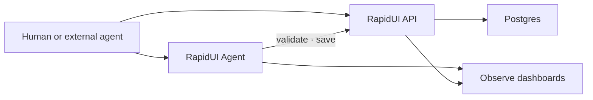

# RapidUI

Agent-first platform for building **schema-driven UIs** with validation, persistence, telemetry, and evals.

**Production:** [rapidui.dev](https://rapidui.dev) · **Agent:** [agent.rapidui.dev](https://agent.rapidui.dev)

## What it does

- **Generate RUIs** — JSON documents that describe operations-first UIs (tables, forms, workflows)
- **Validate before save** — semantic rules catch errors; agents can correct and retry
- **Persist and share** — saved specs get a shareable inspector URL (`/specs/:id`)
- **Observe behavior** — dashboards for API and agent sessions (pass rates, retries, timelines)
- **Prove reliability** — deterministic eval harness scores agent runs against golden cases

Schema version: **v0.2** (operations-first).

## Who this is for

| Audience | Start here |
|----------|------------|
| **Product builders** | [Try `/chat`](https://rapidui.dev/chat) — describe a UI, validate, save |
| **Agent integrators** | [llms.txt](https://rapidui.dev/llms.txt) and [API docs](https://rapidui.dev/api/docs) |
| **Operators / contributors** | [Quick start](#quick-start) below, then [docs/OPERATIONS.md](docs/OPERATIONS.md) |

## Architecture



Two services, one platform:

- **rapidui.dev** — Next.js app: `/chat` UI, public API, Observe dashboards, Postgres store
- **agent.rapidui.dev** — FastAPI agent that calls the public API (same workflow external agents use)

Deep dive: [docs/ARCHITECTURE.md](docs/ARCHITECTURE.md)

## Quick start

### Platform only

```bash
npm install
cp .env.example .env.local   # set DATABASE_URL for full features
npm run dev
```

Open [localhost:3000/chat](http://localhost:3000/chat) for the UI builder. API routes live under `/api/*`.

### Full chat stack (UI + agent)

```bash
# Terminal 1 — platform
npm run dev

# Terminal 2 — agent (see agent/README.md)
cd agent && uvicorn main:app --reload --port 8000
```

Set in `.env.local`:

```bash
NEXT_PUBLIC_RAPIDUI_AGENT_URL=http://localhost:8000/chat
```

Pull production secrets when linked to Vercel:

```bash
npx vercel login && npx vercel link && npx vercel env pull .env.local
```

Database setup: [docs/OPERATIONS.md#database](docs/OPERATIONS.md#database)

## Try it (demo script)

### Path A — browser chat

1. Open `/chat` — click a starter chip (UC1–UC3) or paste JSON/CSV
2. Chat until validate succeeds → **Draft spec** in Spec tab; save → **Saved** badge
3. Click the session bar (or telemetry icon) → agent run at `/observe/agent/sessions/:id`
4. Open **viewUrl** → shareable inspector at `/specs/:id`
5. Browse `/observe` — hub, API timeline, agent metrics

**Use cases:** UC1 static browse · UC2 CRUD admin · UC3 AI review queue

### Path B — external agent (terminal)

Proves the public API is agent-agnostic. Same grader as Path A.

```bash
npm run eval:prompt -- --case=crud-admin-v0.2 --env=prod
# Run the generated prompt in Cursor, Claude, or Codex (curl only)
npm run eval:log -- --specId=<uuid> --case=crud-admin-v0.2 --agent=cursor --validate-count=<n>
```

Full eval workflow: [eval/README.md](eval/README.md)

## Core concepts

| Concept | Description |
|---------|-------------|
| **RUI** | RapidUI JSON document — schema version, entities, operations, transitions |
| **Validate → save** | Every save re-validates; agents iterate on validation errors |
| **session_id** | UUID joining platform API events, agent runs, and Observe drill-downs |
| **Observe** | Product dashboards on `rapidui.dev` — not optional Logfire tracing |
| **Evals** | Deterministic graders score saved specs against case criteria |

## Routes

| Path | Purpose |
|------|---------|
| `/` | Landing |
| `/chat` | Build a RUI — agent chat + spec inspector |
| `/observe` | Analytics hub |
| `/observe/api` | Platform API sessions |
| `/observe/agent` | Agent run metrics |
| `/observe/evals` | Eval trial comparison |
| `/specs/:id` | Shareable saved RUI inspector |

## Documentation

| Resource | URL |
|----------|-----|
| Agent discovery | [rapidui.dev/llms.txt](https://rapidui.dev/llms.txt) |
| Full agent docs (JSON) | [rapidui.dev/api/docs](https://rapidui.dev/api/docs) |
| Schema reference | [rapidui.dev/api/schema](https://rapidui.dev/api/schema) |
| Architecture | [docs/ARCHITECTURE.md](docs/ARCHITECTURE.md) |
| Operations (env, DB, deploy, smokes) | [docs/OPERATIONS.md](docs/OPERATIONS.md) |
| Eval harness | [eval/README.md](eval/README.md) |
| Agent service | [agent/README.md](agent/README.md) |
| Telemetry ingest contract | [lib/observe/INGEST.md](lib/observe/INGEST.md) |

## Deployment

Pushes to `main` auto-deploy the platform to Vercel at [rapidui.dev](https://rapidui.dev).

The RapidUI Agent deploys separately on Render from `agent/` — see [agent/README.md](agent/README.md).

Release checklist and smoke tests: [docs/OPERATIONS.md](docs/OPERATIONS.md)

## Project structure

```txt
app/          Next.js routes (chat, observe, specs, api)
agent/        RapidUI Agent — FastAPI on Render
components/   UI (demo shell, observe dashboards, site chrome)
lib/
  operations/ v0.2 RUI schemas + golden fixtures
  validate/   validation engine
  observe/    telemetry ingest + queries
  eval/       deterministic grader + CLI helpers
eval/         eval cases + manual runner docs
```
