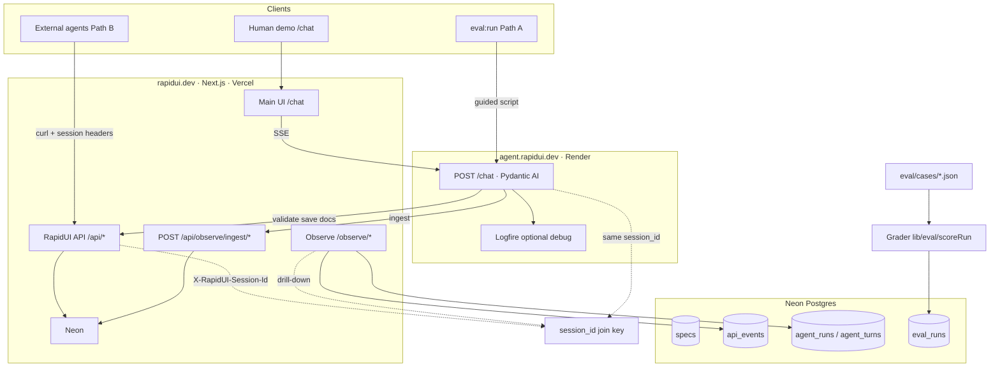

# Architecture

RapidUI v0.2 is an **operations-first** platform: agents (human-guided or external) generate RUI specs, validate them against semantic rules, save to Postgres, and emit telemetry for Observe dashboards and eval regression.

## System diagram



## Services

| Service | Stack | Host | Role |
|---------|-------|------|------|
| **Platform** | Next.js 16 | Vercel (`rapidui.dev`) | UI, public API, Observe, Postgres client |
| **RapidUI Agent** | FastAPI + Pydantic AI | Render (`agent.rapidui.dev`) | Chat endpoint; calls public API tools |
| **Database** | Neon Postgres | Neon | Specs, telemetry, eval runs |

The agent **does not** connect to Postgres directly. It uses the same HTTP API as external agents (`fetch_docs`, `fetch_schema`, `validate_rui`, `save_rui`).

## Request flow (Path A — chat)

1. Browser `/chat` sends Vercel AI SSE messages to `POST /chat` on the agent service
2. Agent calls platform API tools with `X-RapidUI-Session-Id`
3. On validate success, user saves → `POST /api/specs`
4. After each turn, agent POSTs telemetry to `/api/observe/ingest/agent`
5. Observe dashboards query `api_events` and `agent_runs` by `session_id`

## Telemetry lanes

Both lanes share the same **`session_id`** join key (`X-RapidUI-Session-Id` header).

| Lane | Tables | Who writes | Observe view |
|------|--------|------------|--------------|
| **Platform API** | `api_events` | Next.js middleware on validate/save/discovery; external agents (Path B) | `/observe/api` |
| **RapidUI Agent chat** | `agent_runs`, `agent_turns` | FastAPI POST to `/api/observe/ingest/agent` after each turn | `/observe/agent` |

Ingest contract: [lib/observe/INGEST.md](../lib/observe/INGEST.md)

## Observe vs Logfire

| Tool | Purpose | Audience |
|------|---------|----------|
| **Observe** | Product dashboards — pass rates, retries, session timelines | Demo, ops, eval comparison |
| **Logfire** | Optional engineering traces on the agent service (model spans, httpx latency) | Deep debugging only |

Use Observe for portfolio demos. Use Logfire when you need span-level debugging on the agent.

## Eval path

```
eval/cases/*.json → deterministic grader (lib/eval/scoreRun)
                  → eval_runs table
                  → /observe/evals
```

- **Path A** (`npm run eval:run`) — automated guided runs via agent eval driver
- **Path B** (`npm run eval:prompt` + external agent + `npm run eval:log`) — proves API is agent-agnostic

Details: [eval/README.md](../eval/README.md)

## Trust boundaries

- **`X-RapidUI-Session-Id`** correlates telemetry; it is not cryptographic auth
- Agent instructions are server-owned (`agent/prompts/`), never taken from client messages
- Vercel AI `messages` in POST bodies are client-controlled — see [agent README](../agent/README.md#security-and-trust-model)

## Related docs

- [Agent service](../agent/README.md)
- [Chat transcript API](../lib/chat/TRANSCRIPT.md)
- [Agent docs (production)](https://rapidui.dev/api/docs)
